# SFPG Architecture Documentation

**Version:** 1.0
**Last Updated:** 2026-02-10
**Application:** Simple Fast Photo Gallery (SFPG)

## Table of Contents

1. [Overview](#overview)
2. [System Architecture](#system-architecture)
3. [Core Components](#core-components)
4. [Data Layer](#data-layer)
5. [Web Server Layer](#web-server-layer)
6. [Background Processing](#background-processing)
7. [Caching Strategy](#caching-strategy)
8. [Security Model](#security-model)
9. [Configuration Management](#configuration-management)
10. [Utilities & Libraries](#utilities--libraries)
11. [Performance Optimizations](#performance-optimizations)
12. [Testing Strategy](#testing-strategy)

---

## Overview

SFPG (Simple Fast Photo Gallery) is a high-performance, self-hosted photo gallery application built with Go. It prioritizes:

- **Performance**: Asynchronous processing, intelligent caching, connection pooling
- **Idempotency**: Safe to re-run file processing without duplicates
- **Memory Efficiency**: Stream large files, buffer only small responses
- **Security**: Multiple layers (auth, CSRF, path validation, session security)
- **Simplicity**: Single binary, SQLite database, no external dependencies

### Technology Stack

| Component            | Technology                                      |
| -------------------- | ----------------------------------------------- |
| **Language**         | Go 1.23+                                        |
| **Database**         | SQLite (with separate read/write pools)         |
| **Web Framework**    | net/http (standard library)                     |
| **UI**               | HTMX + Go html/template                         |
| **Image Processing** | standard library (image, image/jpeg, image/png) |
| **Metadata**         | imagemeta (EXIF, IPTC, XMP)                     |
| **HTTP Cache**       | Custom SQLite-backed cache with async eviction  |

### Architecture Principles

1. **Separation of Concerns**: Each package has a single, well-defined responsibility
2. **Interface-Based Design**: Heavy use of interfaces for testability and decoupling
3. **Concurrency First**: Worker pools, async writes, background processing
4. **Resource Management**: Bounded queues, connection pooling, graceful shutdown

---

## System Architecture

### High-Level Component Overview

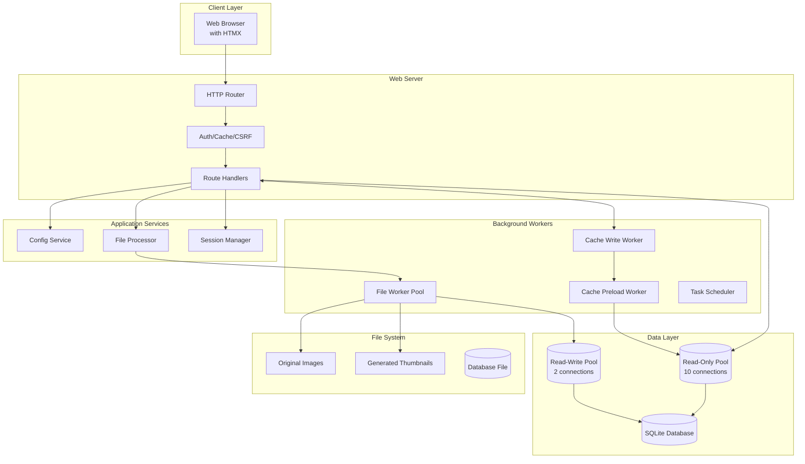

### Request Flow

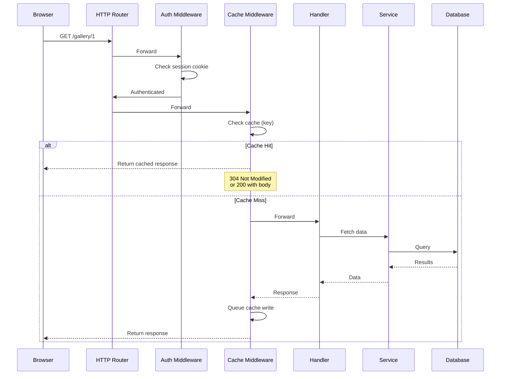

---

## Core Components

### Application Structure

The application is organized into domain-driven packages under `internal/`:

| Package          | Purpose                             | Key Exports                       |
| ---------------- | ----------------------------------- | --------------------------------- |
| **server**       | HTTP server, routing, orchestration | `App`, handlers, middleware       |
| **cachelite**    | HTTP response caching               | `HTTPCacheMiddleware`, `EvictLRU` |
| **workerpool**   | Concurrent task processing          | `Pool`, `Worker`                  |
| **scheduler**    | Cron-like task scheduling           | `Scheduler`, `Task` interface     |
| **queue**        | Thread-safe deque                   | `Queue`                           |
| **writebatcher** | Batch database operations           | `Batcher`                         |
| **dbconnpool**   | SQLite connection pools             | `DbSQLConnPool`                   |
| **gallerydb**    | Database queries (sqlc)             | `Queries`, models                 |
| **thumbnail**    | Thumbnail generation                | `Generator`                       |
| **imagemeta**    | EXIF/IPTC/XMP extraction            | Metadata parsers                  |
| **files**        | File processing pipeline            | `FileProcessor`                   |
| **config**       | Configuration management            | `ConfigService`                   |
| **session**      | Session & CSRF management           | `SessionManager`                  |
| **log**          | Structured logging                  | `Logger`                          |

### Component Diagram

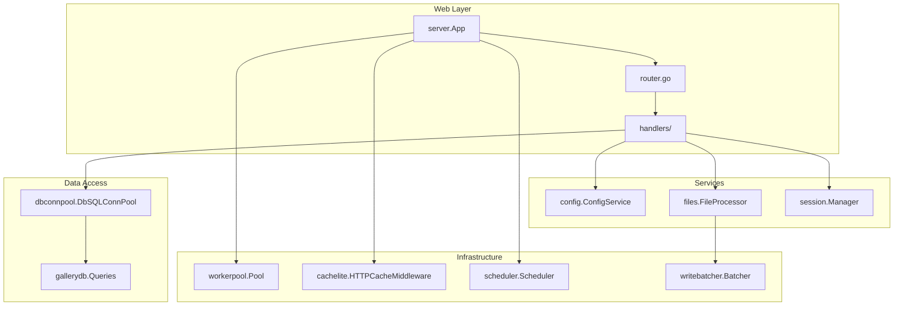

---

## Data Layer

### Unified WriteBatcher Architecture

The application uses a **single unified WriteBatcher** at the App level that handles all high-volume database writes. This architecture eliminates SQLite lock contention by ensuring that only one component is attempting to write to the database at any given time, while still allowing high throughput through efficient batching.

- **File metadata:** Complete file records including path chain, EXIF, and thumbnails.
- **Invalid file tracking:** Records of non-processible or corrupted files for UI tracking.
- **HTTP cache entries:** Full HTTP responses cached with route-specific strategies.

**Benefits:**

- **Reduced Lock Contention:** One writer instead of three competing for the SQLite exclusive lock.
- **Improved Throughput:** Batching reduces transaction overhead and filesystem syncs.
- **Memory Safety:** Batches are bounded by both count and total memory volume (bytes).
- **Graceful Degradation:** Automatic cleanup of pooled resources (HTTP bodies, thumbnails) on both successful flush and failure.

**Implementation Details:**

- **[internal/server/batched_write.go](internal/server/batched_write.go)**: Defines the `BatchedWrite` union type and its memory estimation logic.
- **[internal/server/batched_write_flush.go](internal/server/batched_write_flush.go)**: Contains the unified transactional flush logic and resource cleanup.
- **[internal/server/batcher_adapter.go](internal/server/batcher_adapter.go)**: Implements the adapter pattern to break circular dependencies between `server` and `files` packages.
- **[internal/server/files/service.go](internal/server/files/service.go)**: Consumes the batcher via the `UnifiedBatcher` interface.

### Database Architecture

SFPG uses SQLite with separate read-only and read-write connection pools to maximize concurrency:

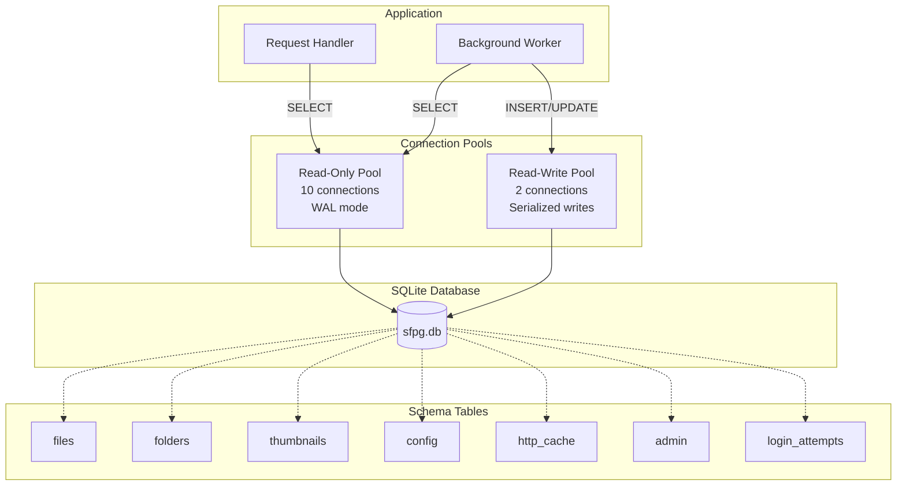

### Connection Pool Design

**Why separate pools?**

- SQLite allows concurrent reads but writes are serialized
- WAL mode enables one writer + multiple readers
- Separate pools prevent writer starvation
- Read-heavy workloads don't block writes

**Pool Configuration:**

```go
Read-Only Pool:  10 connections (handles most queries)
Read-Write Pool: 2 connections  (background writes only)
```

### Database Schema

| Table              | Purpose                 | Key Fields                                                   |
| ------------------ | ----------------------- | ------------------------------------------------------------ |
| **files**          | Image metadata          | id, folder_id, filename, mime_type, width, height, exif_json |
| **folders**        | Directory structure     | id, path, parent_id, name                                    |
| **thumbnails**     | Generated thumbnails    | id, file_id, size, width, height, data                       |
| **config**         | Key-value configuration | key, value, type                                             |
| **http_cache**     | HTTP response cache     | id, path, etag, content_length, body, headers                |
| **admin**          | Admin credentials       | id, username, password_hash, failed_attempts, locked_until   |
| **login_attempts** | Failed login tracking   | id, username, timestamp, ip_address                          |

### Query Generation (sqlc)

All SQL queries are generated using [sqlc](https://sqlc.dev/) from `sqlc/queries/*.sql`:

```
sqlc/queries/
├── files.sql          → gallerydb/files.sql.go
├── folders.sql        → gallerydb/folders.sql.go
├── http_cache.sql     → gallerydb/http_cache.sql.go
├── config.sql         → gallerydb/config.sql.go
└── ...
```

**Benefits:**

- Type-safe queries
- Compile-time SQL validation
- No SQL injection risk
- Easy to refactor

---

## Web Server Layer

### Server Lifecycle

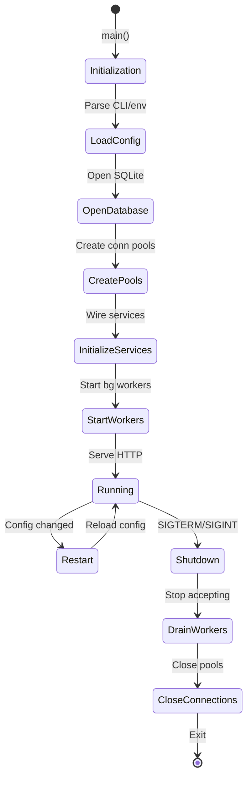

### Request Middleware Stack

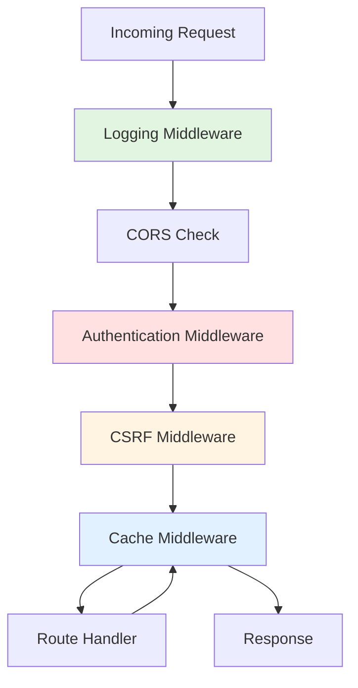

**Middleware Order (Critical):**

1. **Logging** - Log all requests first
2. **CORS** - Check Origin header early
3. **Authentication** - Verify session cookie
4. **CSRF** - Validate CSRF token for unsafe methods
5. **Cache** - Check HTTP cache before handler
6. **Handler** - Process request
7. **Cache (on return)** - Store response if cacheable

### Route Organization

Routes are organized into handler groups by domain:

| Handler Group       | Routes                                  | Purpose            |
| ------------------- | --------------------------------------- | ------------------ |
| **AuthHandlers**    | /login, /logout, /auth/status           | Authentication     |
| **GalleryHandlers** | /gallery, /image, /info, /thumbnail     | Browsing & viewing |
| **ConfigHandlers**  | /config, /config/export, /config/import | Configuration      |
| **HealthHandlers**  | /health, /version, /debug/pprof/\*      | Health & profiling |

**Example:**

```go
// Gallery handlers (public, cacheable)
router.HandleFunc("/gallery/{id}", gh.GalleryByIDHandler)       // Browse gallery
router.HandleFunc("/image/{id}", gh.ImageByIDHandler)           // View image
router.HandleFunc("/info/{id}", gh.InfoHandler)                // Image metadata

// Config handlers (authenticated, not cacheable)
router.HandleFunc("/config", ch.ConfigPageHandler)              // GET/POST config
router.HandleFunc("/config/export", ch.ExportConfigHandler)     // Export YAML
router.HandleFunc("/config/import", ch.ImportConfigHandler)     // Import YAML
```

---

## Background Processing

### Worker Pool Architecture

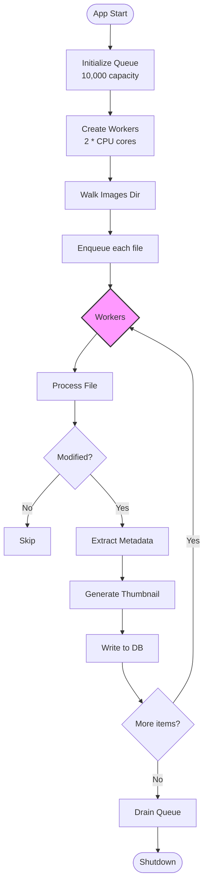

**Worker Pool Configuration:**

```go
Workers:      2 * runtime.NumCPU()  // e.g., 16 on 8-core machine
Queue Size:   10,000 paths
Idle Timeout: 10 seconds
```

### File Processing Pipeline

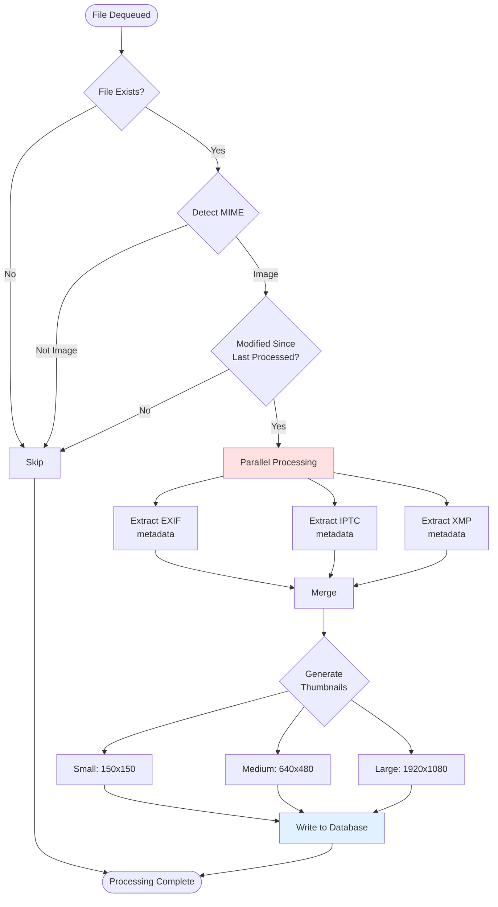

**Processing Steps:**

1. **MIME Detection** - Determine file type (image/jpeg, image/png, etc.)
2. **Modification Check** - Compare `mtime` with database
3. **Metadata Extraction** - EXIF, IPTC, XMP (parallel)
4. **Thumbnail Generation** - 3 sizes in parallel
5. **Database Write** - Batch insert/update

### Task Scheduler

```mermaid
graph TB
    subgraph "Scheduler"
        Scheduler[Scheduler<br/>Max 5 concurrent]
        TaskQueue[Task Queue]
    end

    subgraph "Task Types"
        OneTime[One-Time Tasks]
        Hourly[Hourly Tasks]
        Daily[Daily Tasks]
        Weekly[Weekly Tasks]
        Monthly[Monthly Tasks]
    end

    subgraph "Example Tasks"
        T1[Cache Cleanup<br/>Daily 2am]
        T2[Log Rotation<br/>Daily midnight]
        T3[Config Backup<br/>Hourly]
    end

    TaskQueue --> Scheduler
    Scheduler --> OneTime
    Scheduler --> Hourly
    Scheduler --> Daily
    Scheduler --> Weekly
    Scheduler --> Monthly

    T1 --> Daily
    T2 --> Daily
    T3 --> Hourly
```

**Scheduler Features:**

- Drift-free intervals (won't skip scheduled times)
- Context-based cancellation (graceful shutdown)
- Error isolation (task errors don't stop scheduler)
- Configurable concurrency (max 5 concurrent by default)

---

## Caching Strategy

SFPG uses a sophisticated multi-layer caching strategy:

### Cache Architecture Overview

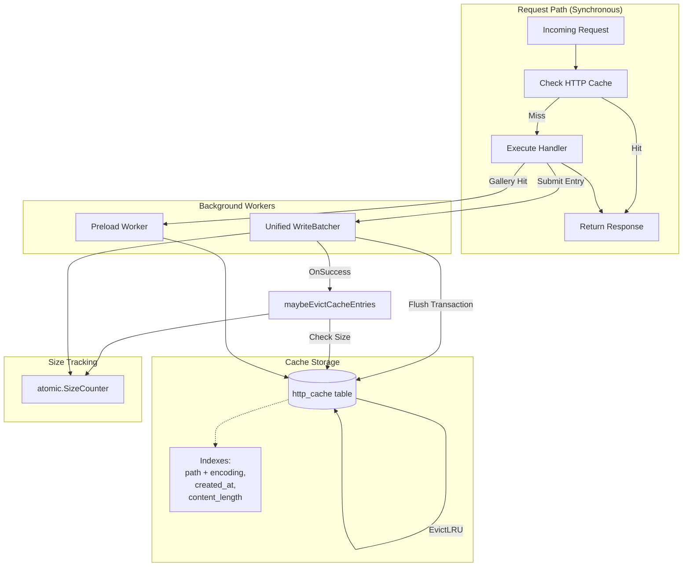

### HTTP Cache (cachelite)

**Purpose:** Persist entire HTTP responses (headers + compressed body) in SQLite

**Cache Key:** `METHOD:/path?query|encoding`

Example:

```
GET:/gallery/1?sort=name|gzip
GET:/gallery/1?sort=name|br
```

**Cache Flow:**

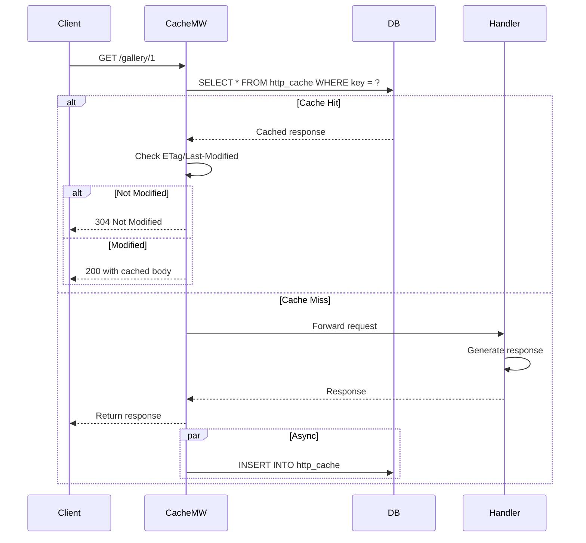

**Cache Eviction:**

Cache eviction happens **after successful batch flush** in the `OnSuccess` callback:

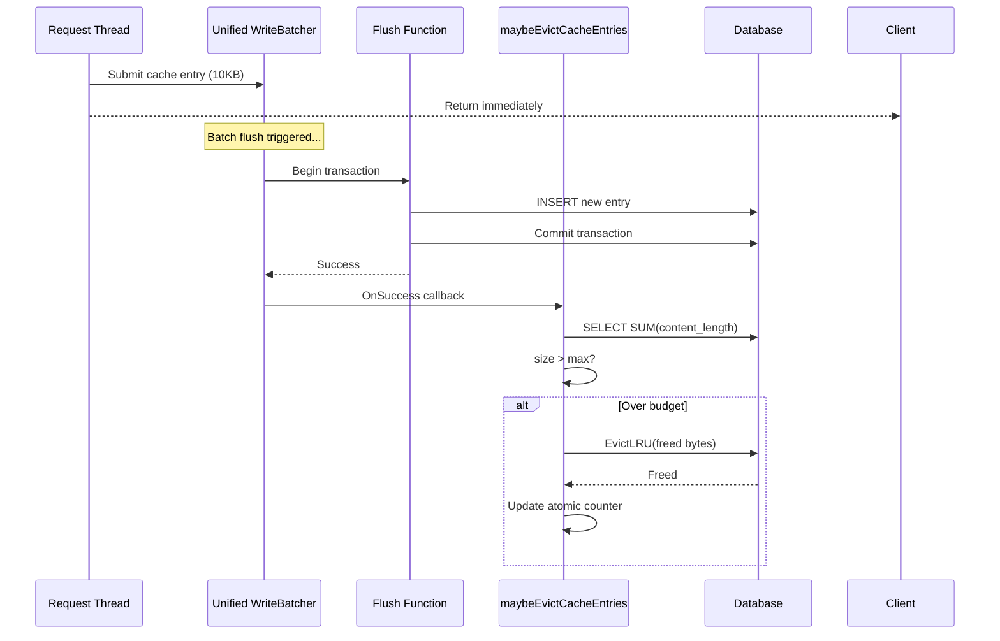

**Design Notes:**

- Eviction happens **outside the transaction** to avoid SQLite deadlocks
- Database is queried for actual size (source of truth)
- 10% buffer added to eviction target to avoid thrashing
- Atomic counter updated for runtime eviction calculations

### Cache Preload

When a gallery page is requested, the system preloads related pages in the background:

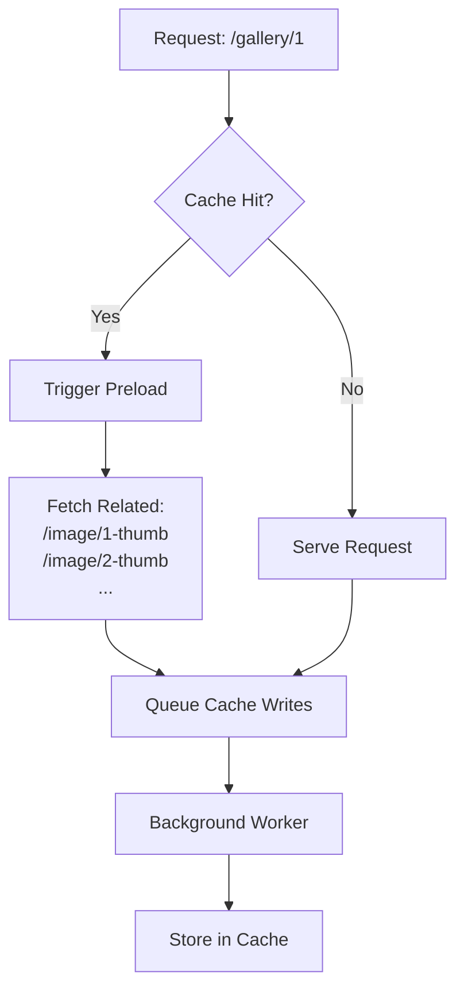

**Preload Strategy:**

- Only cache hits trigger preload
- Preloads thumbnail images for the gallery
- Skips if client sends `X-Preload: skip` header
- Prevents thundering herd on first access

**Known Limitation - Default Theme Only:**

Cache warm paths (preload and batch load) use internal requests that do not carry a
theme cookie. As a result, only the default theme is warmed. Users who select a
non-default theme will experience cache misses for the first request to each
resource until they are naturally populated by actual user traffic.

### Client-Side Caching

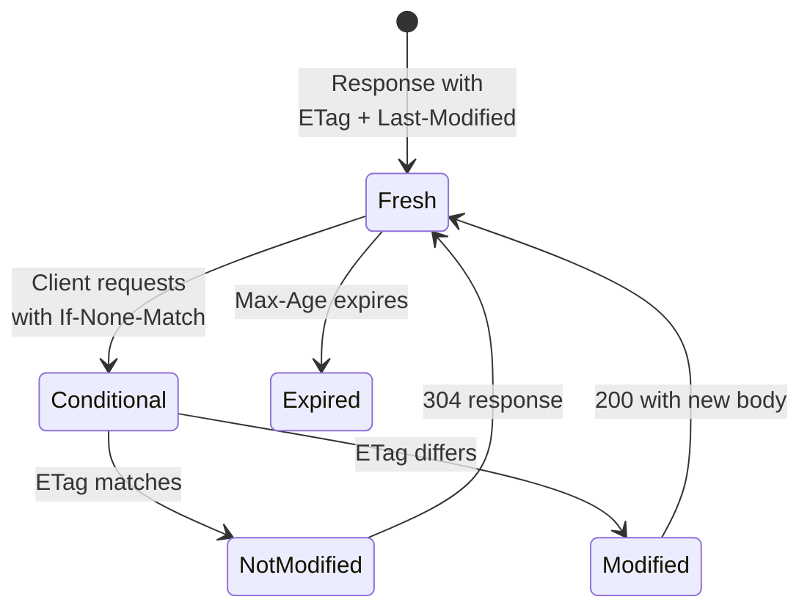

**Headers Set:**

- `ETag`: `"v123456-gzip"` (version + encoding)
- `Last-Modified`: File modification time
- `Cache-Control`: `max-age=3600, must-revalidate`
- `Vary`: `Accept-Encoding` (separate cache per encoding)

---

## Security Model

### Defense in Depth

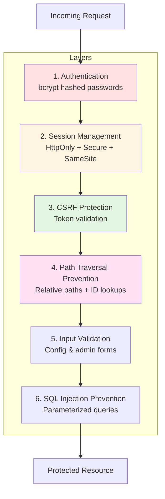

### Authentication Flow

```mermaid
stateDiagram-v2
    [*] --> Unauthenticated: Visit site
    Unauthenticated --> LoginForm: GET /login
    LoginForm --> Validating: POST /login
    Validating --> CheckLockout{Account<br/>locked?}
    CheckLockout -->|Yes| LoginFail: Show locked error
    CheckLockout -->|No| CheckCredentials{bcrypt<br/>verify}
    CheckCredentials -->|Invalid| LoginFail
    CheckCredentials -->|Valid| CheckAttempts{Failed<br/>attempts?}
    CheckAttempts -->|Yes| ResetAttempts[Reset counter]
    CheckAttempts -->|No| CreateSession
    ResetAttempts --> CreateSession
    CreateSession --> Authenticated: Set session cookie
    Authenticated --> Authenticated: Request with cookie
    Authenticated --> Unauthenticated: Logout / expire
```

**Account Lockout:**

- Threshold: 3 failed attempts
- Duration: 1 hour (configurable)
- Automatic unlock after duration

### CSRF Protection

```mermaid
sequenceDiagram
    participant Client
    participant Server
    participant Session

    Client->>Server: GET /config
    Server->>Session: Generate CSRF token
    Session-->>Server: csrf_token
    Server-->>Client: HTML form with<br/><input name="csrf_token">

    Client->>Server: POST /config<br/>csrf_token=abc123
    Server->>Session: Validate token
    alt Valid
        Session-->>Server: OK
        Server-->>Client: 200 OK
    else Invalid
        Session-->>Server: Mismatch
        Server-->>Client: 403 Forbidden
    end
```

**CSRF Middleware:**

- Generates token on first access
- Token stored in session
- All POST/PUT/DELETE/PATCH must include valid token
- Single-use tokens (regenerated after validation)

### Path Traversal Prevention

**Problem:** Prevent `../../../etc/passwd` attacks

**Solution 1: Relative Paths**

```
Database stores: "gallery/vacation/photo.jpg"
Joined with:    "/var/lib/sfpg/images"
Result:         "/var/lib/sfpg/images/gallery/vacation/photo.jpg"
```

**Solution 2: ID-Based Lookups**

```go
// Handler receives: /image/123
// Database lookup: SELECT * FROM files WHERE id = 123
// Returns path:     "gallery/vacation/photo.jpg"
// Construct:        /var/lib/sfpg/images/gallery/vacation/photo.jpg
```

**Solution 3: Path Validation**

```go
func removeImagesDirPrefix(path, imagesDir string) string {
    cleanPath := filepath.Clean(path)
    if !strings.HasPrefix(cleanPath, imagesDir) {
        return "" // Reject paths outside imagesDir
    }
    return strings.TrimPrefix(cleanPath, imagesDir)
}
```

---

## Configuration Management

### Configuration Sources & Precedence

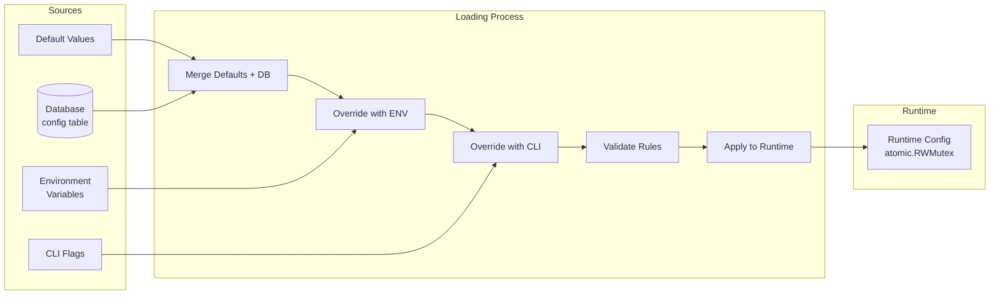

**Precedence (highest to lowest):**

1. CLI flags (`--listen-port=8080`)
2. Environment variables (`SEPG_LISTEN_PORT=8080`)
3. Database values (from `/config` page)
4. Default values (hardcoded)

### Precedence Hardening Guarantees (Mar 2026)

The startup and reload paths now document and enforce an explicit contract for pool-related settings.

Bug fixed:

- Symptom: `DBMaxPoolSize=500` was saved in the database, but active pools stayed at `100`.
- Root cause: `setDB()` executed before `loadConfig()`, so pools were created while `app.config` was `nil` and fell back to default pool sizing.
- Fix: `loadConfig()` now updates `app.config` and then calls `reconfigurePoolsFromConfig()` to recreate pools when loaded values differ from effective values.
- Prevention: dedicated precedence/startup/restart/UI regression tests plus startup diagnostics that explicitly log configured versus effective pool values.

Required sequencing constraint:

- `setDB()` may run before full config load to bootstrap database access.
- `loadConfig()` must run before normal serving and must be followed by `reconfigurePoolsFromConfig()` semantics.
- Any startup/restart path that loads or restores config must ensure pool reconciliation runs afterward.

Operational reconfiguration behavior:

- Triggered automatically at the end of `loadConfig()`.
- Triggered after `-restore-last-known-good` restores configuration.
- Triggered in fallback startup flows that synthesize defaults after config load failure.
- If configured pool values already match effective pool values, pool recreation is skipped.

Diagnostic logging for mismatch visibility:

- `pool config applied`: emits configured and effective RW/RO pool values.
- `configured/effective DB pool mismatch`: emits warning-level diagnostics when values diverge (except intentional auto min-idle behavior with `db_min_idle_connections=0`).
- `startup config summary`: emits one low-noise startup snapshot of configured versus effective values for DB pools and other critical subsystems.

Regression protections:

- Step 2 pool precedence tests (`internal/server/config_pool_precedence_test.go`):
  - `TestDBPoolPrecedence_PoolsIgnoreDatabaseConfig`
  - `TestDBPoolPrecedence_ConfigLoadedAfterPoolCreation`
  - Prevents regressions where pools are initialized from defaults and never reconciled.
- Step 4 broader precedence tests (`internal/server/config_integration_test.go`):
  - `TestIntegration_ConfigPrecedence`
  - `TestConfigPrecedence_CLIOverridesDB`
  - `TestConfigPrecedence_EnvOverridesDB`
  - `TestAppConfigPrecedence_DBOverridesDefaults`
  - Prevents precedence drift across defaults/database/env/CLI layers.
- Step 6 startup/restart regression tests (`internal/server/config_startup_restart_regression_test.go`):
  - `TestStartupWithDBConfig_PoolSizeHonored`
  - `TestRestartWithModifiedDBConfig_AppliesNewValues`
  - Prevents startup/restart paths from reintroducing stale pool sizing.
- Step 8 UI validation tests (`internal/server/config_ui_test.go` and `internal/server/config_modal_javascript_test.go`):
  - `TestConfigUI_FormSubmission_UpdatesDatabase`
  - `TestConfigUI_RestartWarning_Appears`
  - `TestConfigUI_HTMX_PartialUpdate`
  - `TestConfigModal_JavaScript_RendersCorrectly`
  - Prevents config UI regressions from silently breaking persistence or restart signaling.

### Configuration Schema

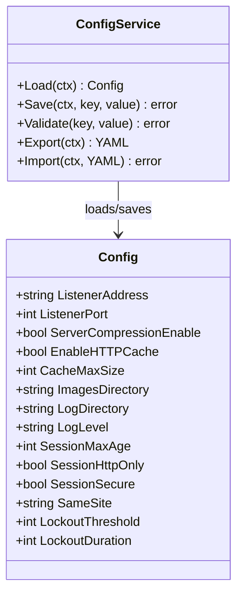

### Hot Configuration Changes

Some configuration changes can be applied without restart:

```mermaid
stateDiagram-v2
    [*] --> Running
    Running --> ConfigChanged: User saves config

    ConfigChanged --> CheckType{What changed?}

    CheckType -->|Listener address/port| RestartRequired
    CheckType -->|Images directory| RestartRequired
    CheckType -->|Log directory| RestartRequired
    CheckType -->|Cache settings| RuntimeUpdate
    CheckType -->|Session settings| RuntimeUpdate
    CheckType -->|Admin credentials| RuntimeUpdate

    RestartRequired --> Restart: Send restart signal
    RuntimeUpdate --> Running: Apply immediately

    Restart --> Restarting[Graceful Restart]
    Restarting --> Running
```

**Restart Types:**

- **HTTP-only restart**: Reload listener (preserves cache)
- **Full restart**: Reinitialize everything (clears cache)

---

## Utilities & Libraries

### Reusable Components

#### workerpool

**Purpose:** Dynamic worker pool with auto-scaling

```go
pool := workerpool.NewPool(ctx, db, 0, 0, 10*time.Second)
pool.AddTask(task)  // Blocks if queue full
pool.Shutdown()     // Drains queue then exits
```

**Features:**

- Bounded queue (10,000 capacity)
- Idle workers exit after timeout
- Graceful shutdown (drains queue)
- Statistics (active workers, queue size)

#### scheduler

**Purpose:** Cron-like task scheduler

```go
sched := scheduler.NewScheduler(5)  // Max 5 concurrent
sched.AddTask(task, scheduler.Daily, time.Now())
sched.Start(ctx)  // Blocks until ctx cancelled
```

**Features:**

- One-time, hourly, daily, weekly, monthly tasks
- Drift-free intervals
- Context-based cancellation
- Error isolation

#### writebatcher

**Purpose:** Generic, transaction-batching write serializer

```go
wb, err := writebatcher.New[MyItem](ctx, writebatcher.Config[MyItem]{
    BeginTx:      func(ctx context.Context) (*sql.Tx, error) { ... },
    Flush:        func(ctx context.Context, tx *sql.Tx, batch []MyItem) error { ... },
    OnSuccess:    func(batch []MyItem) { ... }, // Optional cleanup
    MaxBatchSize: 100,
})
wb.Submit(item)
```

**Benefits:**

- Eliminates write contention on single-writer databases like SQLite
- Automatically flushes on size (count or bytes), interval, or Close()
- Single background worker handles all flushes synchronously

#### queue

**Purpose:** Thread-safe dynamically-resizing deque

```go
q := queue.New[string]()
q.PushBack("item")     // Add to back
q.PopFront()           // Remove from front
q.Len()                // Current size
```

**Features:**

- O(1) push/pop from both ends
- Auto-grows by powers of 2
- Auto-shrinks when < 25% full
- Zero allocations after warmup

#### gensyncpool

**Purpose:** Reduce allocations with sync.Pool

```go
pool := gensyncpool.NewPool(func() *Item {
    return &Item{}
})
item := pool.Get()
// ... use item ...
pool.Put(item)  // Return to pool
```

**Used For:**

- `[]byte` buffers (read/write buffers)
- `HTTPCacheEntry` objects (cache responses)
- Reduces GC pressure significantly

#### dbconnpool

**Purpose:** SQLite connection pooling with WAL mode

```go
pool := dbconnpool.New(ctx, dbPath, 10, 2)
conn, err := pool.Get(ctx)
// ... use conn ...
pool.Put(conn)
```

**Features:**

- Separate read/write pools
- WAL mode enabled
- Connection validation
- Graceful shutdown

### Testing Utilities

#### testutil

**Purpose:** Common test helpers

```go
testutil.Equals(t, want, got)
testutil.Contains(t, haystack, needle)
testutil.Panics(t, func() { ... })
testutil.HTMLContains(t, html, selector)
```

#### gen-test-files

**Purpose:** Generate synthetic test files

```go
gentestfiles.Generate(dir,
    gentestfiles.File("test.jpg", 1024, 800, 600),
    gentestfiles.Dir("gallery",
        gentestfiles.File("photo1.jpg", 2048, 1920, 1080),
    ),
)
```

---

## Performance Optimizations

### Optimization Techniques

| Technique                | Where Used       | Impact                               |
| ------------------------ | ---------------- | ------------------------------------ |
| **Post-flush eviction**  | HTTP cache       | Removes eviction from request path   |
| **Atomic size tracking** | Cache            | Avoids `SELECT SUM()` on every write |
| **Connection pooling**   | Database         | Enables concurrent reads             |
| **Batch writes**         | File processing  | 10-100x throughput improvement       |
| **Resource reclamation** | WriteBatcher     | Pooled objects returned on success   |
| **Object pooling**       | Cache entries    | Reduces allocations by ~80%          |
| **Stream processing**    | Image serving    | Low memory per request               |
| **Cache preload**        | Gallery pages    | 50-100ms faster subsequent loads     |
| **Index optimization**   | Database queries | 2-5x faster queries                  |

### Performance Timeline

```mermaid
timeline
    title SFPG Performance Optimizations
    2024-12 : Initial implementation<br/>Naive cache
    2025-01 : Batch writes<br/>10-100x file processing
    2025-01 : Object pooling<br/>50% reduction in allocations
    2025-02 : Async eviction<br/>Removes sync from request path
    2025-02 : Database indexes<br/>2-5x query improvement
    2025-02 : Atomic size tracking<br/>Eliminates SUM queries
```

### Benchmarks

**Cache Middleware (with async eviction):**

```
BenchmarkCacheMiddleware_CacheHit-8          5000000    250 ns/op
BenchmarkCacheMiddleware_CacheMiss-8          1000000   1250 ns/op
```

**File Processing (with batching):**

```
BenchmarkFileProcessing_100Files_Batched-8    100       10000000 ns/op  (100ms)
BenchmarkFileProcessing_100Files_Individual-8  10        100000000 ns/op (1000ms)
```

---

## Testing Strategy

### Test Organization

The test suite uses **build tags** to separate unit tests from integration tests:

- **Unit Tests**: Default tests (no build tag), fast, no external dependencies
- **Integration Tests**: Files ending in `_integration_test.go` with `//go:build integration` tag
- **Benchmarks**: Performance tests (run with `-bench` flag)

```
internal/
├── cachelite/
│   ├── cache_test.go                          # Unit tests (default)
│   ├── http_cache_middleware_test.go          # Unit tests (default)
│   ├── http_cache_middleware_integration_test.go  # Integration tests
│   └── cache_benchmark_test.go                # Benchmarks
├── server/
│   ├── server_test.go                         # Unit tests (default)
│   ├── server_integration_test.go             # Integration tests
│   ├── config_integration_test.go             # Config E2E tests
│   ├── etag_integration_test.go               # ETag behavior tests
│   ├── logging_integration_test.go            # Logging E2E tests
│   ├── admin_credentials_integration_test.go  # Admin auth tests
│   └── files/
│       ├── service_test.go                    # Unit tests (default)
│       └── files_integration_test.go          # Integration tests
└── workerpool/
    ├── workerpool_test.go                     # Unit tests
    └── mock.go                                # Test doubles
```

**Running tests:**

```bash
# Unit tests only (fast, default)
go test ./...

# Integration tests only
go test -tags integration ./...

# All tests (unit + integration)
go test -tags integration ./...

# Specific integration test file
go test -tags integration ./internal/server -run TestConfigIntegration
```

### Test Coverage

| Package          | Coverage | Type               | Notes                             |
| ---------------- | -------- | ------------------ | --------------------------------- |
| **cachelite**    | 85%+     | Unit + Integration | Unified batcher + eviction tested |
| **workerpool**   | 90%+     | Unit               | Pool dynamics and scaling         |
| **scheduler**    | 85%+     | Unit               | Task scheduling and cancellation  |
| **dbconnpool**   | 80%+     | Integration        | Connection pool behavior          |
| **server**       | 75%+     | Integration        | Unified batcher workflows         |
| **writebatcher** | 95%+     | Unit               | Batching and flush logic          |
| **files**        | 80%+     | Unit + Integration | File processing pipeline          |

### Test Categories

1. **Unit Tests**: Test individual functions/packages (default, fast)
2. **Integration Tests**: Test package interactions (requires `-tags integration`)
3. **End-to-End Tests**: Test complete workflows (subset of integration)
4. **Benchmarks**: Measure performance

### Running Tests

```bash
# Unit tests only (fast, default - recommended for TDD)
go test ./...

# Integration tests only
go test -tags integration ./...

# All tests (unit + integration)
go test -tags integration ./...

# Specific package
go test ./internal/cachelite/...

# With coverage
go test -cover ./...
go test -tags integration -cover ./...

# Run benchmarks
go test -bench=. ./internal/cachelite/...

# Race detection
go test -race ./...
go test -tags integration -race ./...
```

### Recent Testing Improvements (Feb 2026)

**Build Tag Separation:**

- Separated fast unit tests from slower integration tests
- Integration tests now require explicit `-tags integration` flag
- Faster CI/CD pipelines: unit tests run in <5s, integration in ~20s

**Concurrency Fixes:**

- Fixed race condition in cache write batch collection (data loss during shutdown)
- Added lock ordering documentation to prevent deadlocks
- Improved goroutine lifecycle management in ParallelWalk
- Added context cancellation handling in multiple worker loops

**Test Quality:**

- Comprehensive table-driven tests (285 `t.Run()` across 45 files)
- Descriptive error messages with input/got/want context
- Proper cleanup with `t.Cleanup()` where appropriate
- See [GO_TESTING_CODE_REVIEW_2025-02-10.md](GO_TESTING_CODE_REVIEW_2025-02-10.md) for details

---

## Frontend Architecture

**Last Updated:** 2026-03-04

SFPG uses a **hypermedia-driven, mobile-first** frontend built entirely with Go HTML templates, HTMX, Hyperscript, daisyUI, and TailwindCSS. There is no JavaScript framework and no client-side state management.

### Design Principles

- **No JavaScript** — all interactivity via HTMX (HTML-over-the-wire) and Hyperscript
- **Mobile-first** — touch devices are first-class; desktop enhancements are additive
- **iOS safe areas** — `env(safe-area-inset-bottom)` used on body and modals to clear the home indicator
- **Responsive layout** — flexbox wrapping instead of fixed-grid for gallery tiles

### Gallery Tile Layout

Gallery tiles use a `flex flex-wrap justify-center gap` container so tiles reflow naturally at all viewport widths without JavaScript. Each tile uses the daisyUI `card` component.

Thumbnail images use `object-contain` inside a `<figure>` element so portrait and landscape images display without cropping, regardless of aspect ratio.

Long filenames and directory names are truncated with **center-ellipsis** (preserving both prefix and suffix) rather than right-truncation, so the file extension and end of the name remain readable.

### Lightbox Touch Navigation

The lightbox supports swipe navigation on touch devices via Hyperscript `pointerdown`/`pointerup` handlers:

- **Threshold:** 48px horizontal displacement required to trigger a swipe
- **Drift guard:** ±40px vertical tolerance prevents accidental swipes during vertical scrolling
- **Ghost tap prevention:** a `:didSwipe` flag suppresses the `click` event that fires after a swipe
- **Button visibility:** prev/next nav buttons are hidden on mobile (`hidden sm:flex`); swipe replaces them
- **Modal height:** uses `100dvh` (dynamic viewport height) with `env(safe-area-inset-bottom)` subtracted for correct iOS Safari rendering

### Mobile Info Panel

On touch devices (detected via CSS `hover:none` and `pointer:coarse` media queries), the desktop sidebar info box is hidden entirely and replaced with a dedicated modal:

| Element              | Desktop                  | Mobile                 |
| -------------------- | ------------------------ | ---------------------- |
| `#box_info_wrapper`  | Visible sidebar (toggle) | `display:none` via CSS |
| `#info-btn`          | Visible (`sm:flex`)      | Hidden (`hidden`)      |
| `#info-btn-mobile`   | Hidden (`sm:hidden`)     | Visible (`flex`)       |
| `#mobile_info_modal` | —                        | daisyUI checkbox modal |

Content is mirrored from `#box_info` into `#box_info_mobile` on every HTMX swap via a Hyperscript `on htmx:afterSwap` handler, so the modal always reflects the latest selection without an extra network request.

The dashboard suppresses the sidebar entirely — `#box_info_wrapper` is hidden via Hyperscript `init` when `#dashboard-container` is detected in the DOM.

### Dashboard Typography

The dashboard uses a compact typography scale optimised for dense metric display:

| Element          | Before                 | After                        |
| ---------------- | ---------------------- | ---------------------------- |
| Page heading     | `text-3xl font-bold`   | `text-2xl font-semibold`     |
| Section headings | `text-lg`              | `text-base`                  |
| Card titles      | `card-title text-base` | plain `h3 text-sm`           |
| Stat labels      | (no size)              | `text-xs`                    |
| Stat values      | `font-mono text-2xl`   | `font-semibold text-lg/base` |

Removing `font-mono` from stat values aligns them with the rest of the UI's sans-serif type while `font-semibold` maintains visual weight.

### Template Files

| Template                     | Purpose                                                                     |
| ---------------------------- | --------------------------------------------------------------------------- |
| `layout.html.tmpl`           | Shell, footer toolbar, mobile info modal, lightbox modal, safe-area padding |
| `gallery.html.tmpl`          | Flex tile grid, HTMX gallery content, mobile info sync                      |
| `lightbox-content.html.tmpl` | Lightbox image, swipe handlers, prev/next buttons                           |
| `infobox-image.html.tmpl`    | Image metadata panel (loaded into `#box_info`)                              |
| `infobox-folder.html.tmpl`   | Folder metadata panel (loaded into `#box_info`)                             |
| `dashboard.html.tmpl`        | Admin metrics dashboard                                                     |

---

## Appendix

### File Structure

```
sfpg-go/
├── cmd/
│   └── sfpg/                    # Main application entry point
├── docs/
│   ├── diagrams/                # Architecture diagrams
│   └── ARCHITECTURE.md          # This file
├── internal/
│   ├── cachelite/               # HTTP response caching
│   ├── workerpool/              # Concurrent task processing
│   ├── scheduler/               # Task scheduling
│   ├── queue/                   # Generic deque
│   ├── writebatcher/            # Batch database operations
│   ├── dbconnpool/              # Connection pooling
│   ├── gallerydb/               # Database queries (sqlc)
│   ├── thumbnail/               # Thumbnail generation
│   ├── imagemeta/               # EXIF/IPTC/XMP extraction
│   ├── files/                   # File processing
│   ├── server/                  # Web server
│   │   ├── handlers/            # Route handlers
│   │   ├── middleware/          # HTTP middleware
│   │   ├── config/              # Configuration
│   │   └── ...
│   └── ...
├── migrations/                  # Database migrations
├── sqlc/                        # SQL query definitions
├── web/                         # HTML templates
└── scripts/                     # Utility scripts
```

### External Dependencies

| Dependency                      | Purpose                     | License      |
| ------------------------------- | --------------------------- | ------------ |
| **github.com/gorilla/sessions** | Session management          | BSD-3-Clause |
| **github.com/jmoiron/sqlx**     | SQL extensions              | MIT          |
| **golang.org/x/net/html**       | HTML parsing                | BSD-3-Clause |
| **golang.org/x/sync/errgroup**  | Concurrency primitives      | BSD-3-Clause |
| **github.com/rclone/imagemeta** | EXIF/IPTC/XMP               | MIT          |
| **github.com/htmx/htmx.go**     | HTMX integration (optional) | MIT          |

---

## Related Documentation

- [Development Setup](../../README.md#development)
- [API Documentation](../API.md)
- [Deployment Guide](../../DEPLOYMENT.md)
- [Configuration Reference](../../ENV_CONFIGURATION.md)
- [Architecture Diagrams](diagrams/ARCHITECTURE_DIAGRAMS.md)

---

**Document Version:** 1.1
**Last Updated:** 2026-02-12
**Maintained By:** @whgi
