# SFPG Architecture Documentation

**Version:** 1.4
**Last Updated:** 2026-09-02
**Application:** Simple Fast Photo Gallery (SFPG)

## Table of Contents

1. [Overview](#overview)
2. [System Architecture](#system-architecture)
3. [Core Components](#core-components)
4. [Data Layer](#data-layer)
5. [Web Server Layer](#web-server-layer)
6. [Background Processing](#background-processing)
7. [Caching Strategy](#caching-strategy)
8. [Security Model](#security-model)
9. [Configuration Management](#configuration-management)
10. [Utilities & Libraries](#utilities--libraries)
11. [Performance Optimizations](#performance-optimizations)
12. [Testing Strategy](#testing-strategy)

---

## Overview

SFPG (Simple Fast Photo Gallery) is a high-performance, self-hosted photo gallery application built with Go. It prioritizes:

- **Performance**: Asynchronous processing, intelligent caching, connection pooling
- **Idempotency**: Safe to re-run file processing without duplicates
- **Memory Efficiency**: Stream large files, buffer only small responses
- **Security**: COP + auth + path validation (no token CSRF)
- **Simplicity**: Single binary, SQLite database, no external dependencies

### Technology Stack

| Component            | Technology                                                                            |
| -------------------- | ------------------------------------------------------------------------------------- |
| **Language**         | Go 1.27+                                                                              |
| **Database**         | SQLite (with separate read/write pools)                                               |
| **Web Framework**    | net/http (standard library)                                                           |
| **UI**               | HTMX + Go html/template                                                               |
| **Image Processing** | go-scaled-jpeg (JPEG decode), stdlib `image` (non-JPEG decode), `image/jpeg` (encode) |
| **Metadata**         | imagemeta (EXIF, IPTC, XMP)                                                           |
| **HTTP Cache**       | Custom SQLite-backed cache with async eviction                                        |
| **Write Overflow**   | Persistent on-disk FIFO queue (`dque`)                                                |

### Architecture Principles

1. **Separation of Concerns**: Each package has a single, well-defined responsibility
2. **Interface-Based Design**: Heavy use of interfaces for testability and decoupling
3. **Concurrency First**: Worker pools, async writes, background processing
4. **Resource Management**: Bounded queues, connection pooling, graceful shutdown

---

## System Architecture

### High-Level Component Overview

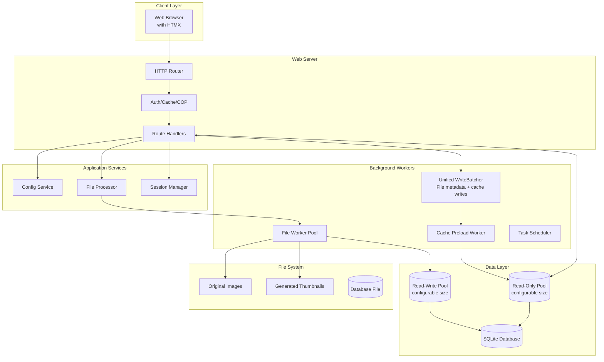
```mermaid
graph TB
    subgraph "Client Layer"
        Browser[Web Browser<br/>with HTMX]
    end

    subgraph "Web Server"
        Router[HTTP Router]
        Middleware[Auth/Cache/COP]
        Handlers[Route Handlers]
    end

    subgraph "Application Services"
        ConfigSvc[Config Service]
        FileProc[File Processor]
        SessionMgr[Session Manager]
    end

    subgraph "Background Workers"
        FileWorkerPool[File Worker Pool]
        CacheWorker[Unified WriteBatcher<br/>File metadata + cache writes]
        PreloadWorker[Cache Preload Worker]
        Scheduler[Task Scheduler]
    end

    subgraph "Data Layer"
        SQLite[(SQLite Database)]
        ROConn[(Read-Only Pool<br/>configurable size)]
        RWConn[(Read-Write Pool<br/>configurable size)]
    end

    subgraph "File System"
        Images[Original Images]
        Thumbnails[Generated Thumbnails]
        Database[(Database File)]
    end

    Browser --> Router
    Router --> Middleware
    Middleware --> Handlers

    Handlers --> ConfigSvc
    Handlers --> FileProc
    Handlers --> SessionMgr

    Handlers <--> CacheWorker
    CacheWorker --> PreloadWorker
    PreloadWorker --> ROConn

    FileProc --> FileWorkerPool
    FileWorkerPool --> Images
    FileWorkerPool --> Thumbnails
    FileWorkerPool --> RWConn

    Handlers --> ROConn
    ROConn --> SQLite
    RWConn --> SQLite
```

### Request Flow

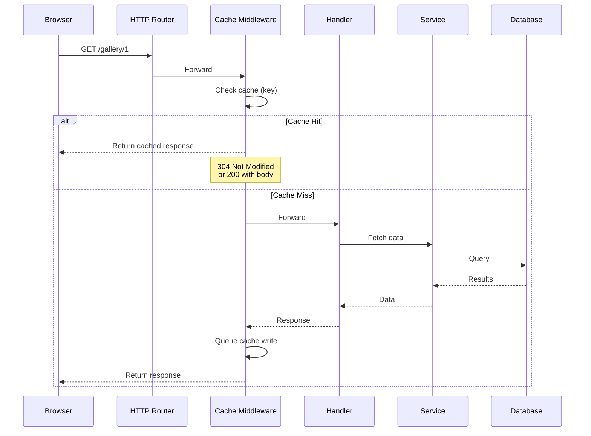
```mermaid
sequenceDiagram
    participant Client as Browser
    participant Router as HTTP Router
    participant CacheMW as Cache Middleware
    participant Handler as Handler
    participant Service as Service
    participant DB as Database

    Client->>Router: GET /gallery/1
    Router->>CacheMW: Forward
    CacheMW->>CacheMW: Check cache (key)
    alt Cache Hit
        CacheMW-->>Client: Return cached response
        Note over CacheMW: 304 Not Modified<br/>or 200 with body
    else Cache Miss
        CacheMW->>Handler: Forward
        Handler->>Service: Fetch data
        Service->>DB: Query
        DB-->>Service: Results
        Service-->>Handler: Data

        Handler-->>CacheMW: Response
        CacheMW->>CacheMW: Queue cache write
        CacheMW-->>Client: Return response
    end
```

Authentication is applied route-specifically (e.g., `/config`, `/dashboard`, `/server/*`) inside the mux after routing.

---

## Core Components

### Application Structure

The application is organized into domain-driven packages under `internal/`:

| Package                 | Purpose                                                                | Key Exports                                                                                                                                   |
| ----------------------- | ---------------------------------------------------------------------- | --------------------------------------------------------------------------------------------------------------------------------------------- |
| **server**              | HTTP server, routing, orchestration                                    | `App`, `getRouter`, middleware                                                                                                                |
| **server** (managers)   | Orchestration structs on `App` (infra embedded; others pointer fields) | `InfrastructureService`, `RuntimeManager`, `HandlerManager`, `SubsystemManager`                                                               |
| **server** (test seams) | Optional test doubles (production pkg)                                 | `testseams.go`: `AppTestSeams`, `*TestSeams` structs                                                                                          |
| **server/auth**         | Authentication service                                                 | `AuthService`, `Authenticate`                                                                                                                 |
| **server/cachebatch**   | Cache batch-load coordination                                          | batch loader helpers                                                                                                                          |
| **server/cachepreload** | Cache preload manager & tasks                                          | `Manager`, preload tasks                                                                                                                      |
| **server/config**       | Configuration management                                               | `Config`, `ConfigService`                                                                                                                     |
| **server/database**     | Database setup, migrations, pools                                      | `Setup`, `RecreatePoolsWithConfig`                                                                                                            |
| **server/files**        | File processing pipeline                                               | `FileProcessor`, `ProcessFile`                                                                                                                |
| **server/handlers**     | Route handlers                                                         | `GalleryHandlers`, `AuthHandlers`, `MenuHandlers`, `ThemeHandlers`, `ConfigHandlers`, `DashboardHandlers`, `ServerHandlers`, `HealthHandlers` |
| **server/interfaces**   | Dependency interfaces for handlers                                     | `ServerDeps`, `HandlerQueries`                                                                                                                |
| **server/logging**      | Request logging helpers                                                | logging middleware wrappers                                                                                                                   |
| **server/metrics**      | Runtime metrics collection                                             | `Collector`                                                                                                                                   |
| **server/middleware**   | HTTP middleware (auth, conditional, logging, loopback)                 | `AuthMiddleware`, `ConditionalMiddleware`, `LoopbackOnly`                                                                                     |
| **server/modulestate**  | Module active-state tracking                                           | `ModuleStateService`                                                                                                                          |
| **server/pathutil**     | Image-directory path utilities                                         | `SafeImagePath`, `RemoveImagesDirPrefix`                                                                                                      |
| **server/conditional**  | Pure ETag/304 helper package                                           | conditional request helpers                                                                                                                   |
| **server/security**     | Lockout calculations                                                   | `CalculateLockout`, `IsLocked`                                                                                                                |
| **server/session**      | Session management only                                                | `SessionManager`, `Manager`                                                                                                                   |
| **server/template**     | Shared template data helpers                                           | `AddCommonData`                                                                                                                               |
| **server/ui**           | Template rendering helpers                                             | `RenderTemplate`                                                                                                                              |
| **server/validation**   | Config validation helpers                                              | validators                                                                                                                                    |
| **cachelite**           | HTTP response caching                                                  | `HTTPCacheMiddleware`, `EvictLRU`                                                                                                             |
| **tableswap**           | Atomic SQLite table rotation                                           | `CloneEmpty`, `CreateIndexes`, `Swap`                                                                                                         |
| **rssmonitor**          | Optional Linux process RSS monitor                                     | `Run`                                                                                                                                         |
| **sqlite3stat**         | SQLite connection memory-status helpers                                | `DBStatusMem`, `PutDebugAttrs`                                                                                                                |
| **workerpool**          | Concurrent task processing                                             | `Pool`, `Worker`                                                                                                                              |
| **scheduler**           | Cron-like task scheduling                                              | `Scheduler`, `Task` interface                                                                                                                 |
| **queue**               | Thread-safe deque                                                      | `Queue`                                                                                                                                       |
| **writebatcher**        | Batch database operations                                              | `WriteBatcher`, `Config`                                                                                                                      |
| **dque**                | Persistent on-disk FIFO (writebatcher overflow + discovery backlog)    | `New`, `Queue`                                                                                                                                |
| **flock**               | Cross-platform file locking                                            | `Flock`                                                                                                                                       |
| **errors**              | Error sentinels for dque                                               | `ErrXxx` sentinels                                                                                                                            |
| **dbconnpool**          | SQLite connection pools                                                | `DbSQLConnPool`                                                                                                                               |
| **gallerydb**           | Database queries (sqlc)                                                | `Queries`, `CustomQueries`                                                                                                                    |
| **gallerylib**          | File import / path-chain upserts                                       | `Importer`                                                                                                                                    |
| **thumbnail**           | Thumbnail generation (go-scaled-jpeg JPEG decode)                      | `GenerateThumbnailAndHashes`                                                                                                                  |
| **imagemeta**           | EXIF extraction (local `replace`)                                      | Metadata parsers                                                                                                                              |
| **multihandler**        | Multi-handler structured logging                                       | `MultiHandler`                                                                                                                                |
| **profiler**            | Optional CPU/mem/block profiling                                       | `Start`                                                                                                                                       |
| **coords**              | Geographic coordinate parsing                                          | `Parse`                                                                                                                                       |
| **humanize**            | Human-readable formatting                                              | formatters                                                                                                                                    |
| **log**                 | Structured logging                                                     | `Logger`                                                                                                                                      |
| **gensyncpool**         | Reset-enforcing `sync.Pool` wrappers                                   | `NewPool`                                                                                                                                     |
| **getopt**              | Config from flags/env                                                  | config loader                                                                                                                                 |
| **parallelwalkdir**     | Concurrent directory scanning                                          | `WalkFunc`                                                                                                                                    |
| **testutil**            | Shared test helpers                                                    | `Equals`, `HTMLContains`                                                                                                                      |
| **gen-test-files**      | Synthetic test file generation                                         | `Generate`                                                                                                                                    |

### Component Diagram

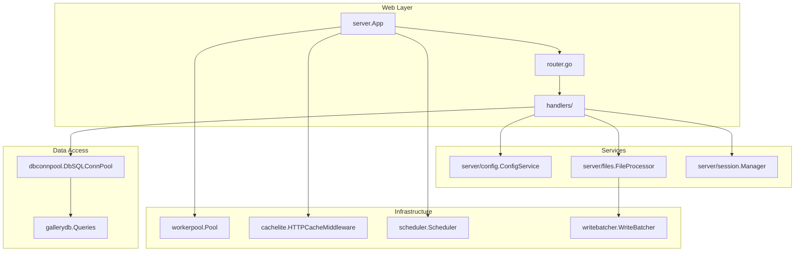
```mermaid
graph TB
    subgraph "Web Layer"
        Server[server.App]
        Router[router.go]
        Handlers[handlers/]
    end

    subgraph "Services"
        ConfigSvc[server/config.ConfigService]
        FileProc[server/files.FileProcessor]
        SessionMgr[server/session.Manager]
    end

    subgraph "Infrastructure"
        WorkerPool[workerpool.Pool]
        CacheMW[cachelite.HTTPCacheMiddleware]
        Scheduler[scheduler.Scheduler]
        WriteBatcher[writebatcher.WriteBatcher]
    end

    subgraph "Data Access"
        DBConn[dbconnpool.DbSQLConnPool]
        Queries[gallerydb.Queries]
    end

    Server --> Router
    Router --> Handlers
    Handlers --> ConfigSvc
    Handlers --> FileProc
    Handlers --> SessionMgr

    Server --> WorkerPool
    Server --> CacheMW
    Server --> Scheduler
    FileProc --> WriteBatcher

    Handlers --> DBConn
    DBConn --> Queries
```

---

## Data Layer

### Unified WriteBatcher Architecture

The application uses a **single unified WriteBatcher** at the App level that handles all high-volume database writes. This architecture eliminates SQLite lock contention by ensuring that only one component is attempting to write to the database at any given time, while still allowing high throughput through efficient batching.

- **File metadata:** Complete file records including path chain, EXIF, and thumbnails.
- **HTTP cache entries:** Full HTTP responses cached with route-specific strategies.

**Benefits:**

- **Reduced Lock Contention:** File-metadata and cache writes share one batched writer instead of competing for the SQLite exclusive lock (invalid-file records are written directly to the RW pool as failures occur).
- **Improved Throughput:** Batching reduces transaction overhead and filesystem syncs.
- **Memory Safety:** Batches are bounded by both count and total memory volume (bytes).
- **Graceful Degradation:** Automatic cleanup of pooled resources (HTTP bodies, thumbnails) on both successful flush and failure.
- **Burst Absorption:** When the in-memory channel fills, excess writes spill to a persistent on-disk queue (`dque`) instead of being dropped, so preload/discovery bursts are fully absorbed.
- **Crash Recovery:** Pending overflow writes persist across process restarts and are flushed on the next startup.

**Persistent Overflow Queue (`dque`):**

When the WriteBatcher's in-memory channel is full and `DQueDirPath` is configured, `Submit` overflows items to `dque` — a generic, segment-backed on-disk FIFO stored in `<db>-dque/` (sibling to the SQLite database). Its maximum on-disk size is capped by the config quota `dque_max_disk_bytes` (default 50 GiB; `0` = unlimited). Each overflow increments `OverflowCount`/`pendingCount` and signals a buffer-1 `dqNotify` channel. The worker's main `select` gains a `dqNotify` case and a drain loop that:

- Pulls items from `dque` and flushes them in `MaxBatchSize` batches **during** the drain (trigger reason `size_limit`), not only after.
- Interleaves channel items with `dque` items so new channel submissions are never starved during a drain.
- Drains `dque` on context cancel, channel close, and `Close()` so no items are lost on shutdown.

Crash recovery: `New()` seeds `pendingCount` from the existing `dque` size, and the worker's `drainDQueAll` loop flushes any recovered `dque` items into batches on its first iteration (no startup memory buffering). `overflowMu` guards the overflow path and `overflowWG` plus `Close` acquiring `mu`-then-`overflowMu` guarantee in-flight overflow `Submit`s finish before `Close` drains, so concurrent `Submit`-during-`Close` loses nothing. `dque` acquires a `flock` on its directory, so reconfiguration closes the old batcher before creating a new one to release the lock.

**`internal/queue` vs `internal/dque`:** These are unrelated. `internal/queue` is a generic in-memory deque (goroutine-safe, resizable ring buffer); it no longer backs the production discovery work queue (tests and bounded-queue helpers may still use it). `internal/dque` is a segment-backed on-disk FIFO with two distinct uses:

- The WriteBatcher keeps a **durable** queue (`<db>-dque/`) for overflow when its in-memory submit channel is full — pending batched DB writes survive restarts.
- Production discovery uses a **dedicated** queue (`discovery-dque/` in the database directory, e.g. `DB/discovery-dque/` beside `sfpg.db`) as the work backlog the walker fills and the file workers drain. It is a **disposable wipe-on-start backlog**: `SubsystemManager.Start` deletes the directory and recreates the queue on every start, and a full re-walk is the recovery — it is **not** durable like the writebatcher `…-dque`. `discovery_queue_max` is currently a no-op (ignored by `Start`; retained for later removal) — the discovery backlog is never bounded in-memory.

To make `BatchedWrite` items persistable, `BatchedWrite` and `files.File` implement `GobEncode`/`GobDecode` via gob-safe wire structs (separately encoding the `File` and `CacheEntry` blobs, and replacing the un-exported `*bytes.Buffer` thumbnail with raw `[]byte`). An `init()` registers `int64` and `sql.Null*` types stored inside sqlc-generated `interface{}` fields.

**Write-Path Throughput Optimizations:**

- **Prepared-statement threading:** `BeginTx` borrows a pooled connection, captures its prepared `*gallerydb.CustomQueries` (`app.batcherQueries`), and `flushBatchedWrites` calls `WithTx(tx)` to propagate all prepared statements onto the transaction. Every statement reuses its compiled plan instead of recompiling raw SQL per call. (`TestPreparedStatementsRoutingInvariant` pins this routing.)
- **Folder-index rebuild INSERT is tx-prepared, not pool-prepared:** `file_folder_index_new` is created at runtime by `CloneEmpty`, so it does not exist at pool Prepare time and cannot be compiled by `PrepareCustomQueries`. `flushBatchedWrites` instead calls `CustomQueries.InsertFileFolderIndexNewRows` on `WithTx(tx)`: one `PrepareContext` of the INSERT on that transaction, then per-row `Exec` (≤ `MaxBatchSize`), never a per-row `tx.ExecContext`. The streaming rebuild scan `QueryFilesForFolderIndexRebuild` reads `files` (which exists at pool init) and is prepared once at pool Prepare; populate loads the stream into a `[][2]int64` and closes the RO cursor before `SubmitFolderIndex`. Both statements' SQL text lives in `sqlc/queries/file_folder_index_rebuild.sql`, which is embed-only and not part of `sqlc generate` (see § Query Generation). While the rebuild RO scan cursor is open (`folderIndexRebuildScanHeld`), `walCheckpointAfterCommit` skips `wal_checkpoint(TRUNCATE)` so it does not busy-wait on the open cursor; G4 applies only while that cursor is open, not during Submit/wait.
- **Intra-batch memoization:** One `gallerylib.Importer` is constructed per batch and reused across all files. Its `folderCache` (path → folder ID) eliminates repeated per-segment `GetFolderByPath` queries in `UpsertPathChain`, and `tiledDirs` skips redundant folder-tile view queries and tile-chain updates for subsequent files in the same directory.
- **Skip guaranteed no-op deletes:** The processor records `File.HadInvalidEntry`; `WriteFileInTx` only issues `DeleteInvalidFileByPath` when a row actually existed, removing a per-file no-op round-trip during fresh preloads.

**Implementation Details:**

- **[internal/server/batched_write.go](internal/server/batched_write.go)**: Defines the `BatchedWrite` union type (`File` and `CacheEntry` variants), its memory estimation logic, and `GobEncode`/`GobDecode` for persistence in `dque`.
- **[internal/server/batched_write_flush.go](internal/server/batched_write_flush.go)**: Contains the unified transactional flush logic, prepared-statement threading (`WithTx`), per-batch `Importer` construction, and resource cleanup.
- **[internal/server/batcher_wiring.go](internal/server/batcher_wiring.go)**: Thin `fileBatcher` wiring that implements `files.UnifiedBatcher` by delegating to the app-level `WriteBatcher[BatchedWrite]`; returns `ErrClosed` when the batcher is nil. Cache entries are submitted directly on `WriteBatcher` from `InfrastructureService.submitCacheWrite` (no separate cache adapter).
- **[internal/server/files/gob.go](internal/server/files/gob.go)**: `GobEncode`/`GobDecode` for `files.File` (handles the `*bytes.Buffer` thumbnail as raw `[]byte`).
- **[internal/gallerylib/importer.go](internal/gallerylib/importer.go)**: File import logic with per-batch `folderCache`/`tiledDirs` memoization.
- **[internal/server/files/service.go](internal/server/files/service.go)**: Consumes the batcher via the `UnifiedBatcher` interface.

### Database Architecture

SFPG uses SQLite with separate read-only and read-write connection pools, plus a separate `thumbs.db` for thumbnail blobs, to maximize concurrency and keep large binary data out of the main database:

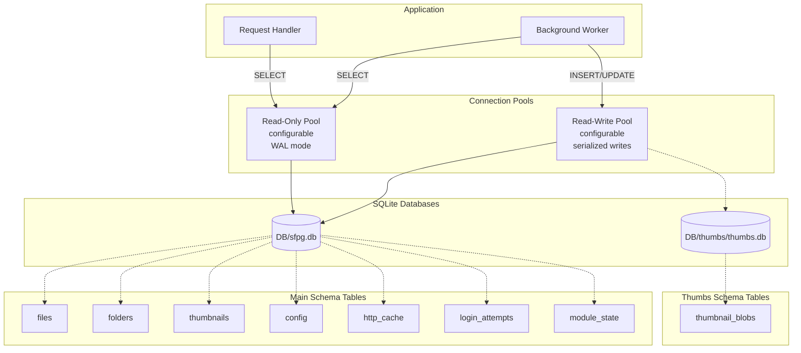
```mermaid
graph TB
    subgraph "Application"
        Handler[Request Handler]
        Worker[Background Worker]
    end

    subgraph "Connection Pools"
        RO[Read-Only Pool<br/>configurable<br/>WAL mode]
        RW[Read-Write Pool<br/>configurable<br/>serialized writes]
    end

    subgraph "SQLite Databases"
        MainDB[(DB/sfpg.db)]
        ThumbsDB[(DB/thumbs/thumbs.db)]
    end

    subgraph "Main Schema Tables"
        Files[files]
        Folders[folders]
        Thumbnails[thumbnails]
        Config[config]
        HTTPCache[http_cache]
        LoginAttempts[login_attempts]
        ModuleState[module_state]
    end

    subgraph "Thumbs Schema Tables"
        ThumbnailBlobs[thumbnail_blobs]
    end

    Handler -->|SELECT| RO
    Worker -->|SELECT| RO
    Worker -->|INSERT/UPDATE| RW

    RO --> MainDB
    RW --> MainDB
    RW -.-> ThumbsDB

    MainDB -.-> Files
    MainDB -.-> Folders
    MainDB -.-> Thumbnails
    MainDB -.-> Config
    MainDB -.-> HTTPCache
    MainDB -.-> LoginAttempts
    MainDB -.-> ModuleState
    ThumbsDB -.-> ThumbnailBlobs
```

- **Main database:** `DB/sfpg.db` holds folders, files, metadata, config, HTTP cache, and module state.
- **Thumbnails database:** `DB/thumbs/thumbs.db` holds only `thumbnail_blobs(thumbnail_id, data)` so large JPEG blobs don't bloat the main database or its WAL.

### Connection Pool Design

**Why separate pools?**

- SQLite allows concurrent reads but writes are serialized
- WAL mode enables one writer + multiple readers
- Separate pools prevent writer starvation
- Read-heavy workloads don't block writes

**Pool Configuration:**

Both pools share the same configurable size, controlled by the database configuration keys `db_max_pool_size` (default `100`) and `db_min_idle_connections` (default `10`), with a pool monitor interval `db_pool_monitor_interval` (default `1m`). Pool sizing is reconciled against effective values at startup/restart via `reconfigurePoolsFromConfig()`.

The live pools always get a positive monitor interval: creating pools with a nil `Config` (e.g. the early `setDB()` bootstrap before config load) or with `db_pool_monitor_interval <= 0` falls back to the `1m` default — a `0` interval never disables the idle grow/shrink monitor.

```go
Read-Only Pool:  MaxConnections = db_max_pool_size  (mode=ro, WAL mode persisted by RW pool)
Read-Write Pool: MaxConnections = db_max_pool_size  (journal_mode=WAL, _txlock=immediate)
```

### Database Schema

| Table               | Purpose                  | Key Fields                                                                                                                                                                |
| ------------------- | ------------------------ | ------------------------------------------------------------------------------------------------------------------------------------------------------------------------- |
| **file_paths**      | Normalized file paths    | `id`, `path` (unique)                                                                                                                                                     |
| **folder_paths**    | Normalized folder paths  | `id`, `path` (unique)                                                                                                                                                     |
| **files**           | Image metadata           | `id`, `folder_id`, `path_id`, `filename`, `size_bytes`, `mtime`, `md5`, `phash`, `mime_type`, `width`, `height`                                                           |
| **folders**         | Directory structure      | `id`, `parent_id`, `path_id`, `name`, `mtime`, `tile_id`                                                                                                                  |
| **thumbnails**      | Generated thumbnail refs | `id`, `file_id`, `size_label`, `width`, `height`, `format`                                                                                                                |
| **thumbnail_blobs** | Thumbnail JPEG bytes     | `thumbnail_id`, `data` (in `thumbs.db`)                                                                                                                                   |
| **exif_metadata**   | EXIF camera/location     | `file_id`, `camera_make/model`, `focal_length`, `aperture`, `iso`, `capture_date`, etc.                                                                                   |
| **iptc_metadata**   | IPTC fields              | `file_id`, `title`, `description`, `keywords`, etc.                                                                                                                       |
| **iptc_keywords**   | IPTC keyword rows        | `id`, `file_id`, `keyword`                                                                                                                                                |
| **xmp_properties**  | XMP property rows        | `id`, `file_id`, `namespace`, `property`, `value`                                                                                                                         |
| **xmp_raw**         | Raw XMP packet           | `file_id`, `raw_xml`                                                                                                                                                      |
| **config**          | Key-value configuration  | `key`, `value`, `type`, `category`, `requires_restart`, `description`, `default_value`, etc.                                                                              |
| **http_cache**      | HTTP response cache      | `key`, `method`, `path`, `query_string`, `status`, `content_type`, `cache_control`, `etag`, `last_modified`, `vary`, `body`, `content_length`, `created_at`, `expires_at` |
| **login_attempts**  | Failed login tracking    | `username` (PK), `failed_attempts`, `locked_until`, `last_attempt_at`                                                                                                     |
| **invalid_files**   | Unprocessable files      | `path`, `mtime`, `size`, `reason`, `created_at`, `updated_at`                                                                                                             |
| **module_state**    | Module active state      | `name` (PK), `is_active`, `last_started_at`, `last_finished_at`, `payload` (TEXT JSON)                                                                                    |

**Views:** `folder_view`, `file_view`, `thumbnail_exists_view`, `folder_tile_exists_view` (plus quality-control views `qc_file_path_subset_file_name` and `qc_folder_path_subset_file_path`).

**file_folder_index rebuild:** Populate COUNTs folder-bearing files, streams `(id, folder_id)` on the RO pool (`ORDER BY folder_id, filename, id`) into a `[][2]int64` (cap from COUNT), closes the cursor and Puts the RO conn, then computes nav columns in Go per folder and `SubmitFolderIndex`s rows to the unified writebatcher which INSERTs into `file_folder_index_new`. The RW pool conn is Put after `CloneEmpty` and before Submit/wait; folder-index inflight reaches 0; then `CreateIndexes` + `Swap` on a new RW conn. `CreateIndexes` sets `PRAGMA temp_store=FILE` on the leased RW connection before `CREATE INDEX`, then restores the previous `temp_store` (DSN stays `memory` for other work). `Swap` `DROP TABLE`s `{active}_to_be_dropped` before it returns (prior leftover stale is dropped inside the cutover transaction before the renames). Explicit index names after the first copy are `idx_*_1` until a later rotate reuses the base name once stale is gone.

### Query Generation (sqlc)

All generated queries are produced by [sqlc](https://sqlc.dev/) from the explicit 14-file `queries:` list in `sqlc.yaml` (nested under `sql:` / `schema`), currently: `sqlc/queries/files.sql`, `folders.sql`, `http_cache.sql`, `config.sql`, `module_state.sql`, `thumbnails.sql`, `xmp.sql`, `login_attempts.sql`, `preload_routes.sql`, `file_paths.sql`, `folder_paths.sql`, `iptc.sql`, `exif.sql`, `invalid_files.sql`. Each compiles to a `gallerydb/*.sql.go` file; the directory listing snapshot below is illustrative, not the source of truth (the authoritative list is the yaml):

```
sqlc/queries/
├── files.sql          → gallerydb/files.sql.go
├── folders.sql        → gallerydb/folders.sql.go
├── http_cache.sql     → gallerydb/http_cache.sql.go
├── config.sql         → gallerydb/config.sql.go
└── ...
```

**Embed-only, not generated:** `sqlc/queries/file_folder_index_rebuild.sql` (COUNT + folder-index rebuild SELECT + dest INSERT) is intentionally omitted from the `sqlc.yaml` generate list and loaded via `go:embed` (package `sqlcqueries`) into `gallerydb` — see § Prepared-statement threading. It is split on `-- statement-break` into `parts[0]` (SELECT), `parts[1]` (INSERT), and `parts[2]` (COUNT). Its dest table is created at runtime by `CloneEmpty`, so a generated pool-prepared INSERT would fail at pool init.

**Benefits:**

- Type-safe queries
- Compile-time SQL validation
- No SQL injection risk
- Easy to refactor

**Testing policy (gallerydb):**

- sqlc-generated output (`db.go`, `querier.go`, sqlc `*.sql.go` — **not** hand-written `custom.sql.go`) — never add test seams; run `sqlc generate` without post-processing.
- Hand-written `custom.sql.go` + `custom_seams.go` — package-level hooks for custom query error-path tests only.
- Generated queries: happy-path integration tests in `gallerydb_*_integration_test.go`.
- Custom queries: `gallerydb_seams_test.go` (prepare/close/row fault injection).

---

## Web Server Layer

### App Orchestration

`App` (`internal/server/app.go`) is the **root orchestrator and change nexus** for the process: one value owns config, sessions, DB pools, HTTP serving, background subsystems, and handler wiring.

**Managers are organizational boundaries, not isolated services.** They group code and lifecycle hooks; everything still runs in-process on the same `App` instance.

| Component               | Wiring on `App`                         | Role                                                                                                                                                       |
| ----------------------- | --------------------------------------- | ---------------------------------------------------------------------------------------------------------------------------------------------------------- |
| `InfrastructureService` | **Embedded** (`*InfrastructureService`) | DB pools, write batcher, HTTP cache middleware, WAL checkpoints, cache eviction — methods promote onto `App` (e.g. `app.dbRwPool`, `app.submitCacheWrite`) |
| `RuntimeManager`        | Pointer field                           | Process lifecycle, HTTP `Serve`, restart/exec, gallery stats cache                                                                                         |
| `HandlerManager`        | Pointer field                           | Constructs and holds domain handler groups                                                                                                                 |
| `SubsystemManager`      | Pointer field                           | Background subsystems (discovery, cache batch load, worker pool wiring)                                                                                    |

Embedding `InfrastructureService` is intentional convenience (handlers and `App` methods share pools and batcher directly) but it **undoes encapsulation**: infra fields and methods are reachable through `*App` without going through the manager type.

**Handler dependencies vs `App`:** `HandlerManager.Build` takes `interfaces.ServerDeps`, not `*App`. Production passes `app` (`var _ interfaces.ServerDeps = (*App)(nil)` in `server.go`). That interface is a **compile-time narrow surface** — not a separate object. `ServerDeps` composes `CredentialStore`, `ConfigOps`, `GalleryOps`, and `ServerControl`; handler groups that need less accept those sub-interfaces directly (e.g. `ConfigHandlers` takes `CredentialStore` + `ConfigOps` only). Unit tests use fakes of those interfaces; integration tests usually build a full `App`.

**Practical implication:** New features often touch `App` methods, promoted infra fields, manager `testSeams`, and one or more handler groups. Decomposing `App` further (compose infra without embed, thinner `ServerDeps` adapter) is structural refactor territory, not required for correctness today.

### Test Seams

Production code uses optional test doubles in `internal/server/testseams.go`. Each orchestration struct holds an unexported `testSeams` field.

**Semantics:**

- **Nil func seam:** zero value → production path (`if seam != nil` in caller).
- **Infrastructure cache func seams:** `NewInfrastructureService` seeds `GetCacheSizeBytes`, `GetCacheEntryCount`, and `EvictLRU` with `cachelite` production functions. Call sites invoke these fields directly (no nil-check); tests override the fields on the struct.
- **Pre-`New()` injection:** set package-level `defaultNewTestSeams` before `New()`; `New()` copies it into `app.testSeams`.

**Field inventory** (keep in sync with `testseams.go` when adding seams):

| Struct                      | Field                        | Replaces / use                                                                                                                                                           |
| --------------------------- | ---------------------------- | ------------------------------------------------------------------------------------------------------------------------------------------------------------------------ |
| **AppTestSeams**            | `NewParseTemplates`          | `ui.ParseTemplates` in `New()`                                                                                                                                           |
|                             | `NewExit`                    | `os.Exit` on template parse failure                                                                                                                                      |
|                             | `Serve`                      | `App.Serve` / `RuntimeManager.Serve`                                                                                                                                     |
|                             | `ProfilerStart`              | `profiler.Start` in `Run()`                                                                                                                                              |
|                             | `MemoryReclaimer`            | memory reclaimer goroutine in `Run()`                                                                                                                                    |
|                             | `ModuleStateActive`          | `moduleStateService.IsActive` in cache batch load                                                                                                                        |
|                             | `BatchLoadManagerRun`        | `batchLoadManager.Run`                                                                                                                                                   |
|                             | `GalleryStatsStartup`        | async gallery stats goroutine at startup                                                                                                                                 |
|                             | `TriggerDiscovery`           | seam checked inside `app.TriggerDiscovery()` (in lieu of walk/drain/rebuild); startup and `ServerDiscoveryPost` dispatch `go app.TriggerDiscovery(context.Background())` |
|                             | `RebuildFileFolderIndex`     | `files.RebuildFileFolderIndex` at discovery completion in `TriggerDiscovery`                                                                                             |
|                             | `FallbackConfig`             | config when `loadConfig` fails in `Run()`                                                                                                                                |
|                             | `ConfigService`              | `config.NewService` in `setDB` / reconfigure                                                                                                                             |
|                             | `LoadConfig`                 | `config.Load` in `loadConfig`                                                                                                                                            |
|                             | `Executable`                 | `os.Executable` in `setRootDir`                                                                                                                                          |
|                             | `SetupBootstrapLogging`      | `logging.SetupBootstrap`                                                                                                                                                 |
|                             | `DatabaseSetup`              | `database.Setup` in CLI unlock / ETag paths                                                                                                                              |
| **InfrastructureTestSeams** | `BuildWriteBatcher`          | `buildWriteBatcher`                                                                                                                                                      |
|                             | `ShutdownWriteBatcher`       | `writeBatcher.Close`                                                                                                                                                     |
|                             | `PerformWALCheckpoint`       | WAL checkpoint after pool recreate                                                                                                                                       |
|                             | `PragmaOptimize`             | `PRAGMA optimize` path                                                                                                                                                   |
|                             | `WALCheckpointQuery`         | WAL checkpoint SQL query                                                                                                                                                 |
|                             | `GetCacheSizeBytes`          | cache size calibration (default: `cachelite.GetCacheSizeBytes`)                                                                                                          |
|                             | `GetCacheEntryCount`         | cache entry count (default: `cachelite.CountCacheEntries`)                                                                                                               |
|                             | `EvictLRU`                   | cache eviction (default: `cachelite.EvictLRU`)                                                                                                                           |
|                             | `FlushBatchedWrites`         | `flushBatchedWrites` in batcher                                                                                                                                          |
|                             | `HandlerQueries`             | live `HandlerQueries` from pool connection                                                                                                                               |
|                             | `RecreatePoolsWithConfig`    | pool recreate on config change                                                                                                                                           |
|                             | `PragmaOptimizePollInterval` | test tuning (non-zero overrides poll interval)                                                                                                                           |
|                             | `PragmaOptimizeMaxWait`      | test tuning (non-zero overrides max wait)                                                                                                                                |
| **RuntimeManagerTestSeams** | `Executable`                 | `os.Executable` for restart                                                                                                                                              |
|                             | `ExecCommand`                | `exec` for restart                                                                                                                                                       |
|                             | `Exit`                       | `os.Exit` for restart failure                                                                                                                                            |
|                             | `BeforeListen`               | hook immediately before `ListenAndServe`                                                                                                                                 |
|                             | `Shutdown`                   | HTTP server shutdown                                                                                                                                                     |
| **HandlerManagerTestSeams** | `BuildHandlers`              | `HandlerManager.buildHandlers`                                                                                                                                           |

Typical test assignments: `app.testSeams.Serve`, `app.testSeams.LoadConfig`, `app.testSeams.GalleryStatsStartup`, `app.InfrastructureService.testSeams.HandlerQueries`, `app.RuntimeManager.testSeams.BeforeListen`, `app.HandlerManager.testSeams.BuildHandlers`.

Do **not** add `testHook*` fields to production structs or use promoted `app.testHook*` assignments in tests (embedding made those ambiguous; they were removed in favor of explicit `*.testSeams.*` paths).

### Server Lifecycle

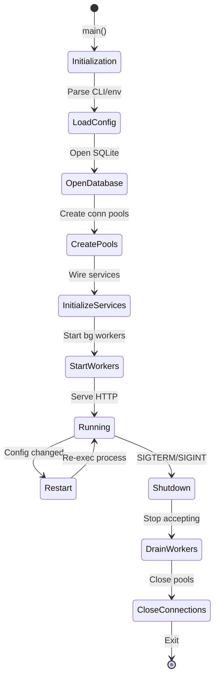
```mermaid
stateDiagram-v2
    [*] --> Initialization: main()
    Initialization --> LoadConfig: Parse CLI/env
    LoadConfig --> OpenDatabase: Open SQLite
    OpenDatabase --> CreatePools: Create conn pools
    CreatePools --> InitializeServices: Wire services
    InitializeServices --> StartWorkers: Start bg workers
    StartWorkers --> Running: Serve HTTP

    Running --> Restart: Config changed
    Restart --> Running: Re-exec process

    Running --> Shutdown: SIGTERM/SIGINT
    Shutdown --> DrainWorkers: Stop accepting
    DrainWorkers --> CloseConnections: Close pools
    CloseConnections --> [*]: Exit
```

### Request Middleware Stack

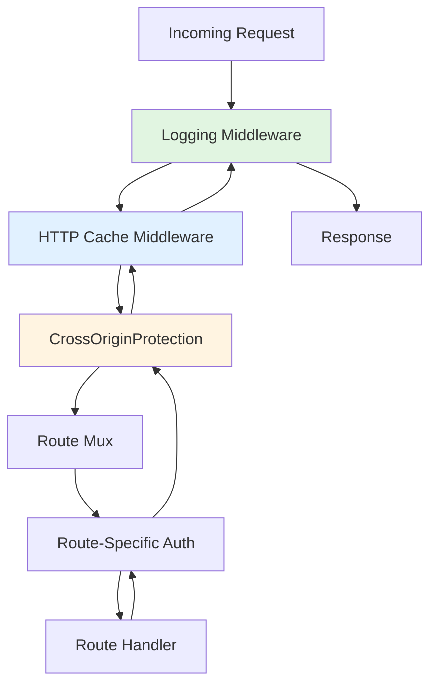
```mermaid
graph TB
    Request[Incoming Request] --> LogMW[Logging Middleware]
    LogMW --> CacheMW[HTTP Cache Middleware]
    CacheMW --> COPMW[CrossOriginProtection]
    COPMW --> Mux[Route Mux]
    Mux --> AuthMW[Route-Specific Auth]
    AuthMW --> Handler[Route Handler]
    Handler --> AuthMW
    AuthMW --> COPMW
    COPMW --> CacheMW
    CacheMW --> LogMW
    LogMW --> Response[Response]

    style LogMW fill:#e1f5e1
    style CacheMW fill:#e1f1ff
    style COPMW fill:#fff4e1
```

**Middleware Order (Critical):**

1. **Logging** (outermost) - Log all requests first
2. **HTTP Cache** - Check SQLite-backed response cache; return 304/hit if present
3. **CrossOriginProtection** - Same-origin check for unsafe methods via `Sec-Fetch-Site`/`Origin`/`Host`; no session tokens
4. **Mux** - Route matching
5. **Authentication** - Applied selectively to protected routes (not global)
6. **Handler** - Process request

There is no separate global "CORS" middleware.

### Route Organization

Routes are registered in `internal/server/router.go` and organized into handler groups by domain:

| Handler Group         | Routes                                                                                                                                                                                                                                                     | Purpose                              |
| --------------------- | ---------------------------------------------------------------------------------------------------------------------------------------------------------------------------------------------------------------------------------------------------------- | ------------------------------------ |
| **AuthHandlers**      | POST /login, GET /login-form, GET /logout-form, POST /logout                                                                                                                                                                                               | Authentication                       |
| **ConfigHandlers**    | GET /config, POST /config, POST /config/themes, POST /config/increment-etag, POST /config/export/to-file, POST /config/import/preview, POST /config/import/commit, POST /config/restore-last-known-good, POST /config/restart, GET /config/export/download | Configuration                        |
| **DashboardHandlers** | GET /dashboard                                                                                                                                                                                                                                             | Admin dashboard                      |
| **GalleryHandlers**   | GET /gallery/{id}, GET /image/{id}, GET /raw-image/{id}, GET /thumbnail/file/{id}, GET /thumbnail/folder/{id}, GET /lightbox/{id}, GET /info/folder/{id}, GET /info/image/{id}                                                                             | Browsing & viewing                   |
| **HealthHandlers**    | GET /, GET /health                                                                                                                                                                                                                                         | Health & root redirect               |
| **MenuHandlers**      | GET /hamburger-menu, GET /about-modal                                                                                                                                                                                                                      | Session-aware menu and about modal   |
| **ServerHandlers**    | POST /server/shutdown, POST /server/discovery, POST /server/cache-batch-load, POST /server/restart, POST /dashboard/folder-index-error/ack                                                                                                                 | Server management                    |
| **ThemeHandlers**     | GET /theme/modal, POST /theme                                                                                                                                                                                                                              | Theme selection                      |
| **pprof**             | GET /debug/pprof/\*                                                                                                                                                                                                                                        | Profiling (loopback + authenticated) |

**Example:**

```go
// Gallery handlers (public, some cacheable)
mux.Handle("GET /gallery/{id}", withConditional(http.HandlerFunc(app.HandlerManager.galleryHandlers.GalleryByID)))
mux.Handle("GET /image/{id}", withConditional(http.HandlerFunc(app.HandlerManager.galleryHandlers.ImageByID)))
mux.Handle("GET /info/folder/{id}", withConditional(http.HandlerFunc(app.HandlerManager.galleryHandlers.InfoBoxFolder)))

// Config handlers (authenticated, not cacheable)
mux.Handle("GET /config", app.authMiddleware(cfgAuth(app.HandlerManager.configHandlers.ConfigGet)))
```

---

## Background Processing

### Worker Pool Architecture


```mermaid
flowchart TD
    Start([App Start]) --> InitQueue[Open discovery dque<br/>wiped on start]
    InitQueue --> CreateWorkers[Create Workers<br/>maxWorkers default: NumCPU-2]
    CreateWorkers --> Walk[Walk Images Dir]
    Walk --> Enqueue[Enqueue each file]
    Enqueue --> Workers{Workers}

    Workers --> Process[Process File]
    Process --> CheckModified{Modified?}
    CheckModified -->|No| Skip
    CheckModified -->|Yes| Extract[Extract Metadata]
    Extract --> Thumbnail[Generate Thumbnail]
    Thumbnail --> Write[Write to DB]
    Write --> Next{More items?}
    Next -->|Yes| Workers
    Next -->|No| Drain[Drain Queue]
    Drain --> Shutdown([Shutdown])

    style Workers fill:#f9f,stroke:#333,stroke-width:2px
```

**Worker Pool Configuration:**

```go
Max Workers:  NumCPU - 2 (when NumCPU > 4); 2 (3-4 cores); 1 otherwise
              // overridable via config: WorkerPoolMax; 0 (default) keeps CPU auto
Min Workers:  0 by default — no idle file workers
              // overridable via config: WorkerPoolMinIdle; 0 = no idle workers
              // (not auto-sizing). Workers are spawned only while the discovery
              // queue is non-empty and scale back to zero when it drains
Queue Size:   dedicated disk-backed dque — no in-memory bound
              // QueueSize no longer sizes the work queue; it still feeds the
              // dashboard queue-capacity display via SetQueueInfo
Idle Timeout: 10 seconds
              // overridable via config: WorkerPoolMaxIdleTime
```

**Worker pool lifecycle:** File workers exist only to drain the discovery
backlog — with min idle 0 the pool runs zero workers when the queue is empty
and scales up on backlog. A config restart (`POST /config/restart`) or server
restart (`POST /server/restart`) does **not** start a gallery walk: both go
through the shared `ExecRestart`, which injects `SEPG_SKIP_STARTUP_DISCOVERY=1`
so `App.Run` skips the automatic startup `TriggerDiscovery`. Cold starts (no
skip env) still walk when `run_file_discovery` is true; `POST /server/discovery`
still triggers a manual walk.

If `restart_after_discovery` is true (default false, hot-reloadable), startup
`TriggerDiscovery` — after walk, drain, and `file_folder_index` rebuild —
calls `TriggerRestart()` (log reason `discovery-complete`). The completion
monitor still logs "File processing completed" and schedules PRAGMA optimize;
it does not restart. Do not wait for PRAGMA. If that `TriggerRestart` runs
before the HTTP server is listening, it sets the restart flag (existing
nil-server warn) and production `RuntimeManager.Serve` skips `ListenAndServe`
(after `BeforeListen`, and again after `httpServer` assign) so `Run` proceeds
to `ExecRestart`. The exec injects `SEPG_SKIP_STARTUP_DISCOVERY=1`, so the new
process does not walk again and the completion monitor does not start. Drain
error / cancelled discovery does not restart. Manual `POST /server/discovery`
does not auto-restart.

If startup `TriggerDiscovery` returns a **folder-index rebuild** failure
(`errors.Is(err, files.ErrFolderIndexRebuild)`), the startup goroutine calls
`app.Shutdown()` and does **not** `TriggerRestart` — a broken populate must not
exec a skip-discovery child that skips the rebuild next boot. Drain-cancel
errors are logged inside `TriggerDiscovery` and keep serving
(no `Shutdown`). `POST /server/discovery` does not `Shutdown` (Task 5 dashboard
banner); only the startup path does.

### File Processing Pipeline


```mermaid
flowchart TD
    Start([File Dequeued]) --> Exists{File Exists?}
    Exists -->|No| Skip
    Exists -->|Yes| MIME{Detect MIME}

    MIME -->|Not Image| Skip
    MIME -->|Image| Modified{Modified Since<br/>Last Processed?}

    Modified -->|No| Skip
    Modified -->|Yes| EXIF[Extract EXIF<br/>metadata]

    EXIF --> Decode[Decode image config]
    Decode --> ThumbGen[Generate Thumbnail]
    ThumbGen --> WriteDB[Write to Database]

    WriteDB --> Done([Processing Complete])
    Skip --> Done

    style WriteDB fill:#e1f1ff
```

**Processing Steps:**

1. **MIME Detection** - Determine file type (image/jpeg, image/png, image/webp, etc.)
2. **Modification Check** - Compare `mtime` and `size` with database
3. **Metadata Extraction** - EXIF only; IPTC/XMP tables exist but are not populated
4. **Image Decode** - Read width/height via `image.DecodeConfig`
5. **Thumbnail Generation** - Single size `"m"` (200x150 box), JPEG, stored in `thumbs.db`
6. **Database Write** - Batch insert/update via unified WriteBatcher

**Thumbnail decode (`GenerateThumbnailAndHashes`):**

- **All images** decode via `fullImageDecodeHook` (production default `decodeFullImage`): JPEG input is sniffed with a buffered peek, then that same buffered reader is handed to the go-scaled-jpeg decoder at an **adaptive DCT scale** (`chooseJPEGDCTSize`); any other format falls back to stdlib `image.Decode` on the buffered reader. The scale is chosen from the source dimensions (read via `image.DecodeConfig` in step 4) so the decoded JPEG is at least the 200×150 gallery-thumb fit size: large JPEGs decode at 1/8 (`DCTSizeScaled: 1`), small JPEGs decode closer to 1:1 so the thumbnail resize never upscales. A JPEG full-image decode error **hard-fails** generation - there is no stdlib `image/jpeg.Decode` fallback and no embedded-EXIF-thumbnail shortcut.
- **TIFF** - all TIFF inputs hard-fail thumbnail generation (there is no TIFF decoder on the generate path).
- **WebP** - WebP with a full image payload still decodes (`golang.org/x/image/webp` is registered); WebP that is thumb-only / not a full image may hard-fail.
- **Encode** stays stdlib `image/jpeg.Encode` (go-scaled-jpeg is decode-only).

> **Note:** Existing `thumbs.db` thumbnail blobs and stored pHash rows are **unchanged** until rediscovery/regeneration. New thumbnails for EXIF-bearing JPEGs come from the full-image decode (adaptive DCT scale) instead of the embedded EXIF thumbnail, so quality improves but thumb bytes and pHash differ. **New** thumbnails/pHash can change geometry - under the old fixed 1/8 decode a 400×300 JPEG decoded to 50×37 and rendered as an upscaled 200×148; the adaptive scale decodes it at dct 4 (1/2) to exactly 200×150, so small JPEGs are no longer upscaled.

### Task Scheduler

```mermaid
graph TB
    subgraph "Scheduler"
        Scheduler[Scheduler<br/>Max 5 concurrent]
        TaskQueue[Task Queue]
    end

    subgraph "Task Types"
        OneTime[One-Time Tasks]
        Hourly[Hourly Tasks]
        Daily[Daily Tasks]
        Weekly[Weekly Tasks]
        Monthly[Monthly Tasks]
    end

    subgraph "Example Tasks"
        T1[Cache Cleanup<br/>Daily 2am]
        T2[Log Rotation<br/>Daily midnight]
        T3[Config Backup<br/>Hourly]
    end

    TaskQueue --> Scheduler
    Scheduler --> OneTime
    Scheduler --> Hourly
    Scheduler --> Daily
    Scheduler --> Weekly
    Scheduler --> Monthly

    T1 --> Daily
    T2 --> Daily
    T3 --> Hourly
```

**Scheduler Features:**

- Drift-free intervals (won't skip scheduled times)
- Context-based cancellation (graceful shutdown)
- Error isolation (task errors don't stop scheduler)
- Configurable concurrency (0 means `runtime.NumCPU()`; defaults to `runtime.NumCPU()` if created with 0)

---

## Caching Strategy

SFPG uses a sophisticated multi-layer caching strategy:

### Cache Architecture Overview

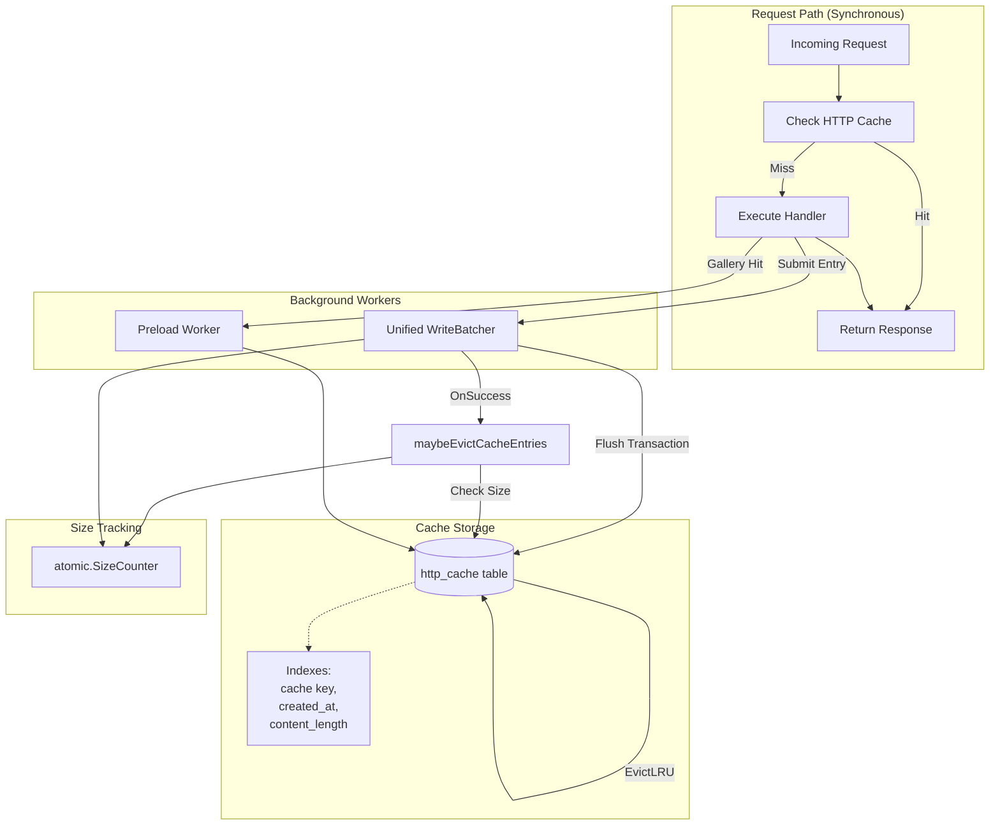
```mermaid
graph TB
    subgraph "Request Path (Synchronous)"
        Request[Incoming Request]
        CacheCheck[Check HTTP Cache]
        Handler[Execute Handler]
        Response[Return Response]
    end

    subgraph "Background Workers"
        Batcher[Unified WriteBatcher]
        Preload[Preload Worker]
    end

    subgraph "Cache Storage"
        CacheDB[(http_cache table)]
        Indexes[Indexes:<br/>cache key,<br/>created_at,<br/>content_length]
    end

    subgraph "Size Tracking"
        AtomicCounter[atomic.SizeCounter]
    end

    Request --> CacheCheck
    CacheCheck -->|Hit| Response
    CacheCheck -->|Miss| Handler
    Handler -->|Submit Entry| Batcher
    Handler -->|Gallery Hit| Preload
    Handler --> Response

    Batcher -->|Flush Transaction| CacheDB
    Batcher -->|OnSuccess| Evict
    Evict[maybeEvictCacheEntries] -->|Check Size| CacheDB
    CacheDB -->|EvictLRU| CacheDB
    Evict --> AtomicCounter
    Batcher --> AtomicCounter

    Preload --> CacheDB

    CacheDB -.-> Indexes
```

### HTTP Cache (cachelite)

**Purpose:** Persist entire HTTP responses (headers + body) in SQLite

**Table rotation:** `RotateCacheTable` uses `internal/tableswap`
(`CloneEmpty`, `CreateIndexes` on one RW pool lease; `Swap` on a dedicated
`*dbconnpool.CpConn` that `Swap` Puts after `DROP TABLE`).
`CreateIndexes` sets `PRAGMA temp_store=FILE` on the leased RW connection before
`CREATE INDEX`, then restores the previous `temp_store` (DSN stays `memory` for
other work).
Destination is `http_cache_new`. After cutover, `Swap` `DROP TABLE`s
`http_cache_to_be_dropped` before it returns (a prior leftover stale table is
dropped inside the cutover transaction before the renames).
First `CreateIndexes` while live indexes exist allocates `idx_http_cache_*_1`
(SQLite index names are database-global). Callers must set `PRAGMA busy_timeout`
(gallery RW DSN already does).

**Cache Key:** `METHOD:/path?query|Variant=<name>`

The key includes:

- HTTP method and path
- Query string
- Normalized variant name (`full`, `gallery-content`, `box_info`, `lightbox-ui`)
- **No theme** — theme is a client-only cookie; SSR always uses the site default (`CurrentTheme`)
- **Body compression** — bodies may be **compressed at rest** in SQLite (zstd-1 by default); clients still receive plaintext; wire compression remains at Caddy
- **No HTMX headers** — info/lightbox paths collapse to one variant regardless of HTMX; gallery distinguishes full vs `gallery-content`

Examples:

```
GET:/gallery/1?sort=name|Variant=gallery-content
GET:/gallery/1?sort=name|Variant=full
GET:/lightbox/1|Variant=lightbox-ui
GET:/info/folder/1|Variant=box_info
```

**Cacheable Routes:** `/gallery/`, `/lightbox/`, `/info/folder/`, `/info/image/`

**Cache vs auth guardrail:** Cache keys intentionally exclude session/auth state (and theme; see above). HTML for cacheable gallery/lightbox routes must not vary on whether the viewer is logged in — otherwise one user's cached page could leak to another. Today this holds: `IsAuthenticated` appears only in the hamburger menu HTMX partial (`hamburger-menu-items.html.tmpl`), not in cacheable full-page or gallery-content variants. Do not add per-user markup to cacheable templates without also changing cache keying or disabling cache for that route.

**Cache Flow:**

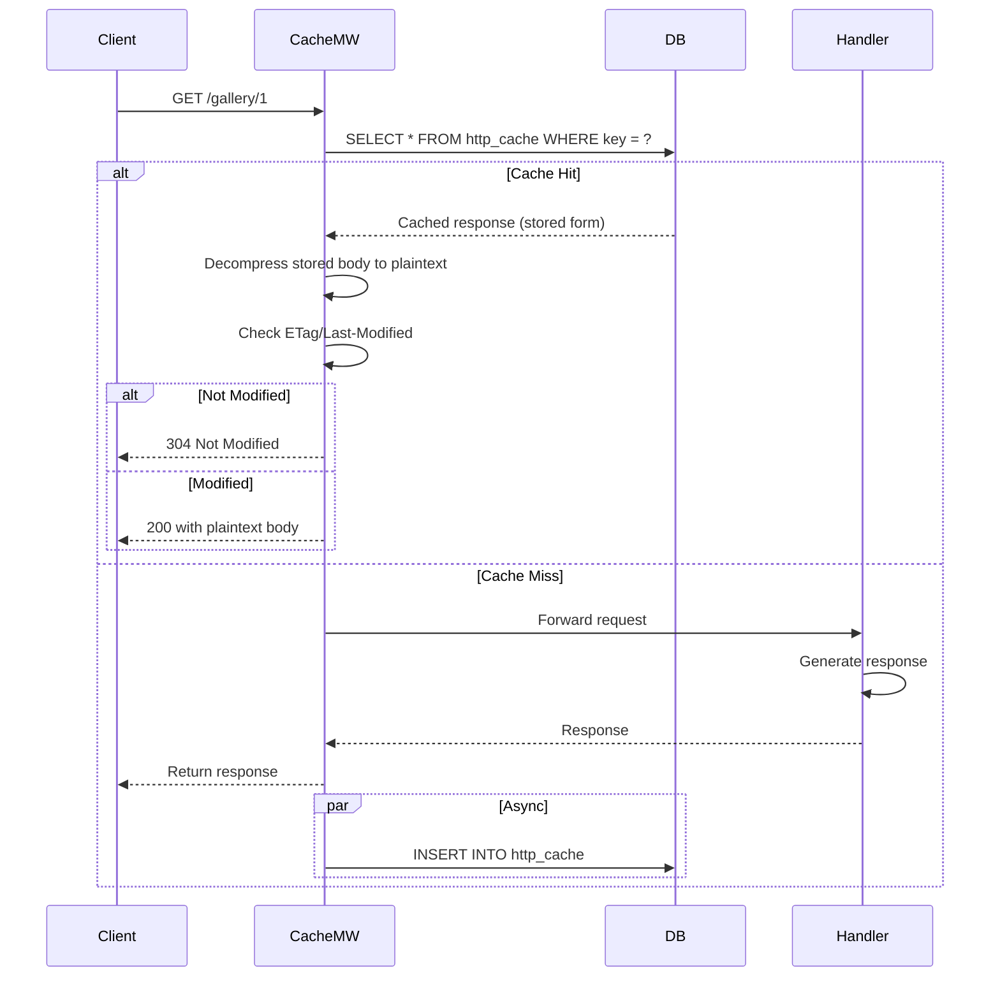
```mermaid
sequenceDiagram
    participant Client
    participant CacheMW
    participant DB
    participant Handler

    Client->>CacheMW: GET /gallery/1
    CacheMW->>DB: SELECT * FROM http_cache WHERE key = ?
    alt Cache Hit
        DB-->>CacheMW: Cached response (stored form)
        CacheMW->>CacheMW: Decompress stored body to plaintext
        CacheMW->>CacheMW: Check ETag/Last-Modified
        alt Not Modified
            CacheMW-->>Client: 304 Not Modified
        else Modified
            CacheMW-->>Client: 200 with plaintext body
        end
    else Cache Miss
        CacheMW->>Handler: Forward request
        Handler->>Handler: Generate response
        Handler-->>CacheMW: Response
        CacheMW-->>Client: Return response

        par Async
            CacheMW->>DB: INSERT INTO http_cache
        end
    end
```

### Cache Body Compression

HTTP cache response bodies may be **compressed at rest** in SQLite using a pluggable codec registry. This reduces the disk footprint of large cached gallery pages (samples up to ~10 MB each) without changing the on-wire representation.

- **No migration.** Read dispatch uses magic-prefix matching (primary) + `htmlsniff` (plaintext fallback). Legacy plaintext HTML rows (no compression magic) still HIT.
- `content_length` column stores the **uncompressed** size (HTTP `Content-Length` on replay; `MaxEntrySize` check).
- Disk accounting (`GetHttpCacheSizeBytes`, LRU eviction, batcher `OnSuccess`) uses **stored** bytes (`LENGTH(body)` / `len(Body)`).
- **Default write codec:** `zstd-1`. Configurable via `http_cache_body_codec` (YAML/DB/modal only; no `SFG_` env variable — same pattern as `etag_version`).
- Typical profile (~10 MB gallery page): encode ~56 ms, decode ~14 ms; `Match` + `htmlsniff` ≪1 ms per request.
- **`ErrUnrecognizedCacheBody`** (corrupt or unclassifiable blob) → MISS. The middleware logs a warning and falls through to handler re-render, which overwrites the bad row on store.

**Implementation lives entirely inside `internal/cachelite/`:**

- `body_storage.go` — `ConfigureBodyCodec`, `FinalizeForStorage`, `decodeCacheBodyForServe`
- `bodycodec/` — pluggable codec registry, `zstd-1`, `gzip-6`, `htmlsniff`
- No registry fields on `App` / `InfrastructureService`; configured via `cachelite.ConfigureBodyCodec()`.

**Cache Eviction:**

Cache eviction happens **after successful batch flush** in the `OnSuccess` callback:

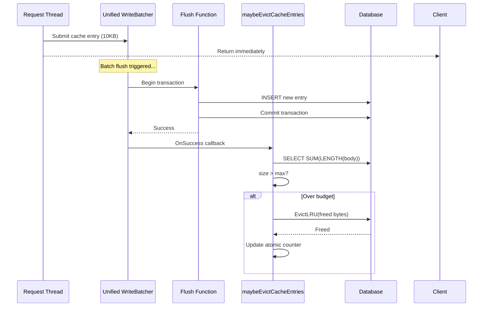
```mermaid
sequenceDiagram
    participant Req as Request Thread
    participant Batcher as Unified WriteBatcher
    participant Flush as Flush Function
    participant Evict as maybeEvictCacheEntries
    participant DB as Database

    Req->>Batcher: Submit cache entry (10KB)
    Req-->>Client: Return immediately

    Note over Batcher: Batch flush triggered...

    Batcher->>Flush: Begin transaction
    Flush->>DB: INSERT new entry
    Flush->>DB: Commit transaction
    Flush-->>Batcher: Success

    Batcher->>Evict: OnSuccess callback
    Evict->>DB: SELECT SUM(LENGTH(body))
    Evict->>Evict: size > max?
    alt Over budget
        Evict->>DB: EvictLRU(freed bytes)
        DB-->>Evict: Freed
        Evict->>Evict: Update atomic counter
    end
```

**Design Notes:**

- Eviction happens **outside the transaction** to avoid SQLite deadlocks
- Database is queried for actual size (source of truth)
- 10% buffer added to eviction target to avoid thrashing
- Atomic counter updated for runtime eviction calculations
- WAL checkpointing runs after every successful batch commit and periodically (every 5 minutes or when the WAL exceeds 256 MB); periodic `PRAGMA optimize` runs from `postCommitMaintenance` every `DBOptimizeInterval` (default 1h)

### Cache Preload

When a gallery page is requested, the system preloads related pages in the background:

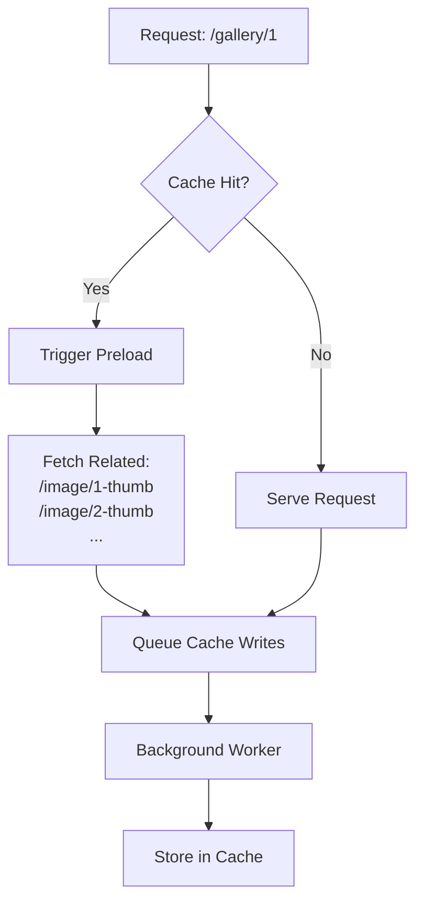
```mermaid
graph TB
    Request[Request: /gallery/1] --> CacheHit{Cache Hit?}
    CacheHit -->|Yes| Trigger[Trigger Preload]
    Trigger --> Fetch[Fetch Related:<br/>/image/1-thumb<br/>/image/2-thumb<br/>...]
    Fetch --> Queue[Queue Cache Writes]
    Queue --> Worker[Background Worker]
    Worker --> Store[Store in Cache]

    CacheHit -->|No| Serve[Serve Request]
    Serve --> Queue
```

**Preload Strategy:**

- Only cache hits trigger preload
- Preloads thumbnail images for the gallery
- Skips if client sends `X-Preload: skip` header
- Prevents thundering herd on first access

### Client-Side Caching

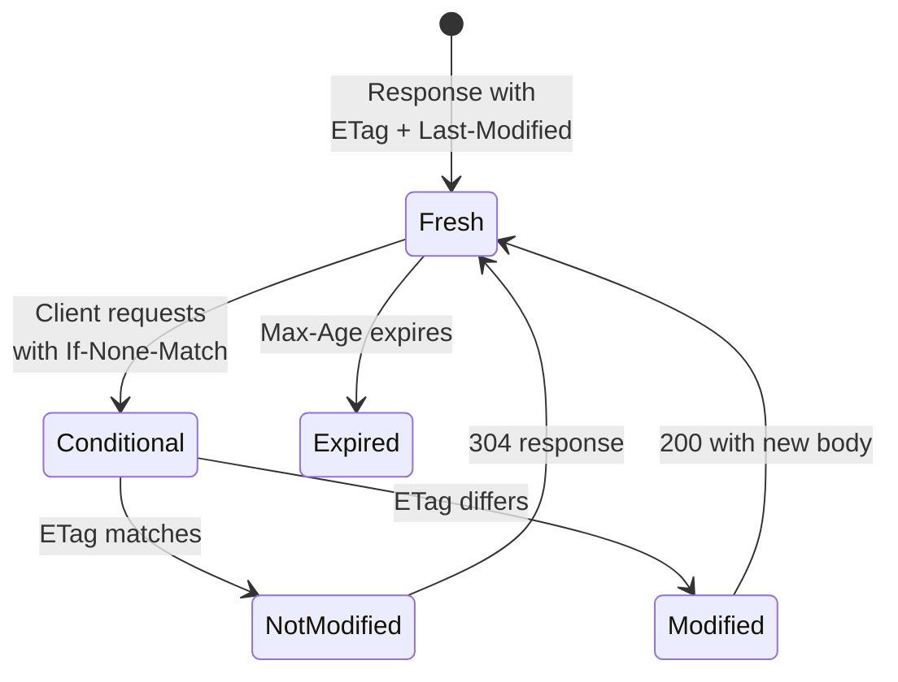
```mermaid
stateDiagram-v2
    [*] --> Fresh: Response with<br/>ETag + Last-Modified
    Fresh --> Conditional: Client requests<br/>with If-None-Match
    Conditional --> NotModified: ETag matches
    Conditional --> Modified: ETag differs

    NotModified --> Fresh: 304 response
    Modified --> Fresh: 200 with new body

    Fresh --> Expired: Max-Age expires
```

**Headers Set (gallery / lightbox):**

- `ETag`: `"<etagVersion>-<folderID>"` (content version + resource id; no theme or encoding)
- `Last-Modified`: File modification time
- `Cache-Control`: `public, max-age=2592000` (gallery) or handler-specific
- `Vary`: `HX-Request`, `HX-Target` on gallery (partial vs full page); not `Cookie` or `Accept-Encoding`

---

## Security Model

### Defense in Depth

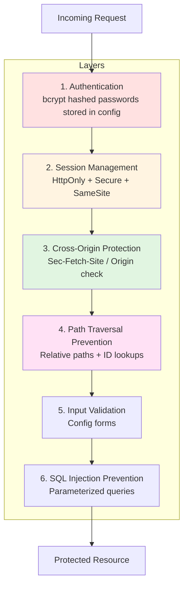
```mermaid
graph TB
    subgraph "Layers"
        L1[1. Authentication<br/>bcrypt hashed passwords stored in config]
        L2[2. Session Management<br/>HttpOnly + Secure + SameSite]
        L3[3. Cross-Origin Protection<br/>Sec-Fetch-Site / Origin check]
        L4[4. Path Traversal Prevention<br/>Relative paths + ID lookups]
        L5[5. Input Validation<br/>Config forms]
        L6[6. SQL Injection Prevention<br/>Parameterized queries]
    end

    Request[Incoming Request] --> L1
    L1 --> L2
    L2 --> L3
    L3 --> L4
    L4 --> L5
    L5 --> L6
    L6 --> Protected[Protected Resource]

    style L1 fill:#ffe1e1
    style L2 fill:#fff4e1
    style L3 fill:#e1f5e1
    style L4 fill:#ffe1f5
```

### Authentication Flow

```mermaid
stateDiagram-v2
    [*] --> Unauthenticated: Visit site
    Unauthenticated --> ModalOpened: Click login button
    ModalOpened --> LoginFetched: HTMX GET /login-form
    LoginFetched --> LoginSubmit: POST /login
    LoginSubmit --> CheckLockout{HX-Trigger:
auth-changed}
    CheckLockout -->|Account locked| LoginFail: Show error in modal
    CheckLockout -->|COP rejection| LoginFail: Show error in modal
    CheckLockout -->|Valid + locked| LockedCheck{Account<br/>locked?}
    LockedCheck -->|Yes| LoginFail: Show locked error
    LockedCheck -->|No| CredentialsCheck{bcrypt<br/>verify}
    CredentialsCheck -->|Invalid| LoginFail
    CredentialsCheck -->|Valid| AttemptsCheck{Failed<br/>attempts?}
    AttemptsCheck -->|Yes| ResetAttempts[Reset counter]
    AttemptsCheck -->|No| CreateSession
    ResetAttempts --> CreateSession
    CreateSession --> Authenticated: HX-Trigger:
auth-changed
    Authenticated --> Authenticated: Request with cookie
    Authenticated --> Unauthenticated: Logout / expire
```

**Account Lockout:**

- Credentials are stored in the `config` table (keys `user` and `password`), not in a separate `admin` table
- Threshold: configurable via `lockout_threshold` (default 3 failed attempts per account; minimum 1)
- Duration: configurable via `LockoutDuration` (`lockout_duration`, default 1 hour)
- Automatic unlock after duration
- Configured in the config modal **Session** tab under **Login security** (hot reload, no restart)

**IP login rate limiting:**

- Limits `POST /login` attempts per client IP per **60-second sliding window** (`internal/server/security/ratelimit.go`)
- Config key: `login_rate_limit_per_ip` (default **10**; **`0` disables** IP rate limiting)
- Enforced in `AuthHandlers.Login` **before** authentication (each POST counts, including failed auth)
- Uses `RemoteAddr` only (not `X-Forwarded-For`); behind a reverse proxy all clients may share the proxy IP unless the app sees distinct connection addresses
- Hot reload: `SyncLoginRateLimitMax` on config apply (`SetMax` + `Clear` on one limiter instance)
- Startup override: `SEPG_LOGIN_RATE_LIMIT_PER_IP` (see [ENV_CONFIGURATION.md](../ENV_CONFIGURATION.md)); no CLI flag
- Complements per-account lockout (IP cap vs. account lockout are independent)

### Cross-Origin Protection (COP)

Cross-site request forgery protection is handled entirely by the
`http.CrossOriginProtection` middleware. It does **not** use session tokens.

**How it works:**

- For unsafe methods (POST/PUT/DELETE/PATCH), the middleware validates the request
  origin via `Sec-Fetch-Site` header (preferred) or `Origin` header (fallback)
- The request origin must match the configured host, or be same-site
- `Host` header is preserved through reverse proxies so same-origin checks work
  behind Caddy / nginx (see [`DEPLOYMENT.md`](../DEPLOYMENT.md) and
  [`deploy/Caddyfile`](../deploy/Caddyfile); local smoke:
  [`deploy/Caddyfile.local`](../deploy/Caddyfile.local) +
  [`scripts/caddy-smoke.sh`](../scripts/caddy-smoke.sh))
- Wire compression is Caddy `encode zstd gzip` (not in-app); brotli needs a custom Caddy build
- Safe methods (GET/HEAD/OPTIONS) are allowed unconditionally
- No session token generation, no hidden form fields, no per-session state

**Why this approach:**

- Cache-friendly: cached responses do not embed per-session tokens
- Simpler architecture: no token generation, storage, or validation in request path
- Sufficient for a self-hosted app where the attack surface is a local network or
  limited domain

### Path Traversal Prevention

**Problem:** Prevent `../../../etc/passwd` attacks

**Solution 1: Relative Paths**

```
Database stores: "gallery/vacation/photo.jpg"
Joined with:    "/var/lib/sfpg/images"
Result:         "/var/lib/sfpg/images/gallery/vacation/photo.jpg"
```

**Solution 2: ID-Based Lookups**

```go
// Handler receives: /image/123
// Database lookup: SELECT * FROM files WHERE id = 123
// Returns path:     "gallery/vacation/photo.jpg"
// Construct:        /var/lib/sfpg/images/gallery/vacation/photo.jpg
```

**Solution 3: Path Validation**

Serving and discovery use `pathutil.SafeImagePath` (absolute join + prefix check) so `../` cannot escape `image_directory`. Import/discovery paths are normalized with `pathutil.RemoveImagesDirPrefix` (reject `..` segments and absolute paths outside the images root).

```go
// SafeImagePath — used before opening files for serve/thumbnail
absPath, err := pathutil.SafeImagePath(imagesDir, filePath)
if err != nil {
    // ErrPathTraversal, ErrInvalidPath, or ErrInvalidImagesDir
}

// RemoveImagesDirPrefix — used when storing relative paths in the DB
rel, err := pathutil.RemoveImagesDirPrefix(normalizedImagesDir, path)
```

---

## Configuration Management

### Configuration Sources & Precedence

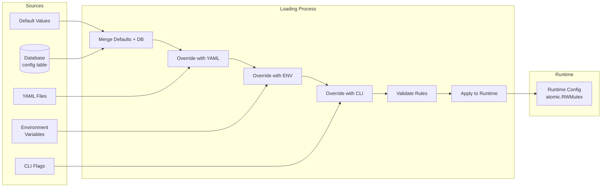
```mermaid
flowchart LR
    subgraph "Sources"
        Defaults[Default Values]
        Database[(Database<br/>config table)]
        YAML[YAML Files]
        ENV[Environment<br/>Variables]
        CLI[CLI Flags]
    end

    subgraph "Loading Process"
        M1[Merge Defaults + DB]
        M2[Override with YAML]
        M3[Override with ENV]
        M4[Override with CLI]
        Validate[Validate Rules]
        Apply[Apply to Runtime]
    end

    subgraph "Runtime"
        Config[Runtime Config<br/>atomic.RWMutex]
    end

    Defaults --> M1
    Database --> M1
    M1 --> M2
    YAML --> M2
    M2 --> M3
    ENV --> M3
    M3 --> M4
    CLI --> M4
    M4 --> Validate
    Validate --> Apply
    Apply --> Config
```

**Precedence (highest to lowest):**

1. CLI flags (`--port=8080`)
2. Environment variables (`SFG_PORT=8080`)
3. YAML files (`config.yaml`)
4. Database values (from `/config` page)
5. Default values (hardcoded)

The precedence inside `getopt.Parse()` is specifically CLI > Environment. `config.Load()` then applies Defaults → Database → YAML → CLI/Env.

### Precedence Hardening Guarantees (Mar 2026)

The startup and reload paths now document and enforce an explicit contract for pool-related settings.

Bug fixed:

- Symptom: `DBMaxPoolSize=500` was saved in the database, but active pools stayed at `100`.
- Root cause: `setDB()` executed before `loadConfig()`, so pools were created while `app.config` was `nil` and fell back to default pool sizing.
- Fix: `loadConfig()` now updates `app.config` and then calls `reconfigurePoolsFromConfig()` to recreate pools when loaded values differ from the effective (clamped) values.
- Prevention: dedicated precedence/startup/restart/UI regression tests plus startup diagnostics that explicitly log configured versus effective pool values.

Required sequencing constraint:

- `setDB()` may run before full config load to bootstrap database access.
- `loadConfig()` must run before normal serving and must be followed by `reconfigurePoolsFromConfig()` semantics.
- Any startup/restart path that loads or restores config must ensure pool reconciliation runs afterward.

Operational reconfiguration behavior:

- Triggered automatically at the end of `loadConfig()`.
- Triggered after `-restore-last-known-good` restores configuration.
- Triggered in fallback startup flows that synthesize defaults after config load failure.
- Pool recreation is skipped only when live max connections, min idle connections, and monitor interval all match the effective values — the interval comparison applies the `<= 0` → `1m` clamp, so a configured `db_pool_monitor_interval=0` matching a live `1m` monitor is a no-op.

Diagnostic logging for mismatch visibility:

- `pool config applied`: emits configured and effective RW/RO pool values, including the monitor interval keys `rw_configured_monitor_interval`, `rw_effective_monitor_interval`, `ro_configured_monitor_interval`, and `ro_effective_monitor_interval` (configured side is the raw config value, which may be `0`; effective side is the clamped live value).
- `configured/effective DB pool mismatch`: emits warning-level diagnostics when values diverge. A configured `db_min_idle_connections=0` is applied as effective 0 (no idle connections), not auto-sized; the default is 10. Mismatch warnings still apply when the configured min idle exceeds the max pool size.
- `startup config summary`: emits one low-noise startup snapshot of configured versus effective values for DB pools and other critical subsystems, including `db_configured_monitor_interval`, `db_rw_effective_monitor_interval`, and `db_ro_effective_monitor_interval` (configured is the raw config value; effective is the live pool interval, `0` when the pool has not been created yet).

Regression protections (consolidated root integration tests):

- Pool precedence and startup/restart sizing (`config_lifecycle_integration_test.go`):
  - `TestDBPoolPrecedence_PoolsIgnoreDatabaseConfig`
  - `TestDBPoolPrecedence_ConfigLoadedAfterPoolCreation`
  - `TestStartupWithDBConfig_PoolSizeHonored`
  - `TestRestartWithModifiedDBConfig_AppliesNewValues`
  - Prevents pools from staying on defaults or ignoring database config after restart.
- Broader precedence (`config_precedence_integration_test.go`):
  - `TestConfigPrecedence_*`, `TestCLI_*`, `TestConfigImport_*`
  - Prevents precedence drift across defaults/database/env/CLI layers.
- Config save/restart UI coverage:
  - Handler structure: `internal/server/handlers/config_post_test.go` and related handler tests (`ValidateHTMXResponseStructure` on restart-required responses; success message is main swap, badge OOB without `hidden`)
  - User-visible restart dialog: Playwright `expectRestartDialogOpen` in `tests/config-helpers.ts`; full save → restart flow in `tests/config.spec.ts` ("Config restart") and `tests/server-actions.spec.ts` ("Server restart")
  - Field-specific and UX paths: `tests/config.spec.ts` "13a: db_max_pool_size save opens restart dialog" (number field, not checkbox-only); "13b: Cancel after restart-required save closes cleanly" (originals snapshot refreshed after save)
  - HTMX swap contract (no full admin round-trip): `tests/htmx-restart-alert.spec.ts` — reads `config-save-restart-alert.html.tmpl` from disk and asserts badge loses `hidden` after outerHTML/OOB processing (`air` on `:8083` prerequisite)
  - Persistence-only: `web-testsuite/config_modal_test.go` (HTTP-level; does **not** cover the restart modal UX)
  - Prevents config UI regressions from silently breaking persistence or restart signaling.
- Pool monitor bootstrap and reconfigure skip:
  - `TestCreateDatabasePools` (extended asserts)
  - `TestCreateDatabasePools_MinIdleZero`
  - `TestCreateDatabasePools_ZeroIntervalClampedToDefault`
  - `TestCreateDatabasePools_PositiveIntervalApplied`
  - `TestInfrastructureService_ReconfigurePools_NoOpWhenUnchanged` (updated)
  - `TestInfrastructureService_ReconfigurePools_RecreatesWhenOnlyIntervalDiffers`
  - `TestInfrastructureService_ReconfigurePools_NoOpWhenConfiguredIntervalZeroMatchesClampedLive`
  - `TestDBPoolMonitorBootstrap_NilSetDBLoadDefaultsLiveInterval`
  - `TestInfrastructureService_LogDBPoolConfiguredVsEffective_NormalPath` (keys)
  - `TestLogStartupConfigSummary_EmitsConfiguredVsEffective` (keys)
  - `TestMonitor_ContinuesAfterEmptyShrinkDefault`
  - Prevents nil-config / `<= 0` interval regressions, the skip-interval reconfigure bug, monitor-interval log key drift, and monitor shutdown on empty-channel shrink.

### Configuration Schema

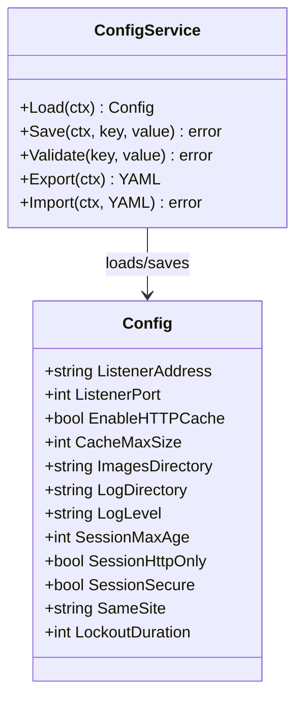
```mermaid
classDiagram
    class Config {
        +string ListenerAddress
        +int ListenerPort
        +bool EnableHTTPCache
        +int CacheMaxSize
        +string ImagesDirectory
        +string LogDirectory
        +string LogLevel
        +int SessionMaxAge
        +bool SessionHttpOnly
        +bool SessionSecure
        +string SameSite
        +int LockoutDuration
    }

    class ConfigService {
        +Load(ctx) Config
        +Save(ctx, key, value) error
        +Validate(key, value) error
        +Export(ctx) YAML
        +Import(ctx, YAML) error
    }

    ConfigService --> Config : loads/saves
```

### Hot Configuration Changes

Some configuration changes can be applied without restart:

```mermaid
stateDiagram-v2
    [*] --> Running
    Running --> ConfigChanged: User saves config

    ConfigChanged --> CheckType{What changed?}

    CheckType -->|Listener address/port| RestartRequired
    CheckType -->|Images directory| RestartRequired
    CheckType -->|Log directory| RestartRequired
    CheckType -->|Cache settings| RuntimeUpdate
    CheckType -->|Session settings| RuntimeUpdate

    RestartRequired --> Restart: Request process restart
    RuntimeUpdate --> Running: Apply immediately

    Restart --> Restarting[Graceful process re-exec]
    Restarting --> Running
```

**Restart behavior:**

A web-triggered restart is a full process re-exec (`syscall.Exec`). The running
process shuts down its HTTP server, flushes pending writes, closes database pools,
and replaces itself with a fresh process image. The new process reloads
configuration from the database and reinitializes all runtime services (HTTP cache,
worker pool, batch-load manager, etc.). There is no longer a separate "HTTP-only"
listener reload.

---

## Utilities & Libraries

### Reusable Components

#### workerpool

**Purpose:** Dynamic worker pool with auto-scaling

```go
pool := workerpool.NewPool(ctx, db, 0, 0, 10*time.Second)
pool.AddTask(task)  // Blocks if queue full
pool.Shutdown()     // Drains queue then exits
```

**Features:**

- Bounded queue (10,000 capacity)
- Idle workers exit after timeout
- Graceful shutdown (drains queue)
- Statistics (active workers, queue size)

#### scheduler

**Purpose:** Cron-like task scheduler

```go
sched := scheduler.NewScheduler(5)  // Max 5 concurrent
sched.AddTask(task, scheduler.Daily, time.Now())
sched.Start(ctx)  // Blocks until ctx cancelled
```

**Features:**

- One-time, hourly, daily, weekly, monthly tasks
- Drift-free intervals
- Context-based cancellation
- Error isolation

#### writebatcher

**Purpose:** Generic, transaction-batching write serializer with optional persistent overflow

```go
wb, err := writebatcher.New[MyItem](ctx, writebatcher.Config[MyItem]{
    BeginTx:      func(ctx context.Context) (*sql.Tx, error) { ... },
    Flush:        func(ctx context.Context, tx *sql.Tx, batch []MyItem) error { ... },
    OnSuccess:    func(batch []MyItem) { ... }, // Optional cleanup
    MaxBatchSize: 100,
    DQueDirPath:  "/var/lib/sfpg/overflow",   // optional: persistent overflow queue
})
wb.Submit(item)
```

**Benefits:**

- Eliminates write contention on single-writer databases like SQLite
- Automatically flushes on size (count or bytes), interval, or Close()
- Single background worker handles all flushes synchronously
- When `DQueDirPath` is set, overflows the in-memory channel to `dque` (absorbs bursts, crash recovery, drain-on-close) instead of returning `ErrFull`

#### dque

**Purpose:** Generic, segment-backed persistent on-disk FIFO queue

```go
q, err := dque.New[Item]("name", dirPath, itemsPerSegment)
q.Enqueue(&item)   // append
item, err := q.Dequeue()
q.Size()
```

**Features:**

- Segment-based storage (tunable items per segment)
- File locking via `internal/flock` (single accessor per directory)
- Used by `writebatcher` for durable overflow and crash recovery
- Backs the production discovery work queue as a disposable wipe-on-start backlog (`discovery-dque/` in the database directory, e.g. `DB/discovery-dque/` beside the main database file; distinct from the writebatcher `<db>-dque/` overflow dir)

#### flock

**Purpose:** Minimal cross-platform file locking (flock on Unix, `LockFileEx` on Windows). Used by `dque` to ensure a single accessor per queue directory.

#### gallerylib

**Purpose:** File import logic — `Importer` performs path-chain upserts (folders + file record) and tracks which directories already had their folder-tile chain updated. Constructed once per write batch and reused across files so its `folderCache` and `tiledDirs` memoize across the batch.

#### queue

**Purpose:** Thread-safe dynamically-resizing deque

```go
q := queue.New[string]()
q.PushBack("item")     // Add to back
q.PopFront()           // Remove from front
q.Len()                // Current size
```

**Features:**

- O(1) push/pop from both ends
- Auto-grows by powers of 2
- Auto-shrinks when < 25% full
- Zero allocations after warmup

#### gensyncpool

**Purpose:** Reduce allocations with sync.Pool

```go
pool := gensyncpool.NewPool(func() *Item {
    return &Item{}
})
item := pool.Get()
// ... use item ...
pool.Put(item)  // Return to pool
```

**Used For:**

- `[]byte` buffers (read/write buffers)
- `HTTPCacheEntry` objects (cache responses)
- Reduces GC pressure significantly

#### dbconnpool

**Purpose:** SQLite connection pooling with WAL mode

```go
pool := dbconnpool.New(ctx, dbPath, 10, 2)
conn, err := pool.Get(ctx)
// ... use conn ...
pool.Put(conn)
```

**Features:**

- Separate read/write pools
- WAL mode enabled
- Connection validation
- Graceful shutdown

#### imagemeta

**Purpose:** EXIF/XMP metadata extraction (forked)

`internal/imagemeta` is a fork of [`github.com/evanoberholster/imagemeta`](https://github.com/evanoberholster/imagemeta) v0.3.1
(MIT-licensed), vendored as a git submodule at [`github.com/lbe/imagemeta`](https://github.com/lbe/imagemeta)
and wired into the module graph via a `replace` directive in `go.mod`:

```
replace github.com/evanoberholster/imagemeta => ./internal/imagemeta
```

Upstream was merged at submodule commit `653f189`, bringing the package restructure:
`exif2` → `meta/exif`, top-level `jpeg` → `meta/jpeg`, and XMP under `meta/xmp`
(plus `meta/logging` shared helpers). The fork has diverged further with
project-specific enhancements that would be difficult to upstream cleanly:

| Area                                     | Changes                                                           |
| ---------------------------------------- | ----------------------------------------------------------------- |
| **Canon makernotes**                     | Enhanced Canon metadata handling and makernote parsing            |
| **Apple makernotes**                     | New Apple makernote package                                       |
| **XMP**                                  | XMP namespace additions and improvements                          |
| **GPS / EXIF**                           | Improved GPS IFD, EXIF IFD, and coordinate parsing                |
| **Image type detection**                 | Expanded magic byte signatures, BMFF/JXL detection, SVG sniffing, |
| subtype detection, ExifTool-style naming |
| **pHash**                                | Deterministic perceptual hash across x86-64 and ARM64             |
| **CI / linting**                         | Harden golangci-lint configuration and security checks            |

**Fork policy:**

- **Status:** Maintain separately. The upstream repository sees limited activity,
  and the fork carries substantial enhancements tailored to this project's needs.
- **Upstream merging:** The fork periodically merges upstream changes to stay
  current with any bug fixes or CL improvements. Merge commits are visible in the
  submodule history.
- **Future direction:** Maintain as a fork with selective upstream pulls. The
  merge at `653f189` demonstrates that re-integrating upstream is feasible;
  future upstream changes will be pulled in selectively as needed rather than
  cherry-picked wholesale. If the upstream project becomes active again,
  individual improvements could be contributed back on a case-by-case basis.

**sfpg-go consumption:**

- `internal/server/files/metadata_xmp.go` — imports `meta/exif`, `meta/jpeg`, and
  `meta/logging`; decodes JPEG metadata via `jpeg.ScanJPEGWithSourceContext` with
  a timeout context so embedded XMP extension segments are captured.
- `internal/server/files/metadata.go` — `ExtractExifData` remaps fields from the
  nested `exif.Exif` struct (`IFD0`, `ExifIFD`, `GPS`, `SelectedDate()`) into the
  `File.Exif` database columns.
- `go.mod` — `replace github.com/evanoberholster/imagemeta => ./internal/imagemeta`.

EXIF decode runs `ScanJPEGWithSourceContext` under a timeout context; the non-JPEG
`imageMetaDecode` path has no context timeout (accepted limitation).

### Testing Utilities

#### testutil

**Purpose:** Common test helpers

```go
testutil.Equals(t, want, got)
testutil.Contains(t, haystack, needle)
testutil.Panics(t, func() { ... })
testutil.HTMLContains(t, html, selector)
```

#### gen-test-files

**Purpose:** Generate synthetic test files

```go
gentestfiles.Generate(dir,
    gentestfiles.File("test.jpg", 1024, 800, 600),
    gentestfiles.Dir("gallery",
        gentestfiles.File("photo1.jpg", 2048, 1920, 1080),
    ),
)
```

---

## Performance Optimizations

### Optimization Techniques

| Technique                        | Where Used         | Impact                                            |
| -------------------------------- | ------------------ | ------------------------------------------------- |
| **Post-flush eviction**          | HTTP cache         | Removes eviction from request path                |
| **Atomic size tracking**         | Cache              | Avoids `SELECT SUM()` on every write              |
| **Connection pooling**           | Database           | Enables concurrent reads                          |
| **Batch writes**                 | File processing    | 10-100x throughput improvement                    |
| **Persistent overflow**          | WriteBatcher       | Absorbs bursts without dropping writes (dque)     |
| **Crash recovery**               | WriteBatcher       | Pending writes survive process restarts (dque)    |
| **Prepared-statement threading** | WriteBatcher flush | Reuses compiled query plans (BeginTx/WithTx)      |
| **Intra-batch memoization**      | gallerylib         | Eliminates repeated folder/path queries per batch |
| **Gob persistence**              | BatchedWrite/File  | Enables on-disk overflow serialization            |
| **Resource reclamation**         | WriteBatcher       | Pooled objects returned on success                |
| **Object pooling**               | Cache entries      | Reduces allocations by ~80%                       |
| **Stream processing**            | Image serving      | Low memory per request                            |
| **Cache preload**                | Gallery pages      | 50-100ms faster subsequent loads                  |
| **Index optimization**           | Database queries   | 2-5x faster queries                               |

### Performance Timeline

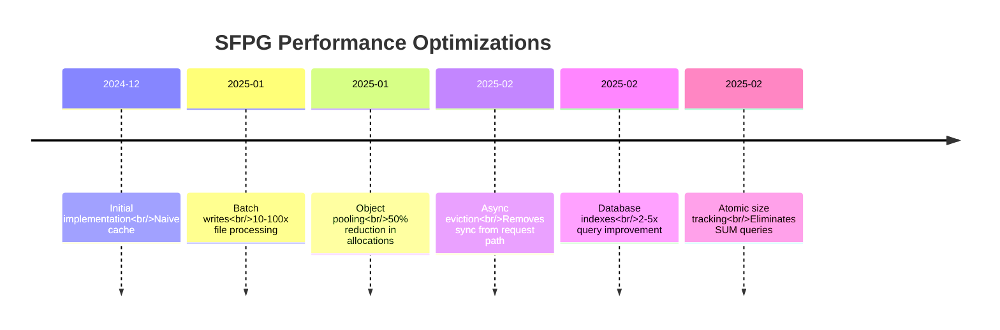
```mermaid
timeline
    title SFPG Performance Optimizations
    2024-12 : Initial implementation<br/>Naive cache
    2025-01 : Batch writes<br/>10-100x file processing
    2025-01 : Object pooling<br/>50% reduction in allocations
    2025-02 : Async eviction<br/>Removes sync from request path
    2025-02 : Database indexes<br/>2-5x query improvement
    2025-02 : Atomic size tracking<br/>Eliminates SUM queries
```

### PRAGMA Optimize Strategy

SQLite `PRAGMA optimize` triggers the query planner to update `sqlite_stat1` statistics
for better index selection. In SFPG, **pool-aware** optimize is handled by
[`internal/dbconnpool/pragma.go`](../../internal/dbconnpool/pragma.go) — the
runner lives in the connection-pool package (never in `database`) and operates
on a single `*sql.Conn`.

| Scenario  | Mask                         | When                                                                |
| --------- | ---------------------------- | ------------------------------------------------------------------- |
| Startup   | `0x10002` (fresh connection) | Async after listen + quiet; once per process                        |
| Periodic  | `0` (plain)                  | Every `DBOptimizeInterval` (default 1h) via `postCommitMaintenance` |
| Migration | `0` (plain)                  | Sync, only when migration actually applied                          |
| Discovery | `0` (plain)                  | Scheduled non-blocking before `return` in discovery completion      |
| Shutdown  | `0` (plain)                  | After batcher close, before pool close; 30s timeout                 |

- **SQLite 3.53.2**: `PRAGMA optimize` auto-limits analysis scope; do **not** add
  manual `PRAGMA analysis_limit`.
- **Stats target**: `sqlite_stat1` table; not per pooled connection.
- **No writebatcher coupling**: Periodic timing uses its own
  `lastPragmaOptimizeRun` atomic, ignoring the writebatcher's `lastOptimizeTime`
  (which had a reset bug that prevented hourly runs from ever firing).

### Benchmarks

**Cache Middleware (with async eviction):**

```
BenchmarkCacheMiddleware_CacheHit-8          5000000    250 ns/op
BenchmarkCacheMiddleware_CacheMiss-8          1000000   1250 ns/op
```

**File Processing (with batching):**

```
BenchmarkFileProcessing_100Files_Batched-8    100       10000000 ns/op  (100ms)
BenchmarkFileProcessing_100Files_Individual-8  10        100000000 ns/op (1000ms)
```

---

## Testing Strategy

### Test Organization

The test suite uses **build tags** to separate unit tests from integration tests:

- **Unit Tests**: Default tests (no build tag), fast, no external dependencies
- **Integration Tests**: Files ending in `_integration_test.go` with `//go:build integration` tag
- **E2E Web Tests**: Package `web-testsuite/` with `//go:build e2eweb` tag (HTTP-level tests against a running server)
- **Benchmarks**: Performance tests (run with `-bench` flag)

```
internal/
├── cachelite/
│   ├── cache_test.go                          # Unit tests (default)
│   ├── http_cache_middleware_test.go          # Unit tests (default)
│   ├── http_cache_middleware_integration_test.go  # Integration tests
│   └── cache_benchmark_test.go                # Benchmarks
├── server/                                    # 27 root *_test.go files
│   ├── helpers_test.go                        # CreateApp, shared test options
│   ├── server_test.go                         # Unit tests (default)
│   ├── app_test.go                            # App + handler manager unit tests
│   ├── app_lifecycle_unit_test.go             # App lifecycle unit tests
│   ├── app_lifecycle_integration_test.go      # Run/Serve/restart integration
│   ├── app_maintenance_test.go                # Maintenance task unit tests
│   ├── server_integration_test.go             # Router/middleware integration
│   ├── config_lifecycle_integration_test.go   # Config DB lifecycle integration
│   ├── config_precedence_integration_test.go  # Precedence integration/e2e
│   ├── logging_integration_test.go            # Logging integration/e2e
│   ├── cache_batch_load_integration_test.go   # Cache batch load integration
│   ├── writebatcher_dque_lifecycle_integration_test.go  # dque overflow integration
│   ├── discovery_dque_test.go                 # Discovery dque unit tests
│   ├── folder_index_sql_guard_test.go         # Folder index SQL guard tests
│   ├── trigger_discovery_test.go            # TriggerDiscovery unit tests
│   ├── infrastructure_service_test.go         # InfrastructureService unit
│   ├── infrastructure_service_integration_test.go
│   ├── infrastructure_pragma_test.go          # PRAGMA optimize scheduling
│   ├── infrastructure_cache_calibration_test.go
│   ├── batcher_wiring_test.go
│   ├── runtime_manager_test.go                # RuntimeManager unit
│   ├── runtime_manager_integration_test.go
│   ├── subsystem_manager_test.go
│   ├── subsystem_manager_integration_test.go
│   ├── metrics_adapters_test.go
│   ├── quiet_once_test.go                     # Quiet-once logging helper tests
│   ├── helpers_integration_test.go            # Shared auth helpers
│   └── files/
│       ├── service_test.go                    # Unit tests (default)
│       └── files_integration_test.go          # Integration tests
└── workerpool/
    ├── workerpool_test.go                     # Unit tests
    └── mock.go                                # Test doubles
```

Root `internal/server/*_test.go` files are listed in the test layout above (27 files).

**Running tests:**

```bash
# Unit tests only (fast, default)
go test ./...

# Integration tests only
go test -tags integration ./...

# All tests (unit + integration)
go test -tags integration ./...

# Specific integration test file
go test -tags integration ./internal/server -run TestConfigIntegration
```

### Test Coverage

| Package          | Coverage | Type               | Notes                             |
| ---------------- | -------- | ------------------ | --------------------------------- |
| **cachelite**    | 85%+     | Unit + Integration | Unified batcher + eviction tested |
| **workerpool**   | 90%+     | Unit               | Pool dynamics and scaling         |
| **scheduler**    | 85%+     | Unit               | Task scheduling and cancellation  |
| **dbconnpool**   | 80%+     | Integration        | Connection pool behavior          |
| **server**       | 75%+     | Integration        | Unified batcher workflows         |
| **writebatcher** | 95%+     | Unit               | Batching and flush logic          |
| **files**        | 80%+     | Unit + Integration | File processing pipeline          |

### Test Categories

1. **Unit Tests**: Test individual functions/packages (default, fast)
2. **Integration Tests**: Test package interactions (requires `-tags integration`)
3. **End-to-End Tests**: Test complete workflows (subset of integration)
4. **Benchmarks**: Measure performance

### Test Location Conventions

Where each test category lives and how to choose the right seam.

#### Unit Tests

- Live in `*_test.go` files in the same package as the code under test.
- Run with `go test ./...` (no build tag).
- Should be fast and isolated; prefer fakes and mocks over real databases or full server startup.

#### Integration Tests

- Live in `*_integration_test.go` files guarded by `//go:build integration`.
- Run with `go test -tags integration ./...`.
- May use real SQLite databases, cross-package wiring, or the full HTTP router.

#### E2E Web Tests

- Live in `web-testsuite/*_test.go` guarded by `//go:build e2eweb`.
- Run with `go test -tags e2eweb ./web-testsuite/...` or as part of `make test-all` (`-tags "integration e2eweb"`).
- Exercise the running application over HTTP (auth, gallery, config modal, lightbox, etc.).

#### E2E / Browser Tests

- Live in `tests/*.spec.ts` as Playwright specifications.
- Exercise the running application through a real browser.
- Shared helpers: `tests/helpers.ts`, `tests/global-setup.ts`.

#### Choosing a Test Seam

| Seam                                   | Location                                                                                | Cost     | Use When                                                                                                                                                 |
| -------------------------------------- | --------------------------------------------------------------------------------------- | -------- | -------------------------------------------------------------------------------------------------------------------------------------------------------- |
| `mockConfigOps`                        | `internal/server/handlers/helpers_test.go`                                              | Very low | Unit-testing config/theme handlers that only need `interfaces.ConfigOps` / `func() *config.Config`.                                                      |
| `mockGalleryOps`                       | `internal/server/handlers/helpers_test.go`                                              | Very low | Unit-testing gallery/image/info-box handlers that only need `interfaces.GalleryOps`.                                                                     |
| `mockServerControl`                    | `internal/server/handlers/helpers_test.go`                                              | Very low | Unit-testing server/dashboard handlers that only need `interfaces.ServerControl`.                                                                        |
| `mockTemplateHelpers`                  | `internal/server/handlers/helpers_test.go`                                              | Very low | Unit-testing handlers that need `AddCommonTemplateData` and `ServerError` helpers.                                                                       |
| `fakeCredentialStore`                  | `internal/server/handlers/helpers_test.go`                                              | Very low | Unit-testing auth handlers that only need `interfaces.CredentialStore`.                                                                                  |
| `setupTestConfigHandlers`              | `internal/server/handlers/config_etag_test.go`                                          | Low      | Unit-testing config handlers with mocked `config.ConfigService` and `auth.AuthService`.                                                                  |
| `setupTestDB` / `setupTestDBForConfig` | `internal/server/config/config_test.go`, `internal/server/config_helpers_test.go`, etc. | Medium   | Testing config/database logic that needs a real migrated SQLite database (in-memory or temp file).                                                       |
| `*.testSeams.*`                        | `internal/server/testseams.go` + manager structs                                        | Low–Med  | Stubbing App/manager lifecycle paths (serve, restart, pool recreate, handler build, cache hooks) without full `CreateApp` when a narrower seam suffices. |
| `CreateApp`                            | `internal/server/helpers_test.go`                                                       | High     | Testing full routing, middleware, lifecycle, or anything that requires a wired `*server.App`. Use sparingly.                                             |

Prefer the lightest seam that exercises the behavior under test. `CreateApp` is appropriate when the test must verify interactions across handlers, middleware, sessions, the worker pool, or the database pools. For handler business logic in isolation, use the narrow per-group mocks (`mockConfigOps`, `mockGalleryOps`, `mockServerControl`, `mockTemplateHelpers`, `fakeCredentialStore`) or `setupTestConfigHandlers` instead. For App or manager lifecycle paths, prefer explicit `app.testSeams.*` or `app.<Manager>.testSeams.*` over embedding-promoted field names.

Integration tests that need custom `HandlerQueries` should set `app.InfrastructureService.testSeams.HandlerQueries` (not `app.testHookHandlerQueries`).

See also `AGENTS.md` for the project's testing workflow (for example, run `make test-all` once and grep the saved output rather than piping `go test` directly).

### Running Tests

```bash
# Unit tests only (fast, default - recommended for TDD)
go test ./...

# Integration tests only
go test -tags integration ./...

# E2E web tests only
go test -tags e2eweb ./web-testsuite/...

# All tests (unit + integration + e2eweb) — same as make test-all
go test -tags "integration e2eweb" ./...

# Browser tests (Playwright; separate from go test)
make test-browser

# Specific package
go test ./internal/cachelite/...

# With coverage
go test -cover ./...
go test -tags "integration e2eweb" -cover ./...

# Run benchmarks
go test -bench=. ./internal/cachelite/...

# Race detection
go test -race ./...
go test -tags "integration e2eweb" -race ./...
```

### Recent Testing Improvements (Feb 2026)

**Build Tag Separation:**

- Separated fast unit tests from slower integration tests
- Integration tests now require explicit `-tags integration` flag
- Faster CI/CD pipelines: unit tests run in <5s, integration in ~20s

**Concurrency Fixes:**

- Fixed race condition in cache write batch collection (data loss during shutdown)
- Added lock ordering documentation to prevent deadlocks
- Improved goroutine lifecycle management in ParallelWalk
- Added context cancellation handling in multiple worker loops

**Test Quality:**

- Comprehensive table-driven tests (285 `t.Run()` across 45 files)
- Descriptive error messages with input/got/want context
- Proper cleanup with `t.Cleanup()` where appropriate
- See `references/tdd_process.md` and `references/methodology-html-content-test-writing.md` for testing methodology details

### Recent Testing Improvements (Jul 2026)

**Phase 2 consolidation (WP-51 … WP-54, WP-16):**

- Reduced root `internal/server/*_test.go` files from 74 → **23**
- Root `CreateApp` mentions from 135 → **64**; 0 uncovered `internal/server/` functions (default + integration)

**Test seam extraction (WP-17, WP-18):**

- Removed all `testHook*` fields from `App` and embedded managers
- Centralized optional doubles in `internal/server/testseams.go` (`AppTestSeams`, `InfrastructureTestSeams`, `RuntimeManagerTestSeams`, `HandlerManagerTestSeams`)
- Tests use explicit `*.testSeams.*` accessors; no promoted `app.testHook*` assignments

---

## Frontend Architecture

**Last Updated:** 2026-09-02

SFPG uses a **hypermedia-driven, mobile-first** frontend built entirely with Go HTML templates, HTMX, Hyperscript, daisyUI, and TailwindCSS. There is no JavaScript framework and no client-side state management.

### Design Principles

- **No JavaScript** — all interactivity via HTMX (HTML-over-the-wire) and Hyperscript
- **Mobile-first** — touch devices are first-class; desktop enhancements are additive
- **iOS safe areas** — `env(safe-area-inset-bottom)` used on body and modals to clear the home indicator
- **Responsive layout** — flexbox wrapping instead of fixed-grid for gallery tiles

### Gallery Tile Layout

Gallery tiles use a `flex flex-wrap justify-center gap` container so tiles reflow naturally at all viewport widths without JavaScript. Each tile uses the daisyUI `card` component.

Thumbnail images use `object-contain` inside a `<figure>` element so portrait and landscape images display without cropping, regardless of aspect ratio.

Long filenames and directory names are truncated with **center-ellipsis** (preserving both prefix and suffix) rather than right-truncation, so the file extension and end of the name remain readable.

### Lightbox Touch Navigation

The lightbox supports swipe navigation on touch devices via Hyperscript `pointerdown`/`pointerup` handlers:

- **Threshold:** 48px horizontal displacement required to trigger a swipe
- **Drift guard:** ±40px vertical tolerance prevents accidental swipes during vertical scrolling
- **Ghost tap prevention:** a `:didSwipe` flag suppresses the `click` event that fires after a swipe
- **Button visibility:** prev/next nav buttons are hidden on mobile (`hidden sm:flex`); swipe replaces them
- **Modal height:** uses `100dvh` (dynamic viewport height) with `env(safe-area-inset-bottom)` subtracted for correct iOS Safari rendering

### Mobile Info Panel

On touch devices (detected via CSS `hover:none` and `pointer:coarse` media queries), the desktop sidebar info box is hidden entirely and replaced with a dedicated modal:

| Element              | Desktop                  | Mobile                 |
| -------------------- | ------------------------ | ---------------------- |
| `#box_info_wrapper`  | Visible sidebar (toggle) | `display:none` via CSS |
| `#info-btn`          | Visible (`sm:flex`)      | Hidden (`hidden`)      |
| `#info-btn-mobile`   | Hidden (`sm:hidden`)     | Visible (`flex`)       |
| `#mobile_info_modal` | —                        | daisyUI checkbox modal |

Content is mirrored from `#box_info` into `#box_info_mobile` on every HTMX swap via a Hyperscript `on htmx:afterSwap` handler, so the modal always reflects the latest selection without an extra network request.

The dashboard suppresses the sidebar entirely — `#box_info_wrapper` is hidden via Hyperscript `init` when `#dashboard-container` is detected in the DOM.

### Dashboard Typography

The dashboard uses a compact typography scale optimised for dense metric display:

| Element          | Before                 | After                        |
| ---------------- | ---------------------- | ---------------------------- |
| Page heading     | `text-3xl font-bold`   | `text-2xl font-semibold`     |
| Section headings | `text-lg`              | `text-base`                  |
| Card titles      | `card-title text-base` | plain `h3 text-sm`           |
| Stat labels      | (no size)              | `text-xs`                    |
| Stat values      | `font-mono text-2xl`   | `font-semibold text-lg/base` |

Removing `font-mono` from stat values aligns them with the rest of the UI's sans-serif type while `font-semibold` maintains visual weight.

### Template Files

| Template                     | Purpose                                                                     |
| ---------------------------- | --------------------------------------------------------------------------- |
| `layout.html.tmpl`           | Shell, footer toolbar, mobile info modal, lightbox modal, safe-area padding |
| `gallery.html.tmpl`          | Flex tile grid, HTMX gallery content, mobile info sync                      |
| `lightbox-content.html.tmpl` | Lightbox image, swipe handlers, prev/next buttons                           |
| `infobox-image.html.tmpl`    | Image metadata panel (loaded into `#box_info`)                              |
| `infobox-folder.html.tmpl`   | Folder metadata panel (loaded into `#box_info`)                             |
| `dashboard.html.tmpl`        | Admin metrics dashboard                                                     |

---

## Appendix

### File Structure

```
sfpg-go/
├── cmd/
│   ├── sfpg-go-dashboard/       # TUI dashboard entry point
│   └── (main package at root)   # Main application entry point (root main.go)
├── docs/
│   ├── diagrams/                # Architecture diagrams
│   ├── ARCHITECTURE.md          # This file
│   └── SERVER_DEEP_DIVE.md      # Server package entry point
├── internal/
│   ├── cachelite/               # HTTP response caching
│   ├── tableswap/               # Atomic SQLite table rotation
│   ├── rssmonitor/              # Optional Linux process RSS monitor
│   ├── sqlite3stat/             # SQLite connection memory-status helpers
│   ├── workerpool/              # Concurrent task processing
│   ├── scheduler/               # Task scheduling
│   ├── queue/                   # Generic deque
│   ├── writebatcher/            # Batch database operations (with overflow)
│   ├── dque/                    # Persistent on-disk FIFO (writebatcher overflow + discovery backlog)
│   ├── flock/                   # Cross-platform file locking
│   ├── errors/                  # Error sentinels for dque
│   ├── dbconnpool/              # Connection pooling
│   ├── gallerydb/               # Database queries (sqlc)
│   ├── gallerylib/              # File import / path-chain upserts
│   ├── thumbnail/               # Thumbnail generation
│   ├── imagemeta/               # EXIF extraction (local replace of evanoberholster/imagemeta)
│   ├── parallelwalkdir/         # Concurrent directory scanning
│   ├── gensyncpool/             # Reset-enforcing sync.Pool wrappers
│   ├── getopt/                  # Config from flags/env
│   ├── multihandler/            # Multi-handler structured logging
│   ├── profiler/                # Optional CPU/mem/block profiling
│   ├── coords/                  # Geographic coordinate parsing
│   ├── humanize/                # Human-readable formatting
│   ├── log/                     # Structured logging wrappers
│   ├── testutil/                # Shared test helpers
│   ├── gen-test-files/          # Synthetic test file generation
│   ├── server/                  # Web server
│   │   ├── app.go, server.go, router.go
│   │   ├── infrastructure_service.go, runtime_manager.go, handler_manager.go, subsystem_manager.go
│   │   ├── testseams.go         # App/manager test doubles
│   │   ├── auth/                # Authentication service
│   │   ├── cachebatch/          # Cache batch-load coordination
│   │   ├── cachepreload/        # Cache preload manager
│   │   ├── conditional/         # ETag/304 helper package
│   │   ├── config/              # Configuration management
│   │   ├── database/            # Database setup and pools
│   │   ├── files/               # File processing pipeline
│   │   ├── handlers/            # Route handlers (auth, gallery, config, menu, theme, etc.)
│   │   ├── interfaces/          # Handler dependency interfaces
│   │   ├── logging/             # Logging helpers
│   │   ├── metrics/             # Runtime metrics
│   │   ├── middleware/          # HTTP middleware (auth, conditional, logging, loopback)
│   │   ├── modulestate/         # Module active-state tracking
│   │   ├── pathutil/            # Path utilities
│   │   ├── security/            # Lockout calculations and IP rate limiting
│   │   ├── session/             # Session management
│   │   ├── template/            # Shared template data
│   │   ├── ui/                  # Template rendering
│   │   └── validation/          # Validation helpers
│   └── ...
├── migrations/                  # Database migrations
│   ├── migrations/              # Main database migrations
│   └── thumbs/                  # Thumbnails database migrations
├── sqlc/                        # SQL query definitions
├── web/                         # HTML templates and static assets
└── scripts/                     # Utility scripts
```

### External Dependencies

| Dependency | Purpose | License |
| ---------- | ------- | ------- |

| **github.com/charmbracelet/bubbles** | TUI dashboard components | MIT |
| **github.com/charmbracelet/bubbletea** | TUI framework | MIT |
| **github.com/charmbracelet/lipgloss** | TUI styling | MIT |
| **github.com/dop251/goja** | JavaScript runtime (tests) | BSD-2-Clause |
| **github.com/evanoberholster/imagemeta** | EXIF metadata (replaced locally) | MIT |
| **github.com/golang-migrate/migrate/v4** | Database migrations | MIT |
| **github.com/gorilla/sessions** | Session management | BSD-3-Clause |
| **github.com/m8rge/go-scaled-jpeg** | Scaled JPEG decode (thumbnail generation) | MIT |
| **github.com/ncruces/go-sqlite3** | SQLite driver | MIT |
| **github.com/nfnt/resize** | Image resizing | ISC |
| **github.com/phsym/console-slog** | Console slog handler | MIT |
| **github.com/pkg/profile** | CPU/mem/block profiling | BSD-2-Clause |
| **github.com/playwright-community/playwright-go** | Browser E2E tests | MIT |
| **golang.org/x/crypto** | bcrypt password hashing | BSD-3-Clause |
| **golang.org/x/image** | WebP decode support | BSD-3-Clause |
| **golang.org/x/net** | Networking utilities | BSD-3-Clause |
| **golang.org/x/sync** | `errgroup` concurrency primitives | BSD-3-Clause |
| **gopkg.in/yaml.v3** | YAML config parsing | MIT |

---

## Related Documentation

- [Development Setup](../../README.md#development)
- [Deployment Guide](../../DEPLOYMENT.md)
- [Configuration Reference](../../ENV_CONFIGURATION.md)
- [Architecture Diagrams](diagrams/)

---

**Document Version:** 1.4
**Last Updated:** 2026-09-02
**Maintained By:** @whgi
