# SFPG Architecture Documentation

**Version:** 1.2
**Last Updated:** 2026-06-19
**Application:** Simple Fast Photo Gallery (SFPG)

## Table of Contents

1. [Overview](#overview)
2. [System Architecture](#system-architecture)
3. [Core Components](#core-components)
4. [Data Layer](#data-layer)
5. [Web Server Layer](#web-server-layer)
6. [Background Processing](#background-processing)
7. [Caching Strategy](#caching-strategy)
8. [Security Model](#security-model)
9. [Configuration Management](#configuration-management)
10. [Utilities & Libraries](#utilities--libraries)
11. [Performance Optimizations](#performance-optimizations)
12. [Testing Strategy](#testing-strategy)

---

## Overview

SFPG (Simple Fast Photo Gallery) is a high-performance, self-hosted photo gallery application built with Go. It prioritizes:

- **Performance**: Asynchronous processing, intelligent caching, connection pooling
- **Idempotency**: Safe to re-run file processing without duplicates
- **Memory Efficiency**: Stream large files, buffer only small responses
- **Security**: Multiple layers (auth, CSRF, path validation, session security)
- **Simplicity**: Single binary, SQLite database, no external dependencies

### Technology Stack

| Component            | Technology                                      |
| -------------------- | ----------------------------------------------- |
| **Language**         | Go 1.26+                                        |
| **Database**         | SQLite (with separate read/write pools)         |
| **Web Framework**    | net/http (standard library)                     |
| **UI**               | HTMX + Go html/template                         |
| **Image Processing** | standard library (image, image/jpeg, image/png) |
| **Metadata**         | imagemeta (EXIF, IPTC, XMP)                     |
| **HTTP Cache**       | Custom SQLite-backed cache with async eviction  |
| **Write Overflow**   | Persistent on-disk FIFO queue (`dque`)          |

### Architecture Principles

1. **Separation of Concerns**: Each package has a single, well-defined responsibility
2. **Interface-Based Design**: Heavy use of interfaces for testability and decoupling
3. **Concurrency First**: Worker pools, async writes, background processing
4. **Resource Management**: Bounded queues, connection pooling, graceful shutdown

---

## System Architecture

### High-Level Component Overview


```mermaid
graph TB
    subgraph "Client Layer"
        Browser[Web Browser<br/>with HTMX]
    end

    subgraph "Web Server"
        Router[HTTP Router]
        Middleware[Auth/Cache/CSRF]
        Handlers[Route Handlers]
    end

    subgraph "Application Services"
        ConfigSvc[Config Service]
        FileProc[File Processor]
        SessionMgr[Session Manager]
    end

    subgraph "Background Workers"
        FileWorkerPool[File Worker Pool]
        CacheWorker[Unified WriteBatcher<br/>File metadata + cache writes]
        PreloadWorker[Cache Preload Worker]
        Scheduler[Task Scheduler]
    end

    subgraph "Data Layer"
        SQLite[(SQLite Database)]
        ROConn[(Read-Only Pool<br/>configurable size)]
        RWConn[(Read-Write Pool<br/>configurable size)]
    end

    subgraph "File System"
        Images[Original Images]
        Thumbnails[Generated Thumbnails]
        Database[(Database File)]
    end

    Browser --> Router
    Router --> Middleware
    Middleware --> Handlers

    Handlers --> ConfigSvc
    Handlers --> FileProc
    Handlers --> SessionMgr

    Handlers <--> CacheWorker
    CacheWorker --> PreloadWorker
    PreloadWorker --> ROConn

    FileProc --> FileWorkerPool
    FileWorkerPool --> Images
    FileWorkerPool --> Thumbnails
    FileWorkerPool --> RWConn

    Handlers --> ROConn
    ROConn --> SQLite
    RWConn --> SQLite
```

### Request Flow

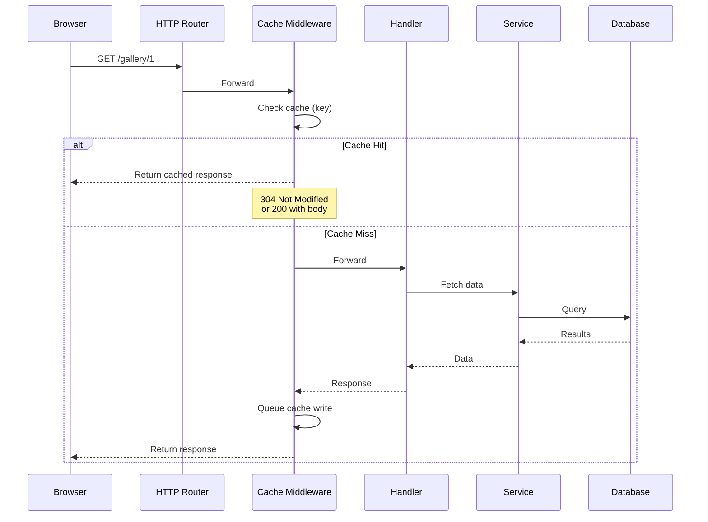
```mermaid
sequenceDiagram
    participant Client as Browser
    participant Router as HTTP Router
    participant CacheMW as Cache Middleware
    participant Handler as Handler
    participant Service as Service
    participant DB as Database

    Client->>Router: GET /gallery/1
    Router->>CacheMW: Forward
    CacheMW->>CacheMW: Check cache (key)
    alt Cache Hit
        CacheMW-->>Client: Return cached response
        Note over CacheMW: 304 Not Modified<br/>or 200 with body
    else Cache Miss
        CacheMW->>Handler: Forward
        Handler->>Service: Fetch data
        Service->>DB: Query
        DB-->>Service: Results
        Service-->>Handler: Data

        Handler-->>CacheMW: Response
        CacheMW->>CacheMW: Queue cache write
        CacheMW-->>Client: Return response
    end
```

Authentication is applied route-specifically (e.g., `/config`, `/dashboard`, `/server/*`) inside the mux after routing.

---

## Core Components

### Application Structure

The application is organized into domain-driven packages under `internal/`:

| Package                 | Purpose                                | Key Exports                        |
| ----------------------- | -------------------------------------- | ---------------------------------- |
| **server**              | HTTP server, routing, orchestration    | `App`, `getRouter`, middleware     |
| **server/auth**         | Authentication service                 | `AuthService`, `Authenticate`      |
| **server/cachebatch**   | Cache batch-load coordination          | batch loader helpers               |
| **server/cachepreload** | Cache preload manager & tasks          | `Manager`, preload tasks           |
| **server/config**       | Configuration management               | `Config`, `ConfigService`          |
| **server/database**     | Database setup, migrations, pools      | `Setup`, `RecreatePoolsWithConfig` |
| **server/files**        | File processing pipeline               | `FileProcessor`, `ProcessFile`     |
| **server/handlers**     | Route handlers                         | `GalleryHandlers`, `AuthHandlers`  |
| **server/interfaces**   | Dependency interfaces for handlers     | `ServerDeps`, `HandlerQueries`     |
| **server/logging**      | Request logging helpers                | logging middleware wrappers        |
| **server/menu**         | Hamburger menu handler                 | `MenuHandlers`                     |
| **server/metrics**      | Runtime metrics collection             | `Collector`                        |
| **server/middleware**   | HTTP middleware (auth, CSRF, etc.)     | `AuthMiddleware`, `CSRFProtection` |
| **server/modulestate**  | Module active-state tracking           | `ModuleStateService`               |
| **server/pathutil**     | Image-directory path utilities         | `RemoveImagesDirPrefix`            |
| **server/runtime**      | Process runtime / restart management   | `RuntimeManager`                   |
| **server/security**     | Lockout calculations                   | `CalculateLockout`, `IsLocked`     |
| **server/session**      | Session & CSRF management              | `SessionManager`, `Manager`        |
| **server/subsystem**    | Lifecycle management for subsystems    | `SubsystemManager`                 |
| **server/template**     | Shared template data helpers           | `AddCommonData`                    |
| **server/theme**        | Theme cookie handling                  | theme helpers                      |
| **server/ui**           | Template rendering helpers             | `RenderTemplate`                   |
| **server/validation**   | Config validation helpers              | validators                         |
| **cachelite**           | HTTP response caching                  | `HTTPCacheMiddleware`, `EvictLRU`  |
| **workerpool**          | Concurrent task processing             | `Pool`, `Worker`                   |
| **scheduler**           | Cron-like task scheduling              | `Scheduler`, `Task` interface      |
| **queue**               | Thread-safe deque                      | `Queue`                            |
| **writebatcher**        | Batch database operations              | `WriteBatcher`, `Config`           |
| **dque**                | Persistent on-disk FIFO overflow queue | `New`, `Queue`                     |
| **flock**               | Cross-platform file locking            | `Flock`                            |
| **errors**              | Error sentinels for dque               | `ErrXxx` sentinels                 |
| **dbconnpool**          | SQLite connection pools                | `DbSQLConnPool`                    |
| **gallerydb**           | Database queries (sqlc)                | `Queries`, `CustomQueries`         |
| **gallerylib**          | File import / path-chain upserts       | `Importer`                         |
| **thumbnail**           | Thumbnail generation                   | `GenerateThumbnailAndHashes`       |
| **imagemeta**           | EXIF extraction (local `replace`)      | Metadata parsers                   |
| **multihandler**        | Multi-handler structured logging       | `MultiHandler`                     |
| **profiler**            | Optional CPU/mem/block profiling       | `Start`                            |
| **coords**              | Geographic coordinate parsing          | `Parse`                            |
| **humanize**            | Human-readable formatting              | formatters                         |
| **log**                 | Structured logging                     | `Logger`                           |
| **gensyncpool**         | Reset-enforcing `sync.Pool` wrappers   | `NewPool`                          |
| **getopt**              | Config from flags/env                  | config loader                      |
| **parallelwalkdir**     | Concurrent directory scanning          | `WalkFunc`                         |
| **testutil**            | Shared test helpers                    | `Equals`, `HTMLContains`           |
| **gen-test-files**      | Synthetic test file generation         | `Generate`                         |

### Component Diagram

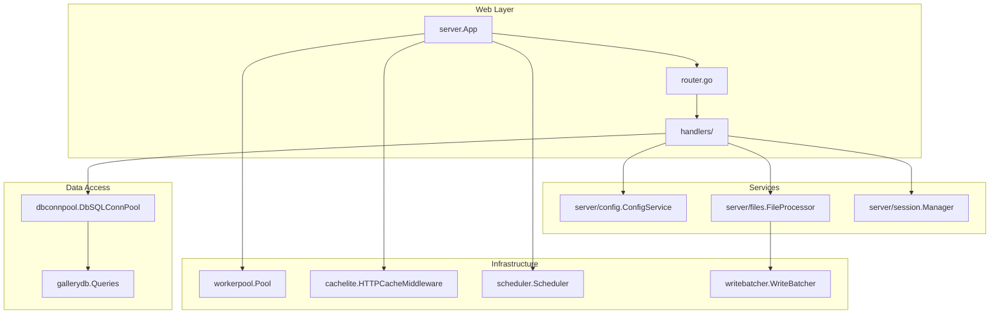
```mermaid
graph TB
    subgraph "Web Layer"
        Server[server.App]
        Router[router.go]
        Handlers[handlers/]
    end

    subgraph "Services"
        ConfigSvc[server/config.ConfigService]
        FileProc[server/files.FileProcessor]
        SessionMgr[server/session.Manager]
    end

    subgraph "Infrastructure"
        WorkerPool[workerpool.Pool]
        CacheMW[cachelite.HTTPCacheMiddleware]
        Scheduler[scheduler.Scheduler]
        WriteBatcher[writebatcher.WriteBatcher]
    end

    subgraph "Data Access"
        DBConn[dbconnpool.DbSQLConnPool]
        Queries[gallerydb.Queries]
    end

    Server --> Router
    Router --> Handlers
    Handlers --> ConfigSvc
    Handlers --> FileProc
    Handlers --> SessionMgr

    Server --> WorkerPool
    Server --> CacheMW
    Server --> Scheduler
    FileProc --> WriteBatcher

    Handlers --> DBConn
    DBConn --> Queries
```

---

## Data Layer

### Unified WriteBatcher Architecture

The application uses a **single unified WriteBatcher** at the App level that handles all high-volume database writes. This architecture eliminates SQLite lock contention by ensuring that only one component is attempting to write to the database at any given time, while still allowing high throughput through efficient batching.

- **File metadata:** Complete file records including path chain, EXIF, and thumbnails.
- **HTTP cache entries:** Full HTTP responses cached with route-specific strategies.

**Benefits:**

- **Reduced Lock Contention:** File-metadata and cache writes share one batched writer instead of competing for the SQLite exclusive lock (invalid-file records are written directly to the RW pool as failures occur).
- **Improved Throughput:** Batching reduces transaction overhead and filesystem syncs.
- **Memory Safety:** Batches are bounded by both count and total memory volume (bytes).
- **Graceful Degradation:** Automatic cleanup of pooled resources (HTTP bodies, thumbnails) on both successful flush and failure.
- **Burst Absorption:** When the in-memory channel fills, excess writes spill to a persistent on-disk queue (`dque`) instead of being dropped, so preload/discovery bursts are fully absorbed.
- **Crash Recovery:** Pending overflow writes persist across process restarts and are flushed on the next startup.

**Persistent Overflow Queue (`dque`):**

When the WriteBatcher's in-memory channel is full and `DQueDirPath` is configured, `Submit` overflows items to `dque` — a generic, segment-backed on-disk FIFO stored in `<db>-dque/` (sibling to the SQLite database). Each overflow increments `OverflowCount`/`pendingCount` and signals a buffer-1 `dqNotify` channel. The worker's main `select` gains a `dqNotify` case and a drain loop that:

- Pulls items from `dque` and flushes them in `MaxBatchSize` batches **during** the drain (trigger reason `size_limit`), not only after.
- Interleaves channel items with `dque` items so new channel submissions are never starved during a drain.
- Drains `dque` on context cancel, channel close, and `Close()` so no items are lost on shutdown.

Crash recovery: `New()` seeds `pendingCount` from the existing `dque` size, and the worker's `drainDQueAll` loop flushes any recovered `dque` items into batches on its first iteration (no startup memory buffering). `overflowMu` guards the overflow path and `overflowWG` plus `Close` acquiring `mu`-then-`overflowMu` guarantee in-flight overflow `Submit`s finish before `Close` drains, so concurrent `Submit`-during-`Close` loses nothing. `dque` acquires a `flock` on its directory, so reconfiguration closes the old batcher before creating a new one to release the lock.

To make `BatchedWrite` items persistable, `BatchedWrite` and `files.File` implement `GobEncode`/`GobDecode` via gob-safe wire structs (separately encoding the `File` and `CacheEntry` blobs, and replacing the un-exported `*bytes.Buffer` thumbnail with raw `[]byte`). An `init()` registers `int64` and `sql.Null*` types stored inside sqlc-generated `interface{}` fields.

**Write-Path Throughput Optimizations:**

- **Prepared-statement threading:** `BeginTx` borrows a pooled connection, captures its prepared `*gallerydb.CustomQueries` (`app.batcherQueries`), and `flushBatchedWrites` calls `WithTx(tx)` to propagate all prepared statements onto the transaction. Every statement reuses its compiled plan instead of recompiling raw SQL per call. (`TestPreparedStatementsRoutingInvariant` pins this routing.)
- **Intra-batch memoization:** One `gallerylib.Importer` is constructed per batch and reused across all files. Its `folderCache` (path → folder ID) eliminates repeated per-segment `GetFolderByPath` queries in `UpsertPathChain`, and `tiledDirs` skips redundant folder-tile view queries and tile-chain updates for subsequent files in the same directory.
- **Skip guaranteed no-op deletes:** The processor records `File.HadInvalidEntry`; `WriteFileInTx` only issues `DeleteInvalidFileByPath` when a row actually existed, removing a per-file no-op round-trip during fresh preloads.

**Implementation Details:**

- **[internal/server/batched_write.go](internal/server/batched_write.go)**: Defines the `BatchedWrite` union type (`File` and `CacheEntry` variants), its memory estimation logic, and `GobEncode`/`GobDecode` for persistence in `dque`.
- **[internal/server/batched_write_flush.go](internal/server/batched_write_flush.go)**: Contains the unified transactional flush logic, prepared-statement threading (`WithTx`), per-batch `Importer` construction, and resource cleanup.
- **[internal/server/batcher_adapter.go](internal/server/batcher_adapter.go)**: Implements the adapter pattern to break circular dependencies between `server` and `files` packages; returns `ErrClosed` when the batcher is nil.
- **[internal/server/files/gob.go](internal/server/files/gob.go)**: `GobEncode`/`GobDecode` for `files.File` (handles the `*bytes.Buffer` thumbnail as raw `[]byte`).
- **[internal/gallerylib/importer.go](internal/gallerylib/importer.go)**: File import logic with per-batch `folderCache`/`tiledDirs` memoization.
- **[internal/server/files/service.go](internal/server/files/service.go)**: Consumes the batcher via the `UnifiedBatcher` interface.

### Database Architecture

SFPG uses SQLite with separate read-only and read-write connection pools, plus a separate `thumbs.db` for thumbnail blobs, to maximize concurrency and keep large binary data out of the main database:

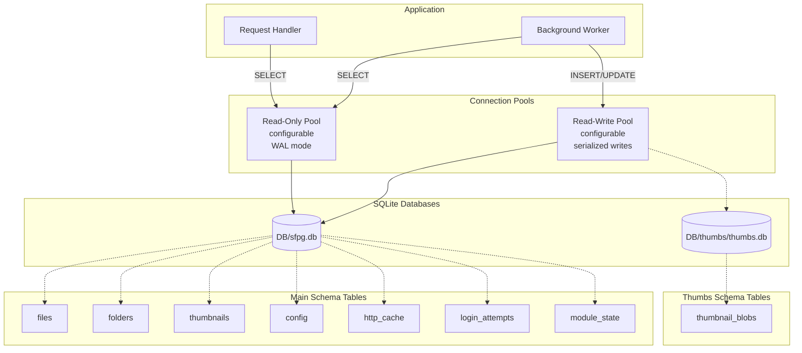
```mermaid
graph TB
    subgraph "Application"
        Handler[Request Handler]
        Worker[Background Worker]
    end

    subgraph "Connection Pools"
        RO[Read-Only Pool<br/>configurable<br/>WAL mode]
        RW[Read-Write Pool<br/>configurable<br/>serialized writes]
    end

    subgraph "SQLite Databases"
        MainDB[(DB/sfpg.db)]
        ThumbsDB[(DB/thumbs/thumbs.db)]
    end

    subgraph "Main Schema Tables"
        Files[files]
        Folders[folders]
        Thumbnails[thumbnails]
        Config[config]
        HTTPCache[http_cache]
        LoginAttempts[login_attempts]
        ModuleState[module_state]
    end

    subgraph "Thumbs Schema Tables"
        ThumbnailBlobs[thumbnail_blobs]
    end

    Handler -->|SELECT| RO
    Worker -->|SELECT| RO
    Worker -->|INSERT/UPDATE| RW

    RO --> MainDB
    RW --> MainDB
    RW -.-> ThumbsDB

    MainDB -.-> Files
    MainDB -.-> Folders
    MainDB -.-> Thumbnails
    MainDB -.-> Config
    MainDB -.-> HTTPCache
    MainDB -.-> LoginAttempts
    MainDB -.-> ModuleState
    ThumbsDB -.-> ThumbnailBlobs
```

- **Main database:** `DB/sfpg.db` holds folders, files, metadata, config, HTTP cache, and module state.
- **Thumbnails database:** `DB/thumbs/thumbs.db` holds only `thumbnail_blobs(thumbnail_id, data)` so large JPEG blobs don't bloat the main database or its WAL.

### Connection Pool Design

**Why separate pools?**

- SQLite allows concurrent reads but writes are serialized
- WAL mode enables one writer + multiple readers
- Separate pools prevent writer starvation
- Read-heavy workloads don't block writes

**Pool Configuration:**

Both pools share the same configurable size, controlled by the database configuration keys `db_max_pool_size` (default `100`) and `db_min_idle_connections` (default `10`), with a pool monitor interval `db_pool_monitor_interval` (default `1m`). Pool sizing is reconciled against effective values at startup/restart via `reconfigurePoolsFromConfig()`.

```go
Read-Only Pool:  MaxConnections = db_max_pool_size  (mode=ro, WAL mode persisted by RW pool)
Read-Write Pool: MaxConnections = db_max_pool_size  (journal_mode=WAL, _txlock=immediate)
```

### Database Schema

| Table               | Purpose                  | Key Fields                                                                                                                                                                                                |
| ------------------- | ------------------------ | --------------------------------------------------------------------------------------------------------------------------------------------------------------------------------------------------------- |
| **file_paths**      | Normalized file paths    | `id`, `path` (unique)                                                                                                                                                                                     |
| **folder_paths**    | Normalized folder paths  | `id`, `path` (unique)                                                                                                                                                                                     |
| **files**           | Image metadata           | `id`, `folder_id`, `path_id`, `filename`, `size_bytes`, `mtime`, `md5`, `phash`, `mime_type`, `width`, `height`                                                                                           |
| **folders**         | Directory structure      | `id`, `parent_id`, `path_id`, `name`, `mtime`, `tile_id`                                                                                                                                                  |
| **thumbnails**      | Generated thumbnail refs | `id`, `file_id`, `size_label`, `width`, `height`, `format`                                                                                                                                                |
| **thumbnail_blobs** | Thumbnail JPEG bytes     | `thumbnail_id`, `data` (in `thumbs.db`)                                                                                                                                                                   |
| **exif_metadata**   | EXIF camera/location     | `file_id`, `camera_make/model`, `focal_length`, `aperture`, `iso`, `capture_date`, etc.                                                                                                                   |
| **iptc_metadata**   | IPTC fields              | `file_id`, `title`, `description`, `keywords`, etc.                                                                                                                                                       |
| **iptc_keywords**   | IPTC keyword rows        | `id`, `file_id`, `keyword`                                                                                                                                                                                |
| **xmp_properties**  | XMP property rows        | `id`, `file_id`, `namespace`, `property`, `value`                                                                                                                                                         |
| **xmp_raw**         | Raw XMP packet           | `file_id`, `raw_xml`                                                                                                                                                                                      |
| **config**          | Key-value configuration  | `key`, `value`, `type`, `category`, `requires_restart`, `description`, `default_value`, etc.                                                                                                              |
| **http_cache**      | HTTP response cache      | `key`, `method`, `path`, `query_string`, `encoding`, `status`, `content_type`, `cache_control`, `etag`, `last_modified`, `vary`, `body`, `content_length`, `created_at`, `expires_at`, `content_encoding` |
| **login_attempts**  | Failed login tracking    | `username` (PK), `failed_attempts`, `locked_until`, `last_attempt_at`                                                                                                                                     |
| **invalid_files**   | Unprocessable files      | `path`, `mtime`, `size`, `reason`, `created_at`, `updated_at`                                                                                                                                             |
| **module_state**    | Module active state      | `name` (PK), `is_active`, `last_started_at`, `last_finished_at`                                                                                                                                           |

**Views:** `folder_view`, `file_view`, `thumbnail_exists_view`, `folder_tile_exists_view` (plus quality-control views `qc_file_path_subset_file_name` and `qc_folder_path_subset_file_path`).

### Query Generation (sqlc)

All SQL queries are generated using [sqlc](https://sqlc.dev/) from `sqlc/queries/*.sql`:

```
sqlc/queries/
├── files.sql          → gallerydb/files.sql.go
├── folders.sql        → gallerydb/folders.sql.go
├── http_cache.sql     → gallerydb/http_cache.sql.go
├── config.sql         → gallerydb/config.sql.go
└── ...
```

**Benefits:**

- Type-safe queries
- Compile-time SQL validation
- No SQL injection risk
- Easy to refactor

---

## Web Server Layer

### Server Lifecycle

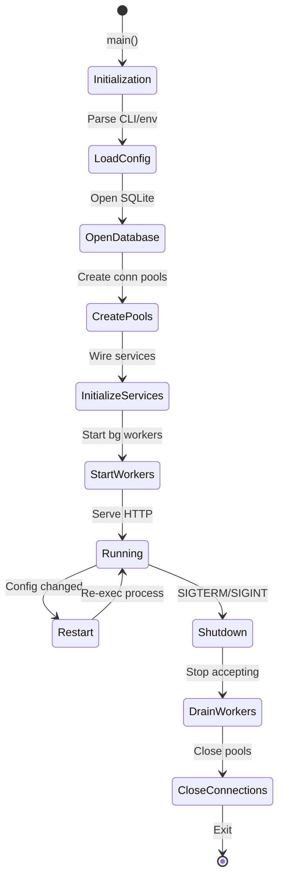
```mermaid
stateDiagram-v2
    [*] --> Initialization: main()
    Initialization --> LoadConfig: Parse CLI/env
    LoadConfig --> OpenDatabase: Open SQLite
    OpenDatabase --> CreatePools: Create conn pools
    CreatePools --> InitializeServices: Wire services
    InitializeServices --> StartWorkers: Start bg workers
    StartWorkers --> Running: Serve HTTP

    Running --> Restart: Config changed
    Restart --> Running: Re-exec process

    Running --> Shutdown: SIGTERM/SIGINT
    Shutdown --> DrainWorkers: Stop accepting
    DrainWorkers --> CloseConnections: Close pools
    CloseConnections --> [*]: Exit
```

### Request Middleware Stack

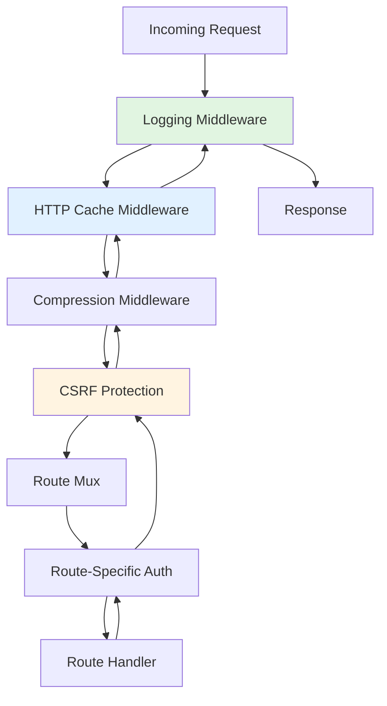
```mermaid
graph TB
    Request[Incoming Request] --> LogMW[Logging Middleware]
    LogMW --> CacheMW[HTTP Cache Middleware]
    CacheMW --> CompressMW[Compression Middleware]
    CompressMW --> CSRFMW[CSRF Protection]
    CSRFMW --> Mux[Route Mux]
    Mux --> AuthMW[Route-Specific Auth]
    AuthMW --> Handler[Route Handler]
    Handler --> AuthMW
    AuthMW --> CSRFMW
    CSRFMW --> CompressMW
    CompressMW --> CacheMW
    CacheMW --> LogMW
    LogMW --> Response[Response]

    style LogMW fill:#e1f5e1
    style CacheMW fill:#e1f1ff
    style CSRFMW fill:#fff4e1
```

**Middleware Order (Critical):**

1. **Logging** (outermost) - Log all requests first
2. **HTTP Cache** - Check SQLite-backed response cache; return 304/hit if present
3. **Compression** - Gzip/Brotli encode/decode if enabled
4. **CSRF Protection** - Same-origin check for unsafe methods
5. **Mux** - Route matching
6. **Authentication** - Applied selectively to protected routes (not global)
7. **Handler** - Process request

There is no separate global "CORS" middleware.

### Route Organization

Routes are registered in `internal/server/router.go` and organized into handler groups by domain:

| Handler Group         | Routes                                                                                                                                                                                                                                                     | Purpose                      |
| --------------------- | ---------------------------------------------------------------------------------------------------------------------------------------------------------------------------------------------------------------------------------------------------------- | ---------------------------- |
| **AuthHandlers**      | POST /login, GET /login-form, GET /logout-form, POST /logout                                                                                                                                                                                               | Authentication               |
| **ConfigHandlers**    | GET /config, POST /config, POST /config/themes, POST /config/increment-etag, POST /config/export/to-file, POST /config/import/preview, POST /config/import/commit, POST /config/restore-last-known-good, POST /config/restart, GET /config/export/download | Configuration                |
| **DashboardHandlers** | GET /dashboard, GET /api/metrics                                                                                                                                                                                                                           | Admin dashboard              |
| **GalleryHandlers**   | GET /gallery/{id}, GET /image/{id}, GET /raw-image/{id}, GET /thumbnail/file/{id}, GET /thumbnail/folder/{id}, GET /lightbox/{id}, GET /info/folder/{id}, GET /info/image/{id}                                                                             | Browsing & viewing           |
| **HealthHandlers**    | GET /, GET /health                                                                                                                                                                                                                                         | Health & root redirect       |
| **MenuHandlers**      | GET /hamburger-menu                                                                                                                                                                                                                                        | Session-aware menu rendering |
| **ServerHandlers**    | POST /server/shutdown, POST /server/discovery, POST /server/cache-batch-load, POST /server/restart                                                                                                                                                         | Server management            |
| **ThemeHandlers**     | GET /theme/modal, POST /theme                                                                                                                                                                                                                              | Theme selection              |
| **pprof**             | GET /debug/pprof/\*                                                                                                                                                                                                                                        | Profiling (authenticated)    |

**Example:**

```go
// Gallery handlers (public, some cacheable)
mux.HandleFunc("GET /gallery/{id}", app.galleryHandlers.GalleryByID)
mux.HandleFunc("GET /image/{id}", app.galleryHandlers.ImageByID)
mux.HandleFunc("GET /info/folder/{id}", app.galleryHandlers.InfoBoxFolder)

// Config handlers (authenticated, not cacheable)
mux.Handle("GET /config", app.authMiddleware(cfgAuth(app.configHandlers.ConfigGet)))
```

---

## Background Processing

### Worker Pool Architecture

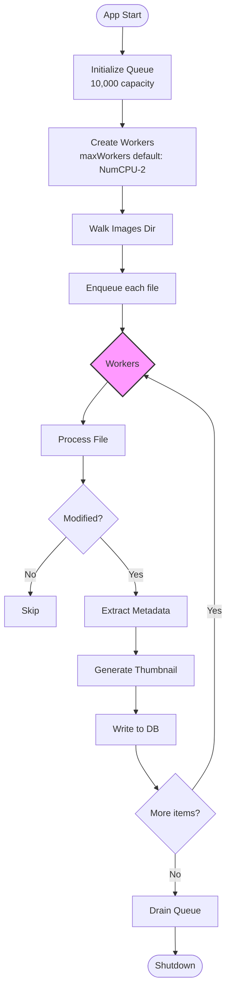
```mermaid
flowchart TD
    Start([App Start]) --> InitQueue[Initialize Queue<br/>10,000 capacity]
    InitQueue --> CreateWorkers[Create Workers<br/>maxWorkers default: NumCPU-2]
    CreateWorkers --> Walk[Walk Images Dir]
    Walk --> Enqueue[Enqueue each file]
    Enqueue --> Workers{Workers}

    Workers --> Process[Process File]
    Process --> CheckModified{Modified?}
    CheckModified -->|No| Skip
    CheckModified -->|Yes| Extract[Extract Metadata]
    Extract --> Thumbnail[Generate Thumbnail]
    Thumbnail --> Write[Write to DB]
    Write --> Next{More items?}
    Next -->|Yes| Workers
    Next -->|No| Drain[Drain Queue]
    Drain --> Shutdown([Shutdown])

    style Workers fill:#f9f,stroke:#333,stroke-width:2px
```

**Worker Pool Configuration:**

```go
Max Workers:  NumCPU - 2 (when NumCPU > 4); 2 (3-4 cores); 1 otherwise
              // overridable via config: WorkerPoolMax
Min Workers:  4 (when NumCPU > 6); 2 (3-4 cores); 1 otherwise
              // overridable via config: WorkerPoolMinIdle
Queue Size:   10,000 paths
              // overridable via config: QueueSize
Idle Timeout: 10 seconds
              // overridable via config: WorkerPoolMaxIdleTime
```

### File Processing Pipeline

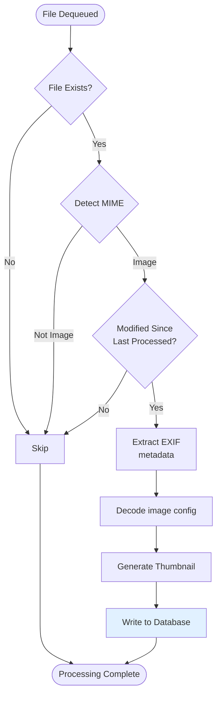
```mermaid
flowchart TD
    Start([File Dequeued]) --> Exists{File Exists?}
    Exists -->|No| Skip
    Exists -->|Yes| MIME{Detect MIME}

    MIME -->|Not Image| Skip
    MIME -->|Image| Modified{Modified Since<br/>Last Processed?}

    Modified -->|No| Skip
    Modified -->|Yes| EXIF[Extract EXIF<br/>metadata]

    EXIF --> Decode[Decode image config]
    Decode --> ThumbGen[Generate Thumbnail]
    ThumbGen --> WriteDB[Write to Database]

    WriteDB --> Done([Processing Complete])
    Skip --> Done

    style WriteDB fill:#e1f1ff
```

**Processing Steps:**

1. **MIME Detection** - Determine file type (image/jpeg, image/png, image/webp, etc.)
2. **Modification Check** - Compare `mtime` and `size` with database
3. **Metadata Extraction** - EXIF only; IPTC/XMP tables exist but are not populated
4. **Image Decode** - Read width/height via `image.DecodeConfig`
5. **Thumbnail Generation** - Single size `"m"` (200x150 box), JPEG, stored in `thumbs.db`
6. **Database Write** - Batch insert/update via unified WriteBatcher

### Task Scheduler

```mermaid
graph TB
    subgraph "Scheduler"
        Scheduler[Scheduler<br/>Max 5 concurrent]
        TaskQueue[Task Queue]
    end

    subgraph "Task Types"
        OneTime[One-Time Tasks]
        Hourly[Hourly Tasks]
        Daily[Daily Tasks]
        Weekly[Weekly Tasks]
        Monthly[Monthly Tasks]
    end

    subgraph "Example Tasks"
        T1[Cache Cleanup<br/>Daily 2am]
        T2[Log Rotation<br/>Daily midnight]
        T3[Config Backup<br/>Hourly]
    end

    TaskQueue --> Scheduler
    Scheduler --> OneTime
    Scheduler --> Hourly
    Scheduler --> Daily
    Scheduler --> Weekly
    Scheduler --> Monthly

    T1 --> Daily
    T2 --> Daily
    T3 --> Hourly
```

**Scheduler Features:**

- Drift-free intervals (won't skip scheduled times)
- Context-based cancellation (graceful shutdown)
- Error isolation (task errors don't stop scheduler)
- Configurable concurrency (0 means `runtime.NumCPU()`; defaults to `runtime.NumCPU()` if created with 0)

---

## Caching Strategy

SFPG uses a sophisticated multi-layer caching strategy:

### Cache Architecture Overview

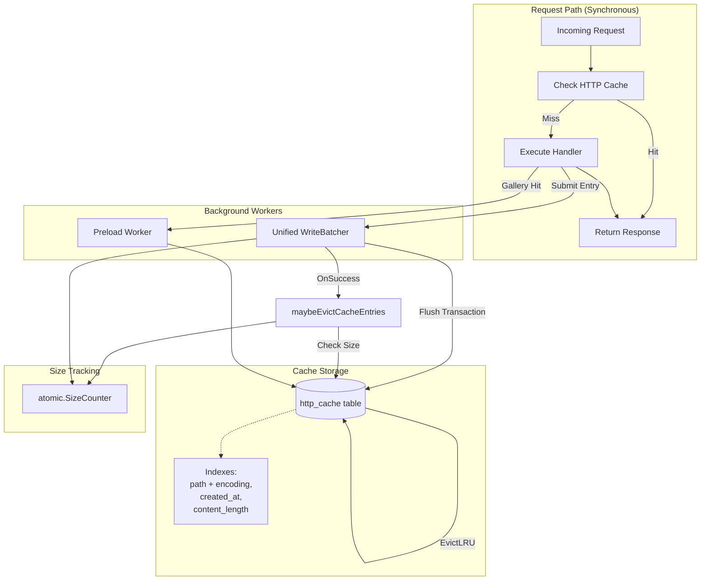
```mermaid
graph TB
    subgraph "Request Path (Synchronous)"
        Request[Incoming Request]
        CacheCheck[Check HTTP Cache]
        Handler[Execute Handler]
        Response[Return Response]
    end

    subgraph "Background Workers"
        Batcher[Unified WriteBatcher]
        Preload[Preload Worker]
    end

    subgraph "Cache Storage"
        CacheDB[(http_cache table)]
        Indexes[Indexes:<br/>path + encoding,<br/>created_at,<br/>content_length]
    end

    subgraph "Size Tracking"
        AtomicCounter[atomic.SizeCounter]
    end

    Request --> CacheCheck
    CacheCheck -->|Hit| Response
    CacheCheck -->|Miss| Handler
    Handler -->|Submit Entry| Batcher
    Handler -->|Gallery Hit| Preload
    Handler --> Response

    Batcher -->|Flush Transaction| CacheDB
    Batcher -->|OnSuccess| Evict
    Evict[maybeEvictCacheEntries] -->|Check Size| CacheDB
    CacheDB -->|EvictLRU| CacheDB
    Evict --> AtomicCounter
    Batcher --> AtomicCounter

    Preload --> CacheDB

    CacheDB -.-> Indexes
```

### HTTP Cache (cachelite)

**Purpose:** Persist entire HTTP responses (headers + compressed body) in SQLite

**Cache Key:** `METHOD:/path?query|HX=...|HXTarget=...|IsVariant=...|Theme=...|encoding`

The key includes:

- HTTP method and path
- Query string
- HTMX request headers (`HX-Request`, `HX-Target`, variant flag)
- Selected theme cookie (default `dark`)
- Normalized `Accept-Encoding` (`gzip`, `br`, or `identity`)

Example:

```
GET:/gallery/1?sort=name|HX=true|HXTarget=gallery-content|IsVariant=true|Theme=dark|gzip
GET:/lightbox/1?|HX=true|HXTarget=lightbox-ui|IsVariant=true|Theme=light|br
```

**Cacheable Routes:** `/gallery/`, `/lightbox/`, `/info/folder/`, `/info/image/`

**Cache Flow:**

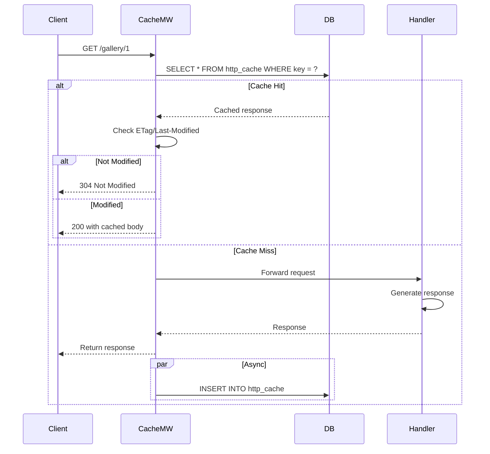
```mermaid
sequenceDiagram
    participant Client
    participant CacheMW
    participant DB
    participant Handler

    Client->>CacheMW: GET /gallery/1
    CacheMW->>DB: SELECT * FROM http_cache WHERE key = ?
    alt Cache Hit
        DB-->>CacheMW: Cached response
        CacheMW->>CacheMW: Check ETag/Last-Modified
        alt Not Modified
            CacheMW-->>Client: 304 Not Modified
        else Modified
            CacheMW-->>Client: 200 with cached body
        end
    else Cache Miss
        CacheMW->>Handler: Forward request
        Handler->>Handler: Generate response
        Handler-->>CacheMW: Response
        CacheMW-->>Client: Return response

        par Async
            CacheMW->>DB: INSERT INTO http_cache
        end
    end
```

**Cache Eviction:**

Cache eviction happens **after successful batch flush** in the `OnSuccess` callback:

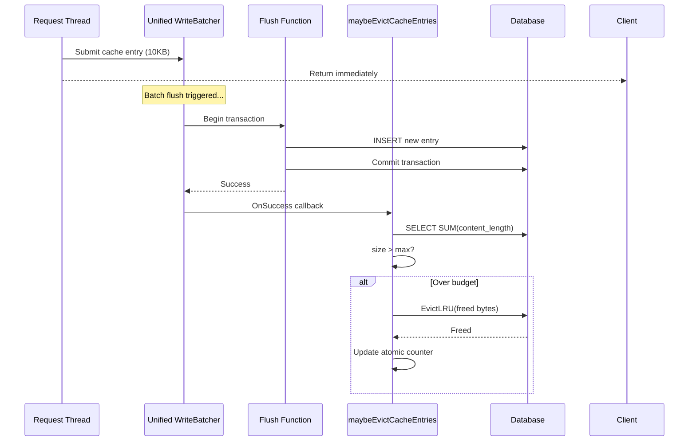
```mermaid
sequenceDiagram
    participant Req as Request Thread
    participant Batcher as Unified WriteBatcher
    participant Flush as Flush Function
    participant Evict as maybeEvictCacheEntries
    participant DB as Database

    Req->>Batcher: Submit cache entry (10KB)
    Req-->>Client: Return immediately

    Note over Batcher: Batch flush triggered...

    Batcher->>Flush: Begin transaction
    Flush->>DB: INSERT new entry
    Flush->>DB: Commit transaction
    Flush-->>Batcher: Success

    Batcher->>Evict: OnSuccess callback
    Evict->>DB: SELECT SUM(content_length)
    Evict->>Evict: size > max?
    alt Over budget
        Evict->>DB: EvictLRU(freed bytes)
        DB-->>Evict: Freed
        Evict->>Evict: Update atomic counter
    end
```

**Design Notes:**

- Eviction happens **outside the transaction** to avoid SQLite deadlocks
- Database is queried for actual size (source of truth)
- 10% buffer added to eviction target to avoid thrashing
- Atomic counter updated for runtime eviction calculations
- WAL checkpointing runs after every successful batch commit and periodically (every 5 minutes or when the WAL exceeds 256 MB); `PRAGMA optimize` runs hourly

### Cache Preload

When a gallery page is requested, the system preloads related pages in the background:

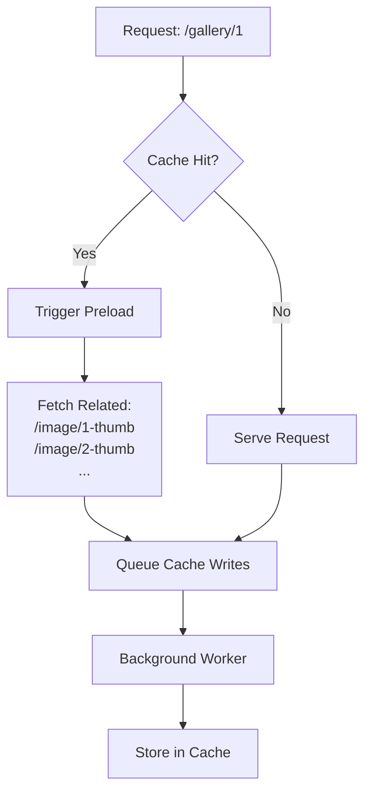
```mermaid
graph TB
    Request[Request: /gallery/1] --> CacheHit{Cache Hit?}
    CacheHit -->|Yes| Trigger[Trigger Preload]
    Trigger --> Fetch[Fetch Related:<br/>/image/1-thumb<br/>/image/2-thumb<br/>...]
    Fetch --> Queue[Queue Cache Writes]
    Queue --> Worker[Background Worker]
    Worker --> Store[Store in Cache]

    CacheHit -->|No| Serve[Serve Request]
    Serve --> Queue
```

**Preload Strategy:**

- Only cache hits trigger preload
- Preloads thumbnail images for the gallery
- Skips if client sends `X-Preload: skip` header
- Prevents thundering herd on first access

**Known Limitation - Default Theme Only:**

Cache warm paths (preload and batch load) use internal requests that do not carry a
theme cookie. As a result, only the default theme is warmed. Users who select a
non-default theme will experience cache misses for the first request to each
resource until they are naturally populated by actual user traffic.

### Client-Side Caching

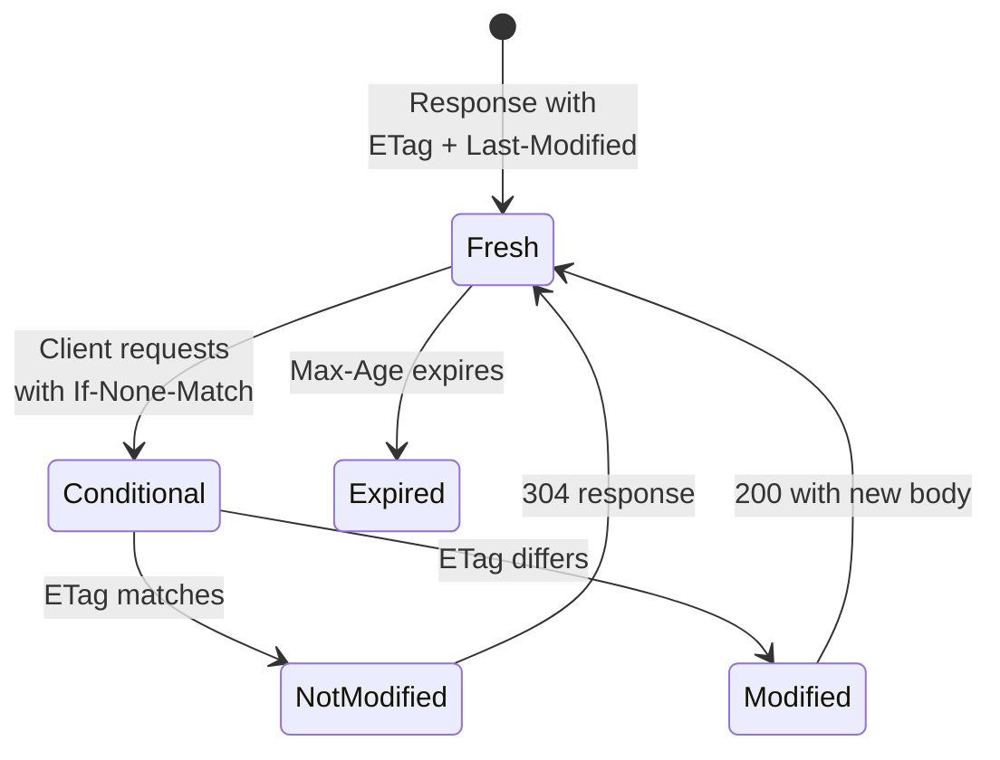
```mermaid
stateDiagram-v2
    [*] --> Fresh: Response with<br/>ETag + Last-Modified
    Fresh --> Conditional: Client requests<br/>with If-None-Match
    Conditional --> NotModified: ETag matches
    Conditional --> Modified: ETag differs

    NotModified --> Fresh: 304 response
    Modified --> Fresh: 200 with new body

    Fresh --> Expired: Max-Age expires
```

**Headers Set:**

- `ETag`: `"v123456-gzip"` (version + encoding)
- `Last-Modified`: File modification time
- `Cache-Control`: `max-age=3600, must-revalidate`
- `Vary`: `Accept-Encoding` (separate cache per encoding)

---

## Security Model

### Defense in Depth

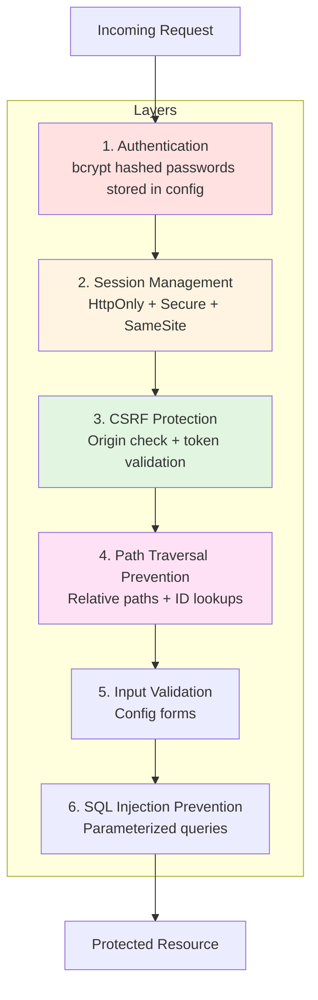
```mermaid
graph TB
    subgraph "Layers"
        L1[1. Authentication<br/>bcrypt hashed passwords stored in config]
        L2[2. Session Management<br/>HttpOnly + Secure + SameSite]
        L3[3. CSRF Protection<br/>Origin check + token validation]
        L4[4. Path Traversal Prevention<br/>Relative paths + ID lookups]
        L5[5. Input Validation<br/>Config forms]
        L6[6. SQL Injection Prevention<br/>Parameterized queries]
    end

    Request[Incoming Request] --> L1
    L1 --> L2
    L2 --> L3
    L3 --> L4
    L4 --> L5
    L5 --> L6
    L6 --> Protected[Protected Resource]

    style L1 fill:#ffe1e1
    style L2 fill:#fff4e1
    style L3 fill:#e1f5e1
    style L4 fill:#ffe1f5
```

### Authentication Flow

```mermaid
stateDiagram-v2
    [*] --> Unauthenticated: Visit site
    Unauthenticated --> ModalOpened: Click login button
    ModalOpened --> LoginFetched: HTMX GET /login-form
    LoginFetched --> LoginSubmit: POST /login
    LoginSubmit --> CheckLockout{HX-Trigger:
auth-changed}
    CheckLockout -->|Account locked| LoginFail: Show error in modal
    CheckLockout -->|CSRF invalid| LoginFail: Show error in modal
    CheckLockout -->|Valid + locked| LockedCheck{Account<br/>locked?}
    LockedCheck -->|Yes| LoginFail: Show locked error
    LockedCheck -->|No| CredentialsCheck{bcrypt<br/>verify}
    CredentialsCheck -->|Invalid| LoginFail
    CredentialsCheck -->|Valid| AttemptsCheck{Failed<br/>attempts?}
    AttemptsCheck -->|Yes| ResetAttempts[Reset counter]
    AttemptsCheck -->|No| CreateSession
    ResetAttempts --> CreateSession
    CreateSession --> Authenticated: HX-Trigger:
auth-changed
    Authenticated --> Authenticated: Request with cookie
    Authenticated --> Unauthenticated: Logout / expire
```

**Account Lockout:**

- Credentials are stored in the `config` table (keys `user` and `password`), not in a separate `admin` table
- Threshold: 3 failed attempts
- Duration: configurable via `LockoutDuration` (`lockout_duration`, default 1 hour)
- Automatic unlock after duration

### CSRF Protection

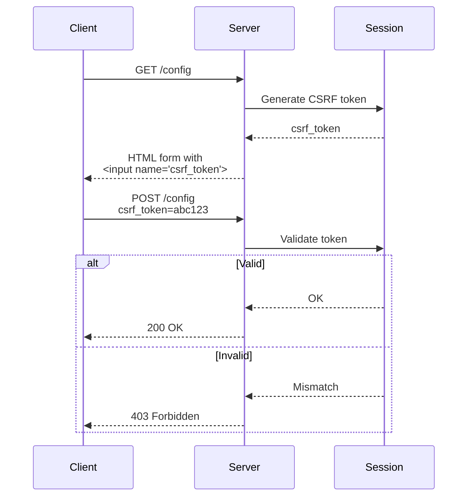
```mermaid
sequenceDiagram
    participant Client
    participant Server
    participant Session

    Client->>Server: GET /config
    Server->>Session: Generate CSRF token
    Session-->>Server: csrf_token
    Server-->>Client: HTML form with<br/><input name="csrf_token">

    Client->>Server: POST /config<br/>csrf_token=abc123
    Server->>Session: Validate token
    alt Valid
        Session-->>Server: OK
        Server-->>Client: 200 OK
    else Invalid
        Session-->>Server: Mismatch
        Server-->>Client: 403 Forbidden
    end
```

**CSRF Middleware:**

- Same-origin check (`Origin` header matches request host) for unsafe methods
- Generates token on first access
- Token stored in session
- All POST/PUT/DELETE/PATCH must include valid token
- Tokens are **not** single-use; the same token is reused across requests

### Path Traversal Prevention

**Problem:** Prevent `../../../etc/passwd` attacks

**Solution 1: Relative Paths**

```
Database stores: "gallery/vacation/photo.jpg"
Joined with:    "/var/lib/sfpg/images"
Result:         "/var/lib/sfpg/images/gallery/vacation/photo.jpg"
```

**Solution 2: ID-Based Lookups**

```go
// Handler receives: /image/123
// Database lookup: SELECT * FROM files WHERE id = 123
// Returns path:     "gallery/vacation/photo.jpg"
// Construct:        /var/lib/sfpg/images/gallery/vacation/photo.jpg
```

**Solution 3: Path Validation**

```go
func removeImagesDirPrefix(path, imagesDir string) string {
    cleanPath := filepath.Clean(path)
    if !strings.HasPrefix(cleanPath, imagesDir) {
        return "" // Reject paths outside imagesDir
    }
    return strings.TrimPrefix(cleanPath, imagesDir)
}
```

---

## Configuration Management

### Configuration Sources & Precedence

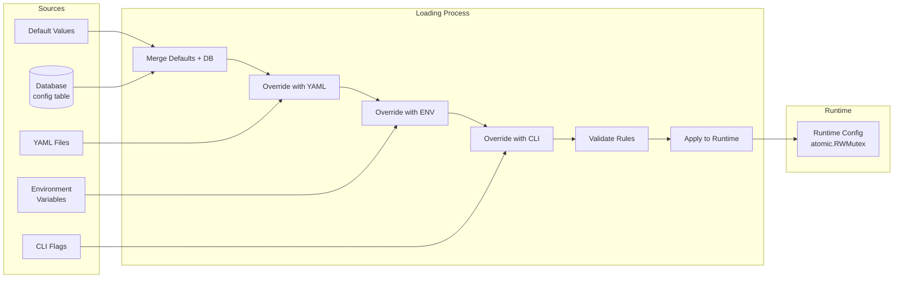
```mermaid
flowchart LR
    subgraph "Sources"
        Defaults[Default Values]
        Database[(Database<br/>config table)]
        YAML[YAML Files]
        ENV[Environment<br/>Variables]
        CLI[CLI Flags]
    end

    subgraph "Loading Process"
        M1[Merge Defaults + DB]
        M2[Override with YAML]
        M3[Override with ENV]
        M4[Override with CLI]
        Validate[Validate Rules]
        Apply[Apply to Runtime]
    end

    subgraph "Runtime"
        Config[Runtime Config<br/>atomic.RWMutex]
    end

    Defaults --> M1
    Database --> M1
    M1 --> M2
    YAML --> M2
    M2 --> M3
    ENV --> M3
    M3 --> M4
    CLI --> M4
    M4 --> Validate
    Validate --> Apply
    Apply --> Config
```

**Precedence (highest to lowest):**

1. CLI flags (`--port=8080`)
2. Environment variables (`SFG_PORT=8080`)
3. YAML files (`config.yaml`)
4. Database values (from `/config` page)
5. Default values (hardcoded)

The precedence inside `getopt.Parse()` is specifically CLI > Environment. `config.Load()` then applies Defaults → Database → YAML → CLI/Env.

### Precedence Hardening Guarantees (Mar 2026)

The startup and reload paths now document and enforce an explicit contract for pool-related settings.

Bug fixed:

- Symptom: `DBMaxPoolSize=500` was saved in the database, but active pools stayed at `100`.
- Root cause: `setDB()` executed before `loadConfig()`, so pools were created while `app.config` was `nil` and fell back to default pool sizing.
- Fix: `loadConfig()` now updates `app.config` and then calls `reconfigurePoolsFromConfig()` to recreate pools when loaded values differ from effective values.
- Prevention: dedicated precedence/startup/restart/UI regression tests plus startup diagnostics that explicitly log configured versus effective pool values.

Required sequencing constraint:

- `setDB()` may run before full config load to bootstrap database access.
- `loadConfig()` must run before normal serving and must be followed by `reconfigurePoolsFromConfig()` semantics.
- Any startup/restart path that loads or restores config must ensure pool reconciliation runs afterward.

Operational reconfiguration behavior:

- Triggered automatically at the end of `loadConfig()`.
- Triggered after `-restore-last-known-good` restores configuration.
- Triggered in fallback startup flows that synthesize defaults after config load failure.
- If configured pool values already match effective pool values, pool recreation is skipped.

Diagnostic logging for mismatch visibility:

- `pool config applied`: emits configured and effective RW/RO pool values.
- `configured/effective DB pool mismatch`: emits warning-level diagnostics when values diverge (except intentional auto min-idle behavior with `db_min_idle_connections=0`).
- `startup config summary`: emits one low-noise startup snapshot of configured versus effective values for DB pools and other critical subsystems.

Regression protections:

- Step 2 pool precedence tests (`internal/server/config_pool_precedence_test.go`):
  - `TestDBPoolPrecedence_PoolsIgnoreDatabaseConfig`
  - `TestDBPoolPrecedence_ConfigLoadedAfterPoolCreation`
  - Prevents regressions where pools are initialized from defaults and never reconciled.
- Step 4 broader precedence tests (`internal/server/config_integration_test.go`):
  - `TestIntegration_ConfigPrecedence`
  - `TestConfigPrecedence_CLIOverridesDB`
  - `TestConfigPrecedence_EnvOverridesDB`
  - `TestAppConfigPrecedence_DBOverridesDefaults`
  - Prevents precedence drift across defaults/database/env/CLI layers.
- Step 6 startup/restart regression tests (`internal/server/config_startup_restart_regression_test.go`):
  - `TestStartupWithDBConfig_PoolSizeHonored`
  - `TestRestartWithModifiedDBConfig_AppliesNewValues`
  - Prevents startup/restart paths from reintroducing stale pool sizing.
- Step 8 UI validation tests (`internal/server/config_ui_test.go` and `internal/server/config_modal_javascript_test.go`):
  - `TestConfigUI_FormSubmission_UpdatesDatabase`
  - `TestConfigUI_RestartWarning_Appears`
  - `TestConfigUI_HTMX_PartialUpdate`
  - `TestConfigModal_JavaScript_RendersCorrectly`
  - Prevents config UI regressions from silently breaking persistence or restart signaling.

### Configuration Schema

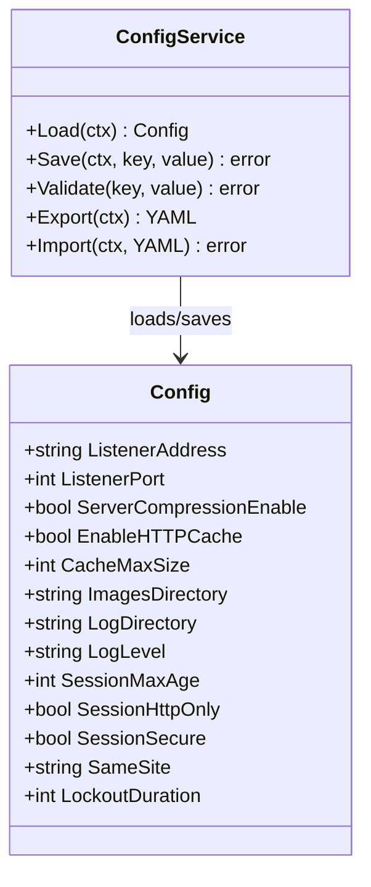
```mermaid
classDiagram
    class Config {
        +string ListenerAddress
        +int ListenerPort
        +bool ServerCompressionEnable
        +bool EnableHTTPCache
        +int CacheMaxSize
        +string ImagesDirectory
        +string LogDirectory
        +string LogLevel
        +int SessionMaxAge
        +bool SessionHttpOnly
        +bool SessionSecure
        +string SameSite
        +int LockoutDuration
    }

    class ConfigService {
        +Load(ctx) Config
        +Save(ctx, key, value) error
        +Validate(key, value) error
        +Export(ctx) YAML
        +Import(ctx, YAML) error
    }

    ConfigService --> Config : loads/saves
```

### Hot Configuration Changes

Some configuration changes can be applied without restart:

```mermaid
stateDiagram-v2
    [*] --> Running
    Running --> ConfigChanged: User saves config

    ConfigChanged --> CheckType{What changed?}

    CheckType -->|Listener address/port| RestartRequired
    CheckType -->|Images directory| RestartRequired
    CheckType -->|Log directory| RestartRequired
    CheckType -->|Cache settings| RuntimeUpdate
    CheckType -->|Session settings| RuntimeUpdate

    RestartRequired --> Restart: Request process restart
    RuntimeUpdate --> Running: Apply immediately

    Restart --> Restarting[Graceful process re-exec]
    Restarting --> Running
```

**Restart behavior:**

A web-triggered restart is a full process re-exec (`syscall.Exec`). The running
process shuts down its HTTP server, flushes pending writes, closes database pools,
and replaces itself with a fresh process image. The new process reloads
configuration from the database and reinitializes all runtime services (HTTP cache,
worker pool, batch-load manager, etc.). There is no longer a separate "HTTP-only"
listener reload.

---

## Utilities & Libraries

### Reusable Components

#### workerpool

**Purpose:** Dynamic worker pool with auto-scaling

```go
pool := workerpool.NewPool(ctx, db, 0, 0, 10*time.Second)
pool.AddTask(task)  // Blocks if queue full
pool.Shutdown()     // Drains queue then exits
```

**Features:**

- Bounded queue (10,000 capacity)
- Idle workers exit after timeout
- Graceful shutdown (drains queue)
- Statistics (active workers, queue size)

#### scheduler

**Purpose:** Cron-like task scheduler

```go
sched := scheduler.NewScheduler(5)  // Max 5 concurrent
sched.AddTask(task, scheduler.Daily, time.Now())
sched.Start(ctx)  // Blocks until ctx cancelled
```

**Features:**

- One-time, hourly, daily, weekly, monthly tasks
- Drift-free intervals
- Context-based cancellation
- Error isolation

#### writebatcher

**Purpose:** Generic, transaction-batching write serializer with optional persistent overflow

```go
wb, err := writebatcher.New[MyItem](ctx, writebatcher.Config[MyItem]{
    BeginTx:      func(ctx context.Context) (*sql.Tx, error) { ... },
    Flush:        func(ctx context.Context, tx *sql.Tx, batch []MyItem) error { ... },
    OnSuccess:    func(batch []MyItem) { ... }, // Optional cleanup
    MaxBatchSize: 100,
    DQueDirPath:  "/var/lib/sfpg/overflow",   // optional: persistent overflow queue
})
wb.Submit(item)
```

**Benefits:**

- Eliminates write contention on single-writer databases like SQLite
- Automatically flushes on size (count or bytes), interval, or Close()
- Single background worker handles all flushes synchronously
- When `DQueDirPath` is set, overflows the in-memory channel to `dque` (absorbs bursts, crash recovery, drain-on-close) instead of returning `ErrFull`

#### dque

**Purpose:** Generic, segment-backed persistent on-disk FIFO queue

```go
q, err := dque.New[Item]("name", dirPath, itemsPerSegment)
q.Enqueue(&item)   // append
item, err := q.Dequeue()
q.Size()
```

**Features:**

- Segment-based storage (tunable items per segment)
- File locking via `internal/flock` (single accessor per directory)
- Used by `writebatcher` for overflow and crash recovery

#### flock

**Purpose:** Minimal cross-platform file locking (flock on Unix, `LockFileEx` on Windows). Used by `dque` to ensure a single accessor per queue directory.

#### gallerylib

**Purpose:** File import logic — `Importer` performs path-chain upserts (folders + file record) and tracks which directories already had their folder-tile chain updated. Constructed once per write batch and reused across files so its `folderCache` and `tiledDirs` memoize across the batch.

#### queue

**Purpose:** Thread-safe dynamically-resizing deque

```go
q := queue.New[string]()
q.PushBack("item")     // Add to back
q.PopFront()           // Remove from front
q.Len()                // Current size
```

**Features:**

- O(1) push/pop from both ends
- Auto-grows by powers of 2
- Auto-shrinks when < 25% full
- Zero allocations after warmup

#### gensyncpool

**Purpose:** Reduce allocations with sync.Pool

```go
pool := gensyncpool.NewPool(func() *Item {
    return &Item{}
})
item := pool.Get()
// ... use item ...
pool.Put(item)  // Return to pool
```

**Used For:**

- `[]byte` buffers (read/write buffers)
- `HTTPCacheEntry` objects (cache responses)
- Reduces GC pressure significantly

#### dbconnpool

**Purpose:** SQLite connection pooling with WAL mode

```go
pool := dbconnpool.New(ctx, dbPath, 10, 2)
conn, err := pool.Get(ctx)
// ... use conn ...
pool.Put(conn)
```

**Features:**

- Separate read/write pools
- WAL mode enabled
- Connection validation
- Graceful shutdown

### Testing Utilities

#### testutil

**Purpose:** Common test helpers

```go
testutil.Equals(t, want, got)
testutil.Contains(t, haystack, needle)
testutil.Panics(t, func() { ... })
testutil.HTMLContains(t, html, selector)
```

#### gen-test-files

**Purpose:** Generate synthetic test files

```go
gentestfiles.Generate(dir,
    gentestfiles.File("test.jpg", 1024, 800, 600),
    gentestfiles.Dir("gallery",
        gentestfiles.File("photo1.jpg", 2048, 1920, 1080),
    ),
)
```

---

## Performance Optimizations

### Optimization Techniques

| Technique                        | Where Used         | Impact                                            |
| -------------------------------- | ------------------ | ------------------------------------------------- |
| **Post-flush eviction**          | HTTP cache         | Removes eviction from request path                |
| **Atomic size tracking**         | Cache              | Avoids `SELECT SUM()` on every write              |
| **Connection pooling**           | Database           | Enables concurrent reads                          |
| **Batch writes**                 | File processing    | 10-100x throughput improvement                    |
| **Persistent overflow**          | WriteBatcher       | Absorbs bursts without dropping writes (dque)     |
| **Crash recovery**               | WriteBatcher       | Pending writes survive process restarts (dque)    |
| **Prepared-statement threading** | WriteBatcher flush | Reuses compiled query plans (BeginTx/WithTx)      |
| **Intra-batch memoization**      | gallerylib         | Eliminates repeated folder/path queries per batch |
| **Gob persistence**              | BatchedWrite/File  | Enables on-disk overflow serialization            |
| **Resource reclamation**         | WriteBatcher       | Pooled objects returned on success                |
| **Object pooling**               | Cache entries      | Reduces allocations by ~80%                       |
| **Stream processing**            | Image serving      | Low memory per request                            |
| **Cache preload**                | Gallery pages      | 50-100ms faster subsequent loads                  |
| **Index optimization**           | Database queries   | 2-5x faster queries                               |

### Performance Timeline

```mermaid
timeline
    title SFPG Performance Optimizations
    2024-12 : Initial implementation<br/>Naive cache
    2025-01 : Batch writes<br/>10-100x file processing
    2025-01 : Object pooling<br/>50% reduction in allocations
    2025-02 : Async eviction<br/>Removes sync from request path
    2025-02 : Database indexes<br/>2-5x query improvement
    2025-02 : Atomic size tracking<br/>Eliminates SUM queries
```

### Benchmarks

**Cache Middleware (with async eviction):**

```
BenchmarkCacheMiddleware_CacheHit-8          5000000    250 ns/op
BenchmarkCacheMiddleware_CacheMiss-8          1000000   1250 ns/op
```

**File Processing (with batching):**

```
BenchmarkFileProcessing_100Files_Batched-8    100       10000000 ns/op  (100ms)
BenchmarkFileProcessing_100Files_Individual-8  10        100000000 ns/op (1000ms)
```

---

## Testing Strategy

### Test Organization

The test suite uses **build tags** to separate unit tests from integration tests:

- **Unit Tests**: Default tests (no build tag), fast, no external dependencies
- **Integration Tests**: Files ending in `_integration_test.go` with `//go:build integration` tag
- **Benchmarks**: Performance tests (run with `-bench` flag)

```
internal/
├── cachelite/
│   ├── cache_test.go                          # Unit tests (default)
│   ├── http_cache_middleware_test.go          # Unit tests (default)
│   ├── http_cache_middleware_integration_test.go  # Integration tests
│   └── cache_benchmark_test.go                # Benchmarks
├── server/
│   ├── server_test.go                         # Unit tests (default)
│   ├── server_integration_test.go             # Integration tests
│   ├── config_integration_test.go             # Config E2E tests
│   ├── etag_integration_test.go               # ETag behavior tests
│   ├── logging_integration_test.go            # Logging E2E tests
│   ├── admin_credentials_integration_test.go  # Admin auth tests
│   └── files/
│       ├── service_test.go                    # Unit tests (default)
│       └── files_integration_test.go          # Integration tests
└── workerpool/
    ├── workerpool_test.go                     # Unit tests
    └── mock.go                                # Test doubles
```

**Running tests:**

```bash
# Unit tests only (fast, default)
go test ./...

# Integration tests only
go test -tags integration ./...

# All tests (unit + integration)
go test -tags integration ./...

# Specific integration test file
go test -tags integration ./internal/server -run TestConfigIntegration
```

### Test Coverage

| Package          | Coverage | Type               | Notes                             |
| ---------------- | -------- | ------------------ | --------------------------------- |
| **cachelite**    | 85%+     | Unit + Integration | Unified batcher + eviction tested |
| **workerpool**   | 90%+     | Unit               | Pool dynamics and scaling         |
| **scheduler**    | 85%+     | Unit               | Task scheduling and cancellation  |
| **dbconnpool**   | 80%+     | Integration        | Connection pool behavior          |
| **server**       | 75%+     | Integration        | Unified batcher workflows         |
| **writebatcher** | 95%+     | Unit               | Batching and flush logic          |
| **files**        | 80%+     | Unit + Integration | File processing pipeline          |

### Test Categories

1. **Unit Tests**: Test individual functions/packages (default, fast)
2. **Integration Tests**: Test package interactions (requires `-tags integration`)
3. **End-to-End Tests**: Test complete workflows (subset of integration)
4. **Benchmarks**: Measure performance

### Running Tests

```bash
# Unit tests only (fast, default - recommended for TDD)
go test ./...

# Integration tests only
go test -tags integration ./...

# All tests (unit + integration)
go test -tags integration ./...

# Specific package
go test ./internal/cachelite/...

# With coverage
go test -cover ./...
go test -tags integration -cover ./...

# Run benchmarks
go test -bench=. ./internal/cachelite/...

# Race detection
go test -race ./...
go test -tags integration -race ./...
```

### Recent Testing Improvements (Feb 2026)

**Build Tag Separation:**

- Separated fast unit tests from slower integration tests
- Integration tests now require explicit `-tags integration` flag
- Faster CI/CD pipelines: unit tests run in <5s, integration in ~20s

**Concurrency Fixes:**

- Fixed race condition in cache write batch collection (data loss during shutdown)
- Added lock ordering documentation to prevent deadlocks
- Improved goroutine lifecycle management in ParallelWalk
- Added context cancellation handling in multiple worker loops

**Test Quality:**

- Comprehensive table-driven tests (285 `t.Run()` across 45 files)
- Descriptive error messages with input/got/want context
- Proper cleanup with `t.Cleanup()` where appropriate
- See `references/tdd_process.md` and `references/methodology-html-content-test-writing.md` for testing methodology details

---

## Frontend Architecture

**Last Updated:** 2026-03-04

SFPG uses a **hypermedia-driven, mobile-first** frontend built entirely with Go HTML templates, HTMX, Hyperscript, daisyUI, and TailwindCSS. There is no JavaScript framework and no client-side state management.

### Design Principles

- **No JavaScript** — all interactivity via HTMX (HTML-over-the-wire) and Hyperscript
- **Mobile-first** — touch devices are first-class; desktop enhancements are additive
- **iOS safe areas** — `env(safe-area-inset-bottom)` used on body and modals to clear the home indicator
- **Responsive layout** — flexbox wrapping instead of fixed-grid for gallery tiles

### Gallery Tile Layout

Gallery tiles use a `flex flex-wrap justify-center gap` container so tiles reflow naturally at all viewport widths without JavaScript. Each tile uses the daisyUI `card` component.

Thumbnail images use `object-contain` inside a `<figure>` element so portrait and landscape images display without cropping, regardless of aspect ratio.

Long filenames and directory names are truncated with **center-ellipsis** (preserving both prefix and suffix) rather than right-truncation, so the file extension and end of the name remain readable.

### Lightbox Touch Navigation

The lightbox supports swipe navigation on touch devices via Hyperscript `pointerdown`/`pointerup` handlers:

- **Threshold:** 48px horizontal displacement required to trigger a swipe
- **Drift guard:** ±40px vertical tolerance prevents accidental swipes during vertical scrolling
- **Ghost tap prevention:** a `:didSwipe` flag suppresses the `click` event that fires after a swipe
- **Button visibility:** prev/next nav buttons are hidden on mobile (`hidden sm:flex`); swipe replaces them
- **Modal height:** uses `100dvh` (dynamic viewport height) with `env(safe-area-inset-bottom)` subtracted for correct iOS Safari rendering

### Mobile Info Panel

On touch devices (detected via CSS `hover:none` and `pointer:coarse` media queries), the desktop sidebar info box is hidden entirely and replaced with a dedicated modal:

| Element              | Desktop                  | Mobile                 |
| -------------------- | ------------------------ | ---------------------- |
| `#box_info_wrapper`  | Visible sidebar (toggle) | `display:none` via CSS |
| `#info-btn`          | Visible (`sm:flex`)      | Hidden (`hidden`)      |
| `#info-btn-mobile`   | Hidden (`sm:hidden`)     | Visible (`flex`)       |
| `#mobile_info_modal` | —                        | daisyUI checkbox modal |

Content is mirrored from `#box_info` into `#box_info_mobile` on every HTMX swap via a Hyperscript `on htmx:afterSwap` handler, so the modal always reflects the latest selection without an extra network request.

The dashboard suppresses the sidebar entirely — `#box_info_wrapper` is hidden via Hyperscript `init` when `#dashboard-container` is detected in the DOM.

### Dashboard Typography

The dashboard uses a compact typography scale optimised for dense metric display:

| Element          | Before                 | After                        |
| ---------------- | ---------------------- | ---------------------------- |
| Page heading     | `text-3xl font-bold`   | `text-2xl font-semibold`     |
| Section headings | `text-lg`              | `text-base`                  |
| Card titles      | `card-title text-base` | plain `h3 text-sm`           |
| Stat labels      | (no size)              | `text-xs`                    |
| Stat values      | `font-mono text-2xl`   | `font-semibold text-lg/base` |

Removing `font-mono` from stat values aligns them with the rest of the UI's sans-serif type while `font-semibold` maintains visual weight.

### Template Files

| Template                     | Purpose                                                                     |
| ---------------------------- | --------------------------------------------------------------------------- |
| `layout.html.tmpl`           | Shell, footer toolbar, mobile info modal, lightbox modal, safe-area padding |
| `gallery.html.tmpl`          | Flex tile grid, HTMX gallery content, mobile info sync                      |
| `lightbox-content.html.tmpl` | Lightbox image, swipe handlers, prev/next buttons                           |
| `infobox-image.html.tmpl`    | Image metadata panel (loaded into `#box_info`)                              |
| `infobox-folder.html.tmpl`   | Folder metadata panel (loaded into `#box_info`)                             |
| `dashboard.html.tmpl`        | Admin metrics dashboard                                                     |

---

## Appendix

### File Structure

```
sfpg-go/
├── cmd/
│   ├── sfpg-go-dashboard/       # TUI dashboard entry point
│   └── (main package at root)   # Main application entry point (root main.go)
├── docs/
│   ├── diagrams/                # Architecture diagrams
│   └── ARCHITECTURE.md          # This file
├── internal/
│   ├── cachelite/               # HTTP response caching
│   ├── workerpool/              # Concurrent task processing
│   ├── scheduler/               # Task scheduling
│   ├── queue/                   # Generic deque
│   ├── writebatcher/            # Batch database operations (with overflow)
│   ├── dque/                    # Persistent on-disk FIFO overflow queue
│   ├── flock/                   # Cross-platform file locking
│   ├── errors/                  # Error sentinels for dque
│   ├── dbconnpool/              # Connection pooling
│   ├── gallerydb/               # Database queries (sqlc)
│   ├── gallerylib/              # File import / path-chain upserts
│   ├── thumbnail/               # Thumbnail generation
│   ├── imagemeta/               # EXIF extraction (local replace of evanoberholster/imagemeta)
│   ├── parallelwalkdir/         # Concurrent directory scanning
│   ├── gensyncpool/             # Reset-enforcing sync.Pool wrappers
│   ├── getopt/                  # Config from flags/env
│   ├── multihandler/            # Multi-handler structured logging
│   ├── profiler/                # Optional CPU/mem/block profiling
│   ├── coords/                  # Geographic coordinate parsing
│   ├── humanize/                # Human-readable formatting
│   ├── log/                     # Structured logging wrappers
│   ├── testutil/                # Shared test helpers
│   ├── gen-test-files/          # Synthetic test file generation
│   ├── server/                  # Web server
│   │   ├── auth/                # Authentication service
│   │   ├── cachebatch/          # Cache batch-load coordination
│   │   ├── cachepreload/        # Cache preload manager
│   │   ├── config/              # Configuration management
│   │   ├── database/            # Database setup and pools
│   │   ├── files/               # File processing pipeline
│   │   ├── handlers/            # Route handlers
│   │   ├── interfaces/          # Handler dependency interfaces
│   │   ├── logging/             # Logging helpers
│   │   ├── menu/                # Hamburger menu handler
│   │   ├── metrics/             # Runtime metrics
│   │   ├── middleware/          # HTTP middleware
│   │   ├── modulestate/         # Module active-state tracking
│   │   ├── pathutil/            # Path utilities
│   │   ├── runtime/             # Process runtime / restart
│   │   ├── security/            # Lockout calculations
│   │   ├── session/             # Session & CSRF management
│   │   ├── subsystem/           # Subsystem lifecycle
│   │   ├── template/            # Shared template data
│   │   ├── theme/               # Theme handling
│   │   ├── ui/                  # Template rendering
│   │   └── validation/          # Validation helpers
│   └── ...
├── migrations/                  # Database migrations
│   ├── migrations/              # Main database migrations
│   └── thumbs/                  # Thumbnails database migrations
├── sqlc/                        # SQL query definitions
├── web/                         # HTML templates and static assets
└── scripts/                     # Utility scripts
```

### External Dependencies

| Dependency                                        | Purpose                           | License      |
| ------------------------------------------------- | --------------------------------- | ------------ |
| **github.com/andybalholm/brotli**                 | Brotli compression                | MIT          |
| **github.com/charmbracelet/bubbles**              | TUI dashboard components          | MIT          |
| **github.com/charmbracelet/bubbletea**            | TUI framework                     | MIT          |
| **github.com/charmbracelet/lipgloss**             | TUI styling                       | MIT          |
| **github.com/dop251/goja**                        | JavaScript runtime (tests)        | BSD-2-Clause |
| **github.com/evanoberholster/imagemeta**          | EXIF metadata (replaced locally)  | MIT          |
| **github.com/golang-migrate/migrate/v4**          | Database migrations               | MIT          |
| **github.com/gorilla/sessions**                   | Session management                | BSD-3-Clause |
| **github.com/ncruces/go-sqlite3**                 | SQLite driver                     | MIT          |
| **github.com/nfnt/resize**                        | Image resizing                    | ISC          |
| **github.com/phsym/console-slog**                 | Console slog handler              | MIT          |
| **github.com/pkg/profile**                        | CPU/mem/block profiling           | BSD-2-Clause |
| **github.com/playwright-community/playwright-go** | Browser E2E tests                 | MIT          |
| **golang.org/x/crypto**                           | bcrypt password hashing           | BSD-3-Clause |
| **golang.org/x/image**                            | WebP decode support               | BSD-3-Clause |
| **golang.org/x/net**                              | Networking utilities              | BSD-3-Clause |
| **golang.org/x/sync**                             | `errgroup` concurrency primitives | BSD-3-Clause |
| **gopkg.in/yaml.v3**                              | YAML config parsing               | MIT          |

---

## Related Documentation

- [Development Setup](../../README.md#development)
- [Deployment Guide](../../DEPLOYMENT.md)
- [Configuration Reference](../../ENV_CONFIGURATION.md)
- [Architecture Diagrams](diagrams/)

---

**Document Version:** 1.2
**Last Updated:** 2026-06-19
**Maintained By:** @whgi
