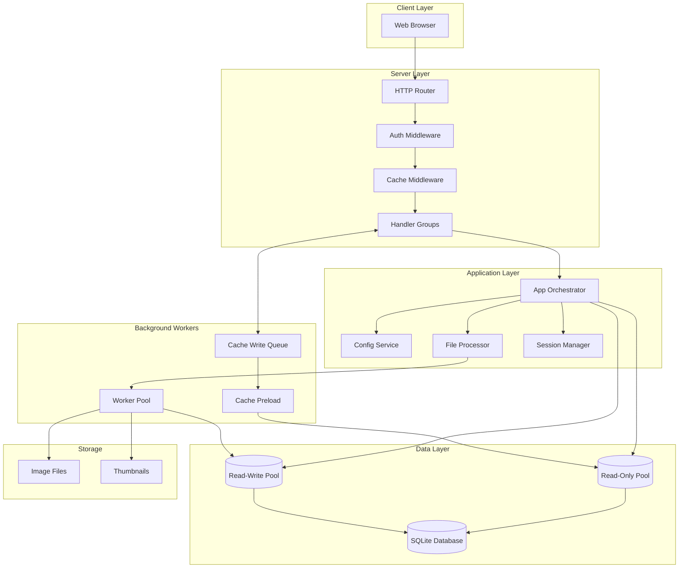
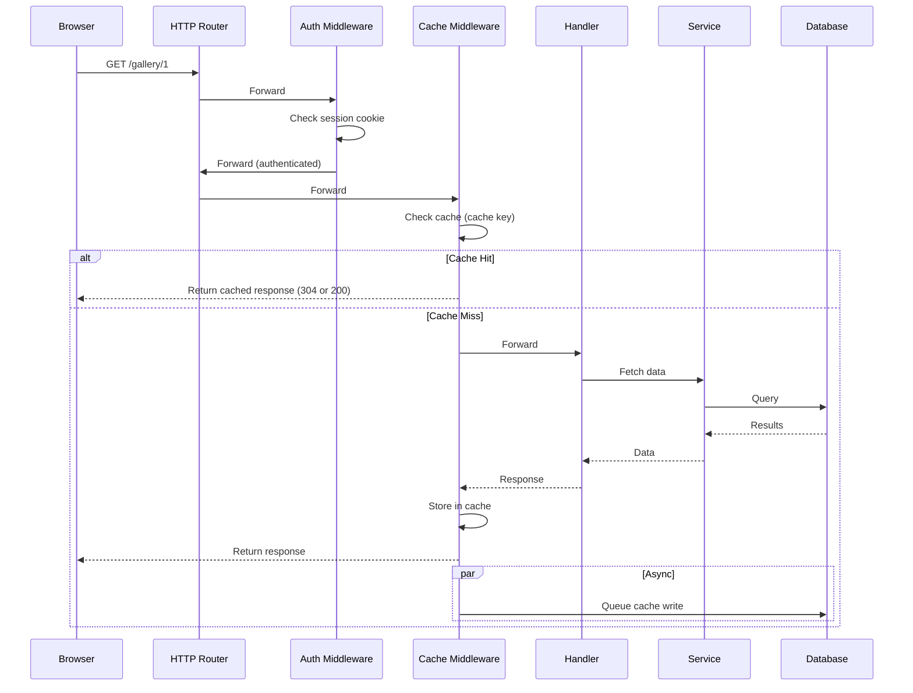
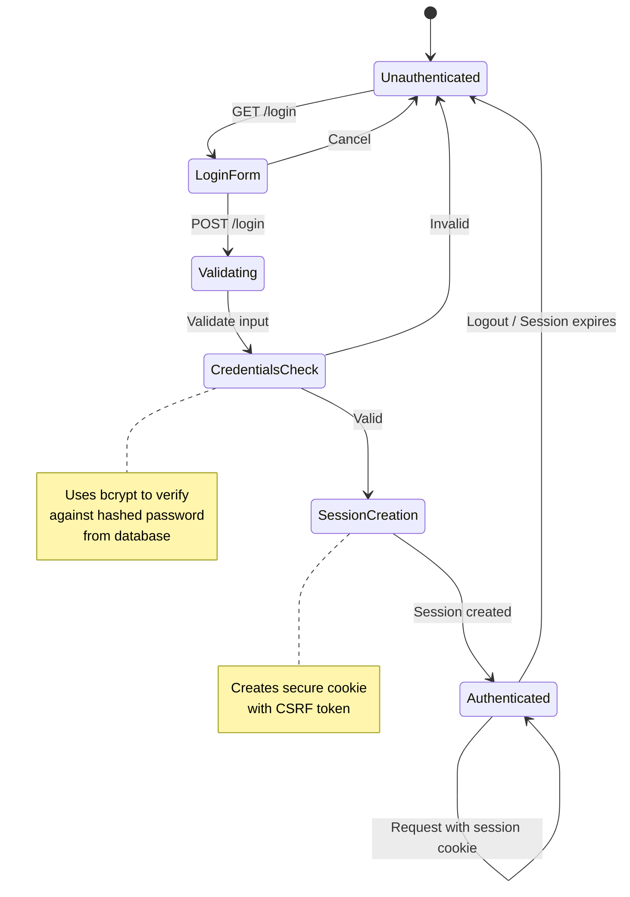
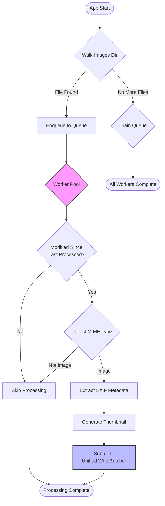
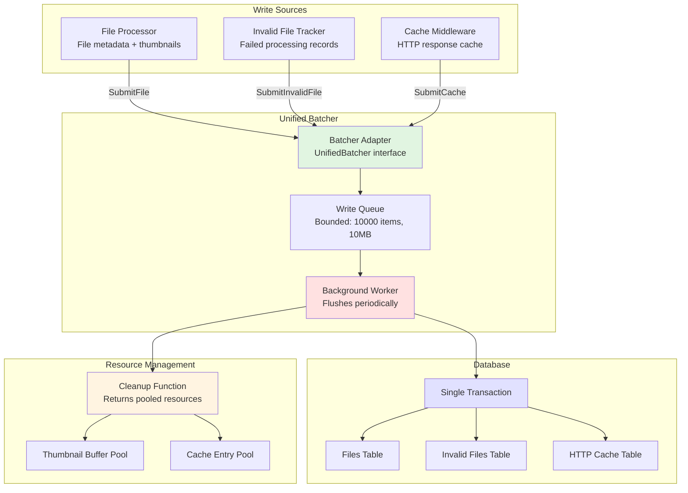
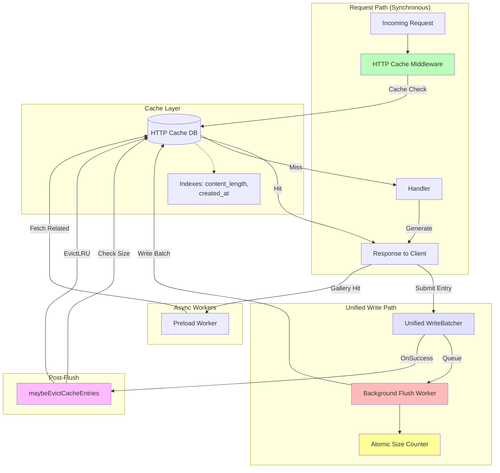
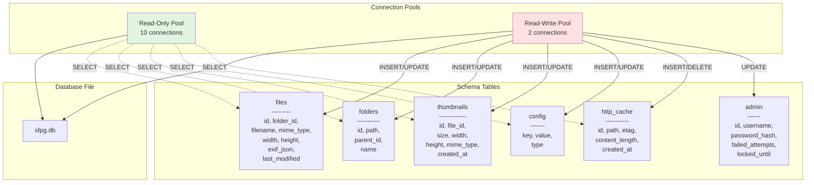
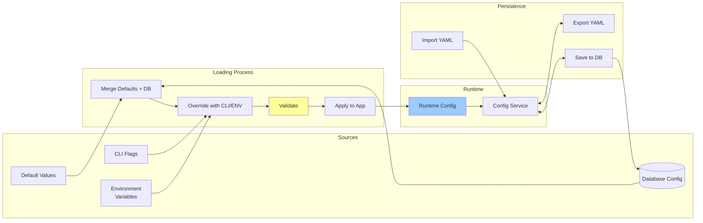
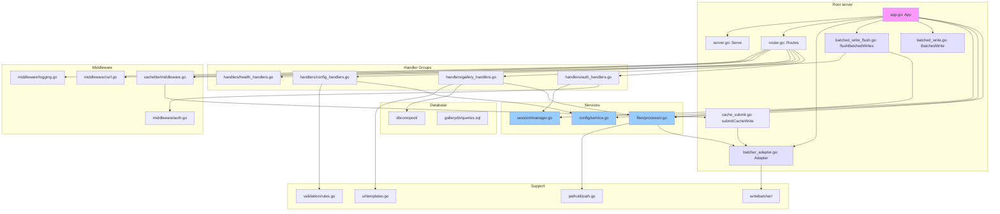

# Architecture Diagrams

This document contains Mermaid diagrams illustrating the SFPG application architecture.

> **Note:** Key diagrams are embedded directly in [`ARCHITECTURE.md`](../ARCHITECTURE.md) where they're explained in context.
> This file collects all diagrams in one place for easy reference, editing, and exporting.

## Table of Contents

1. [System Overview](#system-overview)
2. [Request Flow](#request-flow)
3. [Authentication Flow](#authentication-flow)
4. [File Processing Pipeline](#file-processing-pipeline)
5. [Cache Architecture](#cache-architecture)
6. [Database Architecture](#database-architecture)
7. [Configuration Flow](#configuration-flow)
8. [Component Dependencies](#component-dependencies)

---

## System Overview

High-level architecture showing major components and their relationships:



---

## Request Flow

Detailed flow of a typical HTTP request through the system:



---

## Authentication Flow

Login and session management flow:



---

## File Processing Pipeline

How images are discovered, processed, and stored (updated Feb 2026 for unified WriteBatcher):



---

## Unified WriteBatcher Architecture

The unified WriteBatcher consolidates all high-volume database writes (added Feb 2026):



---

## Cache Architecture

HTTP cache with preload and unified batcher integration (updated Feb 2026):



---

## Database Architecture

Connection pooling and schema organization:



---

## Configuration Flow

How configuration is loaded, validated, and persisted:



---

## Component Dependencies

Package dependency graph showing coupling (updated Feb 2026):



---

## How to View These Diagrams

### Option 1: GitHub/GitLab rendering

Simply view this file on GitHub or GitLab - they render Mermaid diagrams natively.

### Option 2: VS Code

Install the "Markdown Preview Mermaid Support" extension and open this file.

### Option 3: Online

- https://mermaid.live/ - Live editor
- Copy any diagram code to preview

### Option 4: CLI

```bash
npx @mermaid-js/mermaid-cli -i docs/diagrams/ARCHITECTURE_DIAGRAMS.md -o output.png
```

---

## Diagram Maintenance Tips

1. **Keep diagrams simple**: Focus on the most important flows
2. **Update with code changes**: When you refactor, update the diagrams
3. **Use consistent styling**: Similar components should use similar colors
4. **Add notes**: Use `note right of` to explain complex logic
5. **Test rendering**: View in GitHub before committing

---

## Next Steps

Consider adding:

- Performance optimization flow (cache preload decision tree)
- Error handling flows
- Restart/reload flow
- Test architecture diagrams
