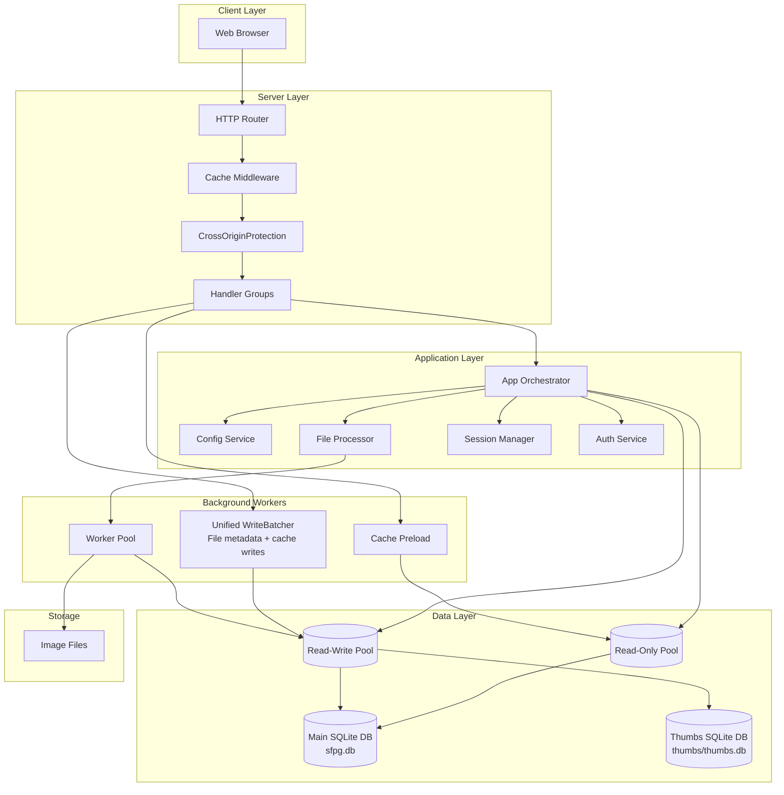
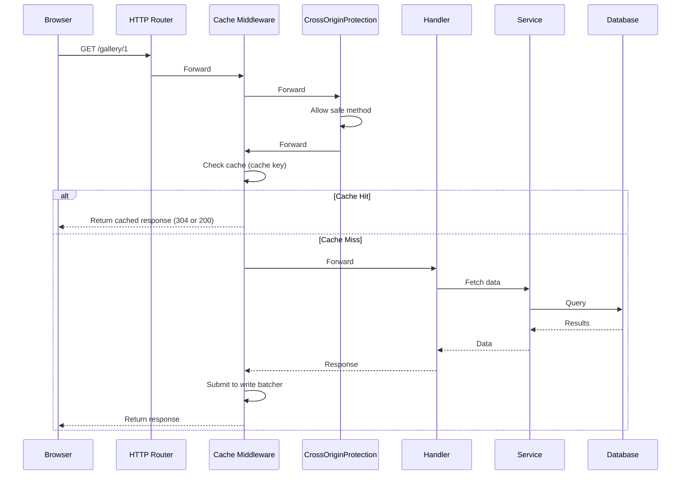
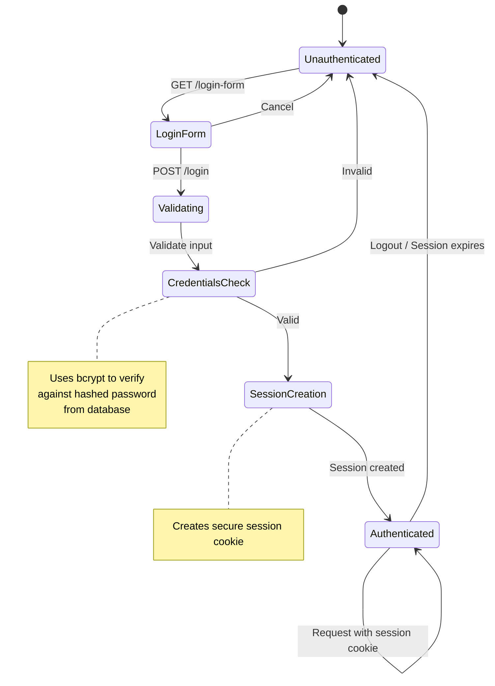
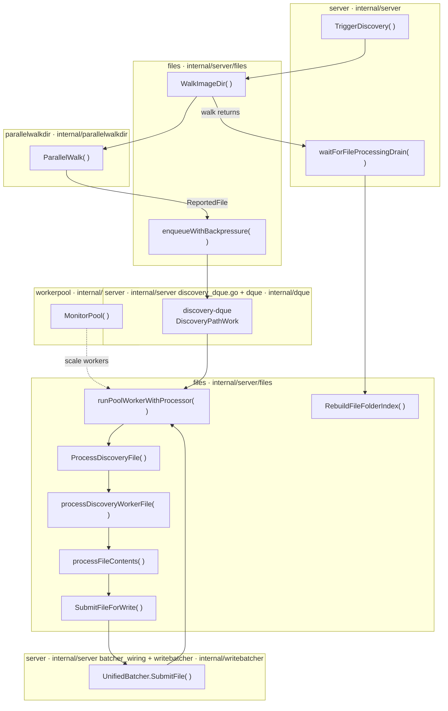
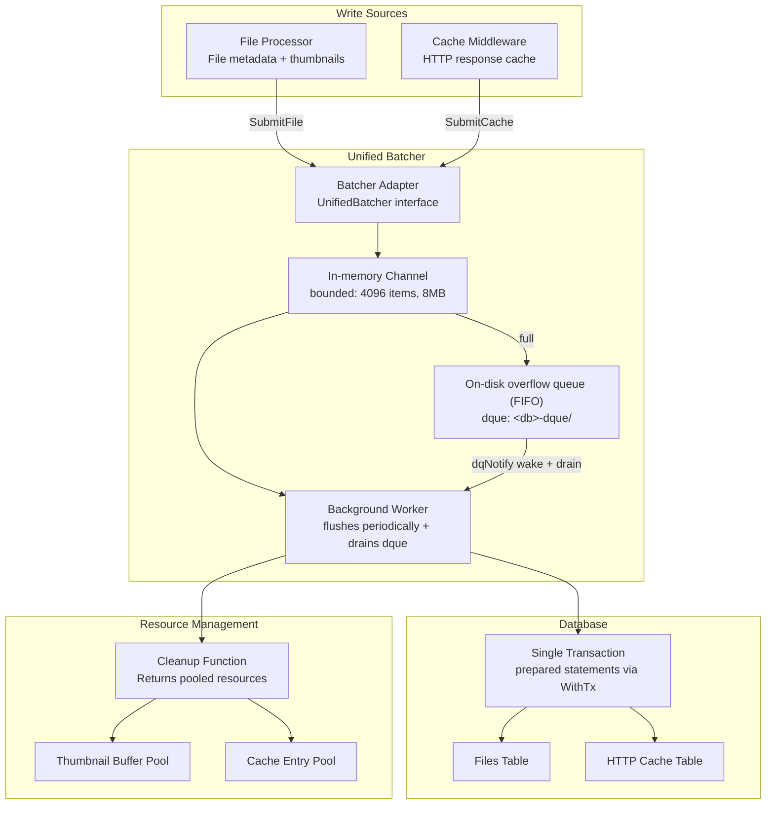
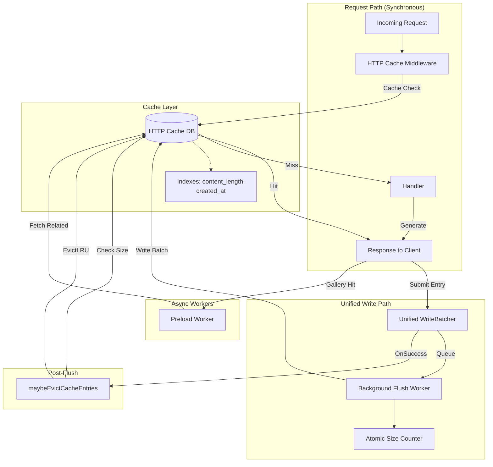
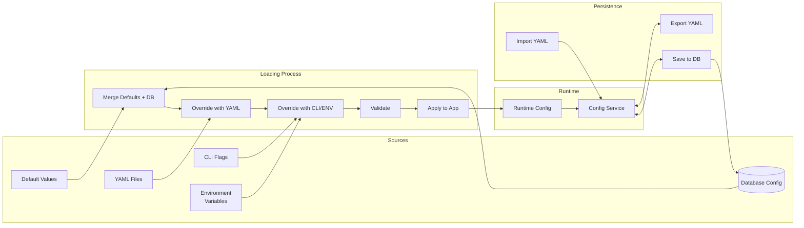

# Architecture Diagrams

This document contains Mermaid diagrams illustrating the SFPG application architecture.

> **Note:** Key diagrams are embedded directly in [`ARCHITECTURE.md`](../ARCHITECTURE.md) where they're explained in context.
> This file collects all diagrams in one place for easy reference, editing, and exporting.
>
> **Packages:** Each diagram illustrates a process documented in [`ARCHITECTURE.md`](../ARCHITECTURE.md). For the Go **package name** and **directory** (relative to the repo root) that implement that process, see [Process-to-package map](../ARCHITECTURE.md#2-process-to-package-map).

## Table of Contents

1. [System Overview](#1-system-overview)
2. [Request Flow](#2-request-flow)
3. [Authentication Flow](#3-authentication-flow)
4. [File Processing Pipeline](#4-file-processing-pipeline)
5. [Unified WriteBatcher Architecture](#5-unified-writebatcher-architecture)
6. [Cache Architecture](#6-cache-architecture)
7. [Database Architecture](#7-database-architecture)
8. [Configuration Flow](#8-configuration-flow)
9. [Component Dependencies](#9-component-dependencies)
10. [How to View These Diagrams](#10-how-to-view-these-diagrams)
11. [Diagram Maintenance Tips](#11-diagram-maintenance-tips)
12. [Next Steps](#12-next-steps)

---

## 1. System Overview

**Packages:** `server`, `handlers`, `cachelite`, `files`, `workerpool`, `writebatcher`, `dbconnpool` — directories in [Process-to-package map](../ARCHITECTURE.md#2-process-to-package-map).

High-level architecture showing major components and their relationships:


```mermaid
graph TB
    subgraph "Client Layer"
        Browser[Web Browser]
    end

    subgraph "Server Layer"
        Router[HTTP Router]
        CacheMW[Cache Middleware]
        COPMW[CrossOriginProtection]
        Handlers[Handler Groups]
    end

    subgraph "Application Layer"
        App[App Orchestrator]
        ConfigSvc[Config Service]
        FileProc[File Processor]
        SessionMgr[Session Manager]
        AuthSvc[Auth Service]
    end

    subgraph "Data Layer"
        MainDB[(Main SQLite DB<br/>sfpg.db)]
        ThumbsDB[(Thumbs SQLite DB<br/>thumbs/thumbs.db)]
        ROConn[(Read-Only Pool)]
        RWConn[(Read-Write Pool)]
    end

    subgraph "Background Workers"
        Pool[Worker Pool]
        WriteBatcher[Unified WriteBatcher<br/>File metadata + cache writes]
        Preload[Cache Preload]
    end

    subgraph "Storage"
        FileSystem[Image Files]
    end

    Browser --> Router
    Router --> CacheMW
    CacheMW --> COPMW
    COPMW --> Handlers

    Handlers --> App
    App --> ConfigSvc
    App --> FileProc
    App --> SessionMgr
    App --> AuthSvc

    App --> ROConn
    App --> RWConn
    ROConn --> MainDB
    RWConn --> MainDB
    RWConn --> ThumbsDB

    Handlers --> WriteBatcher
    WriteBatcher --> RWConn
    Handlers --> Preload
    Preload --> ROConn

    FileProc --> Pool
    Pool --> FileSystem
    Pool --> RWConn
```

---

## 2. Request Flow

**Packages:** `server` (`internal/server/router.go`), `cachelite` (`internal/cachelite`), `handlers` (`internal/server/handlers`), `gallerydb` (`internal/gallerydb`).

Detailed flow of a typical HTTP request through the system:


```mermaid
sequenceDiagram
    participant Client as Browser
    participant Router as HTTP Router
    participant CacheMW as Cache Middleware
    participant COPMW as CrossOriginProtection
    participant Handler as Handler
    participant Service as Service
    participant DB as Database

    Client->>Router: GET /gallery/1
    Router->>CacheMW: Forward
    CacheMW->>COPMW: Forward
    COPMW->>COPMW: Allow safe method

    COPMW->>CacheMW: Forward
    CacheMW->>CacheMW: Check cache (cache key)
    alt Cache Hit
        CacheMW-->>Client: Return cached response (304 or 200)
    else Cache Miss
        CacheMW->>Handler: Forward
        Handler->>Service: Fetch data
        Service->>DB: Query
        DB-->>Service: Results
        Service-->>Handler: Data

        Handler-->>CacheMW: Response
        CacheMW->>CacheMW: Submit to write batcher
        CacheMW-->>Client: Return response
    end
```

---

## 3. Authentication Flow

**Packages:** `handlers` (`internal/server/handlers`), `auth` (`internal/server/auth`), `session` (`internal/server/session`), `security` (`internal/server/security`).

Login and session management flow:


```mermaid
stateDiagram-v2
    [*] --> Unauthenticated
    Unauthenticated --> LoginForm: GET /login-form
    LoginForm --> Unauthenticated: Cancel

    LoginForm --> Validating: POST /login
    Validating --> CredentialsCheck: Validate input
    CredentialsCheck --> Unauthenticated: Invalid
    CredentialsCheck --> SessionCreation: Valid

    SessionCreation --> Authenticated: Session created
    Authenticated --> Authenticated: Request with session cookie
    Authenticated --> Unauthenticated: Logout / Session expires

    note right of CredentialsCheck
        Uses bcrypt to verify
        against hashed password
        from database
    end note

    note right of SessionCreation
        Creates secure session cookie
    end note
```

---

## 4. File Processing Pipeline

End-to-end discovery (startup or `POST /server/discovery`) and one dequeued item. Index: [ARCHITECTURE.md §2 Process-to-package map](../ARCHITECTURE.md#2-process-to-package-map).


```mermaid
flowchart TD
    subgraph server["server · internal/server"]
        TD["TriggerDiscovery( )"]
        DRAIN["waitForFileProcessingDrain( )"]
    end

    subgraph files_walk["files · internal/server/files"]
        WID["WalkImageDir( )"]
        ENQ["enqueueWithBackpressure( )"]
    end

    subgraph pwd["parallelwalkdir · internal/parallelwalkdir"]
        PW["ParallelWalk( )"]
    end

    subgraph discovery_q["server · internal/server discovery_dque.go + dque · internal/dque"]
        Q["discovery-dque<br/>DiscoveryPathWork"]
    end

    subgraph wp["workerpool · internal/workerpool"]
        MON["MonitorPool( )"]
    end

    subgraph files_proc["files · internal/server/files"]
        RPW["runPoolWorkerWithProcessor( )"]
        PDF["ProcessDiscoveryFile( )"]
        PDW["processDiscoveryWorkerFile( )"]
        PFC["processFileContents( )"]
        SFW["SubmitFileForWrite( )"]
        RFI["RebuildFileFolderIndex( )"]
    end

    subgraph batch["server · internal/server batcher_wiring + writebatcher · internal/writebatcher"]
        BAT["UnifiedBatcher.SubmitFile( )"]
    end

    TD --> WID
    WID --> PW
    PW -->|ReportedFile| ENQ
    ENQ --> Q
    MON -.->|scale workers| RPW
    Q --> RPW
    WID -->|walk returns| DRAIN
    DRAIN --> RFI

    RPW --> PDF
    PDF --> PDW
    PDW --> PFC
    PFC --> SFW
    SFW --> BAT
    BAT --> RPW
```

| Diagram label                   | Package                   | Directory                                                    | Symbol / file                                            |
| ------------------------------- | ------------------------- | ------------------------------------------------------------ | -------------------------------------------------------- |
| `TriggerDiscovery( )`           | `server`                  | `internal/server`                                            | `server.go`                                              |
| `waitForFileProcessingDrain( )` | `server`                  | `internal/server`                                            | `app_lifecycle.go`                                       |
| `WalkImageDir( )`               | `files`                   | `internal/server/files`                                      | `walker.go`                                              |
| `enqueueWithBackpressure( )`    | `files`                   | `internal/server/files`                                      | `walker.go`                                              |
| `ParallelWalk( )`               | `parallelwalkdir`         | `internal/parallelwalkdir`                                   | `parallelwalkdir.go`                                     |
| `discovery-dque`                | `server` + `dque`         | `internal/server/discovery_dque.go`, `internal/dque`         | Queue label; opened/wiped in `SubsystemManager.Start( )` |
| `MonitorPool( )`                | `workerpool`              | `internal/workerpool`                                        | `workerpool.go`                                          |
| `runPoolWorkerWithProcessor( )` | `files`                   | `internal/server/files`                                      | `processor.go`                                           |
| `ProcessDiscoveryFile( )`       | `files`                   | `internal/server/files`                                      | `service.go`                                             |
| `processDiscoveryWorkerFile( )` | `files`                   | `internal/server/files`                                      | `processor.go`; always `processFileContents` for dequeue |
| `processFileContents( )`        | `files`                   | `internal/server/files`                                      | `processor.go`; calls `imagemeta`, `thumbnail`           |
| `SubmitFileForWrite( )`         | `files`                   | `internal/server/files`                                      | `service.go`                                             |
| `UnifiedBatcher.SubmitFile( )`  | `server` + `writebatcher` | `internal/server/batcher_wiring.go`, `internal/writebatcher` | Flush via `flushBatchedWrites( )`                        |
| `RebuildFileFolderIndex( )`     | `files`                   | `internal/server/files`                                      | `folder_index.go`                                        |

---

## 5. Unified WriteBatcher Architecture

**Packages:** `writebatcher` (`internal/writebatcher`), `dque` (`internal/dque`), `flock` (`internal/flock`), `server` (`internal/server` batcher wiring), `files` (`internal/server/files`), `gallerylib` (`internal/gallerylib`).

The unified WriteBatcher consolidates all high-volume database writes (added Feb 2026, persistent overflow added Jun 2026):


```mermaid
graph TB
    subgraph "Write Sources"
        FileProc[File Processor<br/>File metadata + thumbnails]
        CacheMW[Cache Middleware<br/>HTTP response cache]
    end

    subgraph "Unified Batcher"
        Adapter[Batcher Adapter<br/>UnifiedBatcher interface]
        Channel[In-memory Channel<br/>bounded: 4096 items, 8MB]
        DQue["On-disk overflow queue (FIFO)<br/>dque: &lt;db&gt;-dque/"]
        Worker[Background Worker<br/>flushes periodically + drains dque]
    end

    subgraph "Database"
        Tx[Single Transaction<br/>prepared statements via WithTx]
        Files[Files Table]
        Cache[HTTP Cache Table]
    end

    subgraph "Resource Management"
        Cleanup[Cleanup Function<br/>Returns pooled resources]
        ThumbnailPool[Thumbnail Buffer Pool]
        CachePool[Cache Entry Pool]
    end

    FileProc -->|SubmitFile| Adapter
    CacheMW -->|SubmitCache| Adapter

    Adapter --> Channel
    Channel -->|full| DQue
    Channel --> Worker
    DQue -->|dqNotify wake + drain| Worker

    Worker --> Tx
    Tx --> Files
    Tx --> Cache

    Worker --> Cleanup
    Cleanup --> ThumbnailPool
    Cleanup --> CachePool
```

Invalid-file cleanup now happens inside the `File` flush path via the `HadInvalidEntry` flag (not a separate batched variant). `dque` acquires a `flock` via `internal/flock`; pending writes in `dque` survive process restarts (crash recovery) and are drained on `Close()`/context cancel.

---

## 6. Cache Architecture

**Packages:** `cachelite` (`internal/cachelite`), `cachepreload` (`internal/server/cachepreload`), `writebatcher` (`internal/writebatcher`), `tableswap` (`internal/tableswap`).

HTTP cache with preload and unified batcher integration (updated Feb 2026).
Table rotation (`RotateCacheTable`) is `CloneEmpty` → `CreateIndexes` → `Swap`;
`Swap` `DROP TABLE`s `http_cache_to_be_dropped` before it returns.


```mermaid
graph TB
    subgraph "Request Path (Synchronous)"
        Request[Incoming Request]
        CacheMW[HTTP Cache Middleware]
        Handler[Handler]
        Response[Response to Client]
    end

    subgraph "Cache Layer"
        CacheDB[(HTTP Cache DB)]
        Index[Indexes: content_length,<br/>created_at]
    end

    subgraph "Unified Write Path"
        Batcher[Unified WriteBatcher]
        FlushWorker[Background Flush Worker]
        AtomicCounter[Atomic Size Counter]
    end

    subgraph "Async Workers"
        PreloadWorker[Preload Worker]
    end

    subgraph "Post-Flush"
        EvictStep[maybeEvictCacheEntries]
    end

    Request --> CacheMW
    CacheMW -->|Cache Check| CacheDB
    CacheDB -->|Hit| Response
    CacheDB -->|Miss| Handler
    Handler -->|Generate| Response
    Response -->|Submit Entry| Batcher

    Batcher -->|Queue| FlushWorker
    FlushWorker -->|Write Batch| CacheDB
    FlushWorker --> AtomicCounter

    Batcher -->|OnSuccess| EvictStep
    EvictStep -->|Check Size| CacheDB
    EvictStep -->|EvictLRU| CacheDB

    Response -->|Gallery Hit| PreloadWorker
    PreloadWorker -->|Fetch Related| CacheDB

    CacheDB -.-> Index
```

---

## 7. Database Architecture

**Packages:** `dbconnpool` (`internal/dbconnpool`), `database` (`internal/server/database`), `gallerydb` (`internal/gallerydb`); schema SQL in `sqlc/queries/`, migrations in `migrations/`.

Connection pooling and schema organization:


```mermaid
graph TB
    subgraph "Connection Pools"
        RO[Read-Only Pool<br/>db_max_pool_size, default 100]
        RW[Read-Write Pool<br/>db_max_pool_size, default 100]
    end

    subgraph "Database Files"
        SQLiteFile[sfpg.db]
        ThumbsFile[thumbs/thumbs.db]
    end

    subgraph "Main Schema Tables"
        Files[files<br/>---------<br/>id, folder_id, path_id,<br/>filename, mime_type,<br/>width, height,<br/>size_bytes, mtime,<br/>md5, phash]
        Folders[folders<br/>-----------<br/>id, path_id, parent_id,<br/>name, mtime, tile_id]
        FilePaths[file_paths<br/>-----------<br/>id, path]
        FolderPaths[folder_paths<br/>---------------<br/>id, path]
        Exif[exif_metadata<br/>-----------------<br/>file_id, json]
        Config[config<br/>-------<br/>key, value,<br/>category, ...]
        HTTPCache[http_cache<br/>-----------<br/>key, method, path,<br/>encoding, etag,<br/>body, content_length,<br/>created_at, expires_at]
        FileFolderIndex[file_folder_index<br/>-------------------<br/>file_id, folder_id,<br/>image_index, image_count,<br/>prev_id, next_id,<br/>first_id, last_id]
        LoginAttempts[login_attempts<br/>-------------------<br/>username, failed_attempts,<br/>locked_until, last_attempt_at]
        ModuleState[module_state<br/>---------------<br/>name, active,<br/>last_started_at]
    end

    subgraph "Thumbs Schema Tables"
        Thumbnails[thumbnails<br/>-------------<br/>file_id, size_label,<br/>width, height,<br/>format, blob_id]
        ThumbnailBlobs[thumbnail_blobs<br/>-----------------<br/>id, data]
    end

    RO --> SQLiteFile
    RW --> SQLiteFile
    RW --> ThumbsFile

    RO -.->|SELECT| Files
    RO -.->|SELECT| Folders
    RO -.->|SELECT| FilePaths
    RO -.->|SELECT| FolderPaths
    RO -.->|SELECT| Exif
    RO -.->|SELECT| Config
    RO -.->|SELECT| HTTPCache
    RO -.->|SELECT| FileFolderIndex
    RO -.->|SELECT| LoginAttempts
    RO -.->|SELECT| ModuleState

    RW -->|INSERT/UPDATE| Files
    RW -->|INSERT/UPDATE| Folders
    RW -->|INSERT/UPDATE| FilePaths
    RW -->|INSERT/UPDATE| FolderPaths
    RW -->|INSERT/UPDATE| Exif
    RW -->|INSERT/UPDATE| Config
    RW -->|INSERT/DELETE| HTTPCache
    RW -->|INSERT/DELETE| FileFolderIndex
    RW -->|INSERT/UPDATE| LoginAttempts
    RW -->|INSERT/UPDATE| ModuleState
    RW -->|INSERT/UPDATE| Thumbnails
    RW -->|INSERT/UPDATE| ThumbnailBlobs
```

---

## 8. Configuration Flow

**Packages:** `config` (`internal/server/config`), `getopt` (`internal/getopt`), `validation` (`internal/server/validation`).

How configuration is loaded, validated, and persisted:


```mermaid
flowchart LR
    subgraph "Sources"
        Defaults[Default Values]
        DB[(Database Config)]
        YAML[YAML Files]
        CLI[CLI Flags]
        ENV[Environment<br/>Variables]
    end

    subgraph "Loading Process"
        Merge1[Merge Defaults + DB]
        Merge2[Override with YAML]
        Merge3[Override with CLI/ENV]
        Validate[Validate]
        Apply[Apply to App]
    end

    subgraph "Runtime"
        RuntimeConfig[Runtime Config]
        ConfigService[Config Service]
    end

    subgraph "Persistence"
        Save[Save to DB]
        Export[Export YAML]
        Import[Import YAML]
    end

    Defaults --> Merge1
    DB --> Merge1
    Merge1 --> Merge2
    YAML --> Merge2
    Merge2 --> Merge3
    CLI --> Merge3
    ENV --> Merge3
    Merge3 --> Validate
    Validate --> Apply

    Apply --> RuntimeConfig
    RuntimeConfig --> ConfigService

    ConfigService <--> Save
    Save --> DB

    ConfigService <--> Export
    Import --> ConfigService
```

---

## 9. Component Dependencies

**Packages:** dependency graph centers on `server` (`internal/server`); see full list in [Process-to-package map](../ARCHITECTURE.md#2-process-to-package-map).

Package dependency graph showing coupling (updated Feb 2026):


```mermaid
graph TD
    subgraph "Root server"
        App[app.go: App]
        Server[server.go: Serve]
        Router[router.go: Routes]
        BatchWrite[batched_write.go: BatchedWrite]
        BatchFlush[batched_write_flush.go: flushBatchedWrites]
        BatchWiring[batcher_wiring.go: fileBatcher]
        CacheSubmit[infrastructure_service.go: submitCacheWrite]
    end

    subgraph "Handler Groups"
        AuthH[handlers/auth_handlers.go]
        GalleryH[handlers/gallery_handlers.go]
        ConfigH[handlers/config_handlers.go]
        DashboardH[handlers/dashboard_handlers.go]
        ServerH[handlers/server_handlers.go]
        ThemeH[handlers/theme_handlers.go]
        MenuH[handlers/menu_handlers.go]
        HealthH[handlers/health_handlers.go]
    end

    subgraph "Services"
        ConfigSvc[config/service.go]
        FileProc[files/processor.go]
        SessionMgr[session/manager.go]
        AuthSvc[auth/service.go]
    end

    subgraph "Middleware"
        AuthMW[middleware/auth.go]
        CacheMW[cachelite/middleware.go]
        COPMW[http.CrossOriginProtection]
        LogMW[middleware/logging.go]
    end

    subgraph "Database"
        DBConn[dbconnpool/]
        GalleryDB[gallerydb/queries.sql]
    end

    subgraph "Support"
        UI[ui/templates.go]
        TemplateData[template/data.go]
        Validation[validation/rules.go]
        Security[security/lockout.go]
        WriteBatch[writebatcher/]
        DQue[dque/]
        Flock[flock/]
        GalleryLib[gallerylib/importer.go]
        PathUtil[pathutil/path.go]
        CacheBatch[cachebatch/]
        CachePreload[cachepreload/]
        ModuleState[modulestate/]
        Metrics[metrics/]
    end

    Router --> AuthH
    Router --> GalleryH
    Router --> ConfigH
    Router --> DashboardH
    Router --> ServerH
    Router --> ThemeH
    Router --> MenuH
    Router --> HealthH

    App --> ConfigSvc
    App --> FileProc
    App --> SessionMgr
    App --> AuthSvc
    App --> BatchWrite
    App --> BatchFlush
    App --> BatchWiring
    App --> CacheBatch
    App --> CachePreload
    App --> ModuleState
    App --> Metrics

    App --> Router
    App --> Server

    AuthH --> AuthMW
    AuthH --> SessionMgr
    AuthH --> AuthSvc
    GalleryH --> FileProc
    GalleryH --> DBConn
    ConfigH --> ConfigSvc
    DashboardH --> Metrics
    ServerH --> CacheBatch

    Router --> CacheMW
    Router --> COPMW
    Router --> LogMW

    CacheMW --> CacheSubmit
    CacheSubmit --> WriteBatch
    BatchWiring --> WriteBatch
    WriteBatch --> DQue
    DQue --> Flock

    GalleryH --> UI
    ConfigH --> Validation
    ConfigH --> TemplateData
    AuthSvc --> Security

    FileProc --> BatchWiring
    FileProc --> PathUtil
    FileProc --> GalleryLib

    BatchFlush --> FileProc
    BatchFlush --> GalleryLib
    BatchFlush --> CacheMW
    CacheBatch --> CachePreload
```

---

## 10. How to View These Diagrams

### 10.1 Option 1: GitHub/GitLab rendering

Simply view this file on GitHub or GitLab - they render Mermaid diagrams natively.

### 10.2 Option 2: VS Code

Install the "Markdown Preview Mermaid Support" extension and open this file.

### 10.3 Option 3: Online

- https://mermaid.live/ - Live editor
- Copy any diagram code to preview

### 10.4 Option 4: CLI

```bash
npx @mermaid-js/mermaid-cli -i docs/diagrams/ARCHITECTURE_DIAGRAMS.md -o output.png
```

---

## 11. Diagram Maintenance Tips

1. **Keep diagrams simple**: Focus on the most important flows
2. **Update with code changes**: When you refactor, update the diagrams
3. **Theme defaults only**: Do not use per-node `style` / `classDef` / custom `fill` — all nodes use the renderer theme so light and dark previews stay readable and consistent
4. **Spell out acronyms**: On first use in each section, write the full term, then the abbreviation in parentheses (e.g. time-of-check to time-of-use (TOCTOU))
5. **Functions in diagrams**: Suffix callable symbols with `( )` in Mermaid node text and the legend; leave queue names, types, and edge labels without parentheses
6. **Add notes**: Use `note right of` to explain complex logic
7. **Test rendering**: View in GitHub and in the IDE markdown preview before committing

---

## 12. Next Steps

Consider adding:

- Performance optimization flow (cache preload decision tree)
- Error handling flows
- Restart/reload flow
- Test architecture diagrams
