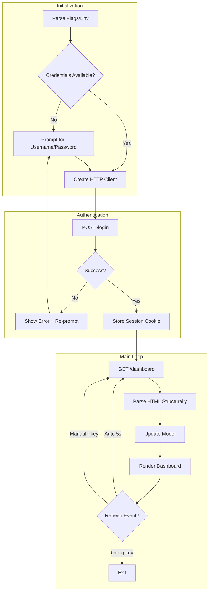
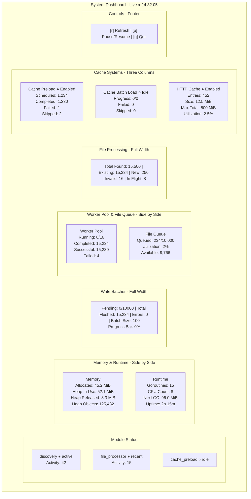

# SFPG-Go Dashboard TUI Design

## Overview

A terminal user interface (TUI) application that displays the same metrics shown in the web dashboard at `/dashboard`. The TUI will be a separate executable rooted at `./cmd/sfpg-go-dashboard`.

## Technology Choices

| Component         | Choice                                                   | Rationale                                                    |
| ----------------- | -------------------------------------------------------- | ------------------------------------------------------------ |
| **TUI Framework** | [Bubble Tea](https://github.com/charmbracelet/bubbletea) | Modern, functional approach with excellent community support |
| **Styling**       | [Lipgloss](https://github.com/charmbracelet/lipgloss)    | Complementary to Bubble Tea for layout/styling               |
| **HTML Parsing**  | `golang.org/x/net/html`                                  | Already used in project; structural parsing per methodology  |
| **HTTP Client**   | `net/http`                                               | Standard library; cookie management for session              |

## Architecture

### Package Structure

```
cmd/sfpg-go-dashboard/
├── main.go                 # Entry point, flag parsing, initial model
├── model.go                # Bubble Tea model definition
├── update.go               # Bubble Tea update function
├── view.go                 # Bubble Tea view rendering
├── client/
│   └── client.go           # HTTP client for authentication and dashboard fetch
├── parser/
│   └── dashboard.go        # HTML parsing using structural approach
└── config/
    └── config.go           # Configuration from flags/env
```

### Data Flow



## Configuration

### Command-Line Flags

| Flag          | Default                 | Description                 |
| ------------- | ----------------------- | --------------------------- |
| `-server`     | `http://localhost:8083` | Server URL                  |
| `-username`   | `""`                    | Username for authentication |
| `-password`   | `""`                    | Password for authentication |
| `-refresh`    | `5s`                    | Auto-refresh interval       |
| `-no-refresh` | `false`                 | Disable auto-refresh        |

### Environment Variables

| Variable        | Description |
| --------------- | ----------- |
| `SFPG_SERVER`   | Server URL  |
| `SFPG_USERNAME` | Username    |
| `SFPG_PASSWORD` | Password    |

### Precedence

Flags > Environment Variables > Interactive Prompt

## Authentication Flow

### Login Request

```go
// POST /login with form data
// Store session cookie from response
func (c *Client) Login(ctx context.Context, username, password string) error {
    data := url.Values{}
    data.Set("username", username)
    data.Set("password", password)

    req, err := http.NewRequestWithContext(ctx, http.MethodPost,
        c.serverURL+"/login", strings.NewReader(data.Encode()))
    if err != nil {
        return err
    }
    req.Header.Set("Content-Type", "application/x-www-form-urlencoded")

    resp, err := c.httpClient.Do(req)
    if err != nil {
        return err
    }
    defer resp.Body.Close()

    // Check for HX-Trigger: login-success header
    if resp.Header.Get("HX-Trigger") == "login-success" {
        // Session cookie automatically stored in cookie jar
        return nil
    }

    // Parse error message from HTML if present
    return ErrAuthenticationFailed
}
```

## HTML Parsing Strategy

Following the methodology in `references/methodology-html-content-test-writing.md`:

### Dashboard Metrics to Extract

Based on `web/templates/dashboard.html.tmpl`, extract the following:

| Section              | Element ID/Class                     | Data                                                |
| -------------------- | ------------------------------------ | --------------------------------------------------- |
| **Header**           | `#last-updated`                      | Timestamp                                           |
| **Module Status**    | `.card` within Module Status section | Name, Status, Activity Count                        |
| **Memory**           | Stats under Memory card              | Allocated, Heap In Use, Heap Released, Heap Objects |
| **Runtime**          | Stats under Runtime card             | Goroutines, CPU Count, Next GC, Uptime              |
| **Write Batcher**    | Stats under Write Batcher section    | Pending, Total Flushed, Errors, Batch Size          |
| **Worker Pool**      | Stats under Worker Pool card         | Running Workers, Completed, Successful, Failed      |
| **File Queue**       | Stats under File Queue card          | Queued Items, Utilization, Available                |
| **File Processing**  | Stats under File Processing section  | Total Found, Existing, New, Invalid, In Flight      |
| **Cache Preload**    | Stats under Cache Preload card       | Scheduled, Completed, Failed, Skipped               |
| **Cache Batch Load** | Stats under Cache Batch Load card    | Progress, Failed, Skipped                           |
| **HTTP Cache**       | Stats under HTTP Cache card          | Entries, Size, Max Total, Max Entry, Utilization    |

### Parsing Approach

The TUI will reuse the existing HTML parsing functions from `internal/testutil/html.go`:

| Function                                | Purpose                               |
| --------------------------------------- | ------------------------------------- |
| `testutil.ParseHTML(r io.Reader)`       | Parse HTML into node tree             |
| `testutil.FindElementByID(n, id)`       | Find element by ID attribute          |
| `testutil.FindElementByClass(n, class)` | Find first element with class         |
| `testutil.FindElementByTag(n, tag)`     | Find first element by tag name        |
| `testutil.FindElement(n, match)`        | Find first element matching predicate |
| `testutil.FindAllElements(n, match)`    | Find all elements matching predicate  |
| `testutil.GetAttr(n, key)`              | Get attribute value                   |
| `testutil.GetTextContent(n)`            | Get all text within node              |

```go
// Import the existing testutil package for HTML parsing
import "github.com/lbe/sfpg-go/internal/testutil"

type DashboardMetrics struct {
    LastUpdated    string
    Modules        []ModuleStatus
    Memory         MemoryStats
    Runtime        RuntimeStats
    WriteBatcher   WriteBatcherStats
    WorkerPool     WorkerPoolStats
    Queue          QueueStats
    FileProcessing FileProcessingStats
    CachePreload   CachePreloadStats
    CacheBatchLoad CacheBatchLoadStats
    HTTPCache      HTTPCacheStats
}

func ParseDashboard(htmlBody io.Reader) (*DashboardMetrics, error) {
    doc, err := testutil.ParseHTML(htmlBody)
    if err != nil {
        return nil, err
    }

    metrics := &DashboardMetrics{}

    // Find dashboard container using existing helper
    container := testutil.FindElementByID(doc, "dashboard-container")
    if container == nil {
        return nil, ErrDashboardNotFound
    }

    // Extract each section using structural parsing
    metrics.LastUpdated = extractLastUpdated(container)
    metrics.Modules = extractModules(container)
    metrics.Memory = extractMemoryStats(container)
    // ... etc

    return metrics, nil
}
```

### Helper Functions for Parsing

```go
// extractStatValue finds a stat by its title and returns the value
func extractStatValue(container *html.Node, statTitle string) string {
    // Find stat-title elements containing the text using testutil helpers
    statTitles := testutil.FindAllElements(container, func(n *html.Node) bool {
        return testutil.GetAttr(n, "class") == "stat-title" &&
               strings.Contains(testutil.GetTextContent(n), statTitle)
    })

    for _, titleEl := range statTitles {
        // Navigate to parent stat div, then find stat-value sibling
        statDiv := titleEl.Parent
        if statDiv == nil {
            continue
        }
        valueEl := testutil.FindElementByClass(statDiv, "stat-value")
        if valueEl != nil {
            return strings.TrimSpace(testutil.GetTextContent(valueEl))
        }
    }
    return ""
}

// extractModules finds all module cards in the Module Status section
func extractModules(container *html.Node) []ModuleStatus {
    var modules []ModuleStatus

    // Find all card elements using testutil.FindAllElements
    cards := testutil.FindAllElements(container, func(n *html.Node) bool {
        classes := strings.Fields(testutil.GetAttr(n, "class"))
        hasCard := false
        for _, c := range classes {
            if c == "card" {
                hasCard = true
                break
            }
        }
        return hasCard && n.Data == "div"
    })

    // Parse each card for module info using testutil.GetTextContent
    for _, card := range cards {
        module := parseModuleCard(card)
        if module.Name != "" {
            modules = append(modules, module)
        }
    }

    return modules
}

// parseModuleCard extracts module status from a single card element
func parseModuleCard(card *html.Node) ModuleStatus {
    module := ModuleStatus{}

    // Find module name - typically in a text-sm font-medium element
    nameEl := testutil.FindElementByClass(card, "text-sm")
    if nameEl != nil {
        module.Name = strings.TrimSpace(testutil.GetTextContent(nameEl))
    }

    // Find badge for status
    badgeEl := testutil.FindElement(card, func(n *html.Node) bool {
        classes := testutil.GetAttr(n, "class")
        return strings.Contains(classes, "badge")
    })
    if badgeEl != nil {
        module.Status = strings.TrimSpace(testutil.GetTextContent(badgeEl))
    }

    return module
}
```

## UI Layout

### Screen Layout



### Color Scheme

Using Lipgloss with a terminal-friendly color palette:

| Element             | Style               |
| ------------------- | ------------------- |
| **Header**          | Bold, primary color |
| **Active status**   | Green               |
| **Warning/Recent**  | Yellow              |
| **Error/Failed**    | Red                 |
| **Idle/Disabled**   | Gray/Dim            |
| **Section headers** | Bold, underlined    |
| **Key bindings**    | Dim, bracketed      |

### Responsive Layout

The layout should adapt to terminal width:

- **Wide - more than 120 cols**: Side-by-side cards as shown
- **Medium - 80 to 120 cols**: Stack some sections vertically
- **Narrow - less than 80 cols**: All sections stacked vertically

## Bubble Tea Model

### Model Definition

```go
package main

import (
    "time"

    "github.com/charmbracelet/bubbletea"
    "github.com/charmbracelet/bubbles/textinput"
)

// AuthState represents the current authentication state
type AuthState int

const (
    authStateNone AuthState = iota
    authStatePrompting
    authStateAuthenticating
    authStateAuthenticated
)

// Model holds the application state
type Model struct {
    // Configuration
    serverURL       string
    refreshInterval time.Duration
    autoRefresh     bool

    // State
    metrics       *DashboardMetrics
    lastUpdated   time.Time
    loading       bool
    error         error
    authState     AuthState

    // Credential input
    usernameInput textinput.Model
    passwordInput textinput.Model
    focusPassword bool // true when password field is focused

    // UI state
    width    int
    height   int
    paused   bool
    quitting bool

    // Client
    client *client.Client
}

// Msg types for Bubble Tea
type MetricsFetchedMsg struct {
    metrics *DashboardMetrics
    err     error
}

type TickMsg time.Time

type PromptCredentialsMsg struct{}

type CredentialsSubmittedMsg struct {
    username string
    password string
}
```

### Update Function

```go
func (m Model) Update(msg bubbletea.Msg) (bubbletea.Model, bubbletea.Cmd) {
    switch msg := msg.(type) {
    case bubbletea.WindowSizeMsg:
        m.width = msg.Width
        m.height = msg.Height

    case TickMsg:
        if !m.paused && m.autoRefresh && m.authState == authStateAuthenticated {
            return m, fetchMetricsCmd(m.client)
        }
        return m, tickCmd(m.refreshInterval)

    case MetricsFetchedMsg:
        m.loading = false
        if msg.err != nil {
            m.error = msg.err
        } else {
            m.metrics = msg.metrics
            m.lastUpdated = time.Now()
            m.error = nil
        }
        if m.autoRefresh {
            return m, tickCmd(m.refreshInterval)
        }

    case PromptCredentialsMsg:
        // Transition to credential input state
        m.authState = authStatePrompting
        m.usernameInput.Focus()
        return m, nil

    case CredentialsSubmittedMsg:
        m.authState = authStateAuthenticating
        m.loading = true
        return m, loginCmd(m.client, msg.username, msg.password)

    case bubbletea.KeyMsg:
        // Handle credential input mode
        if m.authState == authStatePrompting {
            return m.handleCredentialInput(msg)
        }

        // Normal mode key handling
        switch msg.String() {
        case "q", "ctrl+c":
            m.quitting = true
            return m, bubbletea.Quit
        case "r":
            if m.authState == authStateAuthenticated {
                m.loading = true
                return m, fetchMetricsCmd(m.client)
            }
        case "p":
            m.paused = !m.paused
        }
    }

    return m, nil
}

// handleCredentialInput processes keyboard input during credential entry
func (m Model) handleCredentialInput(msg bubbletea.KeyMsg) (bubbletea.Model, bubbletea.Cmd) {
    switch msg.String() {
    case "ctrl+c", "esc":
        m.quitting = true
        return m, bubbletea.Quit
    case "tab", "shift+tab":
        // Toggle between username and password fields
        if m.focusPassword {
            m.passwordInput.Blur()
            m.usernameInput.Focus()
            m.focusPassword = false
        } else {
            m.usernameInput.Blur()
            m.passwordInput.Focus()
            m.focusPassword = true
        }
        return m, nil
    case "enter":
        // Submit credentials
        return m, func() bubbletea.Msg {
            return CredentialsSubmittedMsg{
                username: m.usernameInput.Value(),
                password: m.passwordInput.Value(),
            }
        }
    }

    // Forward to active text input
    if m.focusPassword {
        var cmd bubbletea.Cmd
        m.passwordInput, cmd = m.passwordInput.Update(msg)
        return m, cmd
    }
    var cmd bubbletea.Cmd
    m.usernameInput, cmd = m.usernameInput.Update(msg)
    return m, cmd
}
```

### Commands

```go
func tickCmd(interval time.Duration) bubbletea.Cmd {
    return bubbletea.Tick(interval, func(t time.Time) bubbletea.Msg {
        return TickMsg(t)
    })
}

func fetchMetricsCmd(c *client.Client) bubbletea.Cmd {
    return func() bubbletea.Msg {
        metrics, err := c.FetchDashboard()
        return MetricsFetchedMsg{metrics: metrics, err: err}
    }
}

func loginCmd(c *client.Client, username, password string) bubbletea.Cmd {
    return func() bubbletea.Msg {
        err := c.Login(context.Background(), username, password)
        if err != nil {
            return MetricsFetchedMsg{err: err}
        }
        // After successful login, fetch metrics
        metrics, err := c.FetchDashboard()
        return MetricsFetchedMsg{metrics: metrics, err: err}
    }
}
```

## Error Handling

### Error Types

```go
var (
    ErrAuthenticationFailed = errors.New("authentication failed")
    ErrDashboardNotFound    = errors.New("dashboard element not found in response")
    ErrNetworkError         = errors.New("network error")
    ErrUnauthorized         = errors.New("unauthorized - session expired")
)
```

### Error Display

- **Authentication errors**: Show error message, re-prompt for credentials
- **Network errors**: Show error with retry option
- **Session expired**: Re-prompt for credentials
- **Parsing errors**: Show raw error, continue with partial data if possible

## Testing Strategy

Following TDD principles from `references/tdd_process.md`:

### Test Categories

1. **Unit Tests** - HTML parsing functions
   - Test each `extract*` function with fixture HTML
   - Use structural assertions per methodology

2. **Integration Tests** - Client authentication
   - Test login flow with mock server
   - Test cookie handling

3. **E2E Tests** - Full application
   - Requires running server
   - Test with `-tags e2e`

### Test File Structure

```
cmd/sfpg-go-dashboard/
├── parser/
│   ├── dashboard_test.go      # Unit tests for parsing
│   └── testdata/
│       └── dashboard.html     # Fixture HTML
├── client/
│   └── client_test.go         # Integration tests with mock server
└── main_test.go               # E2E tests
```

## Dependencies

### New Dependencies

```go
// go.mod additions
require (
    github.com/charmbracelet/bubbletea v0.27.0
    github.com/charmbracelet/lipgloss v0.13.0
)
```

### Existing Dependencies Used

- `golang.org/x/net/html` - HTML parsing
- `github.com/lbe/sfpg-go/internal/testutil` - HTML parsing helpers
- `github.com/lbe/sfpg-go/internal/humanize` - Byte/duration formatting

## Implementation Phases

### Phase 1: Foundation

- [ ] Create directory structure
- [ ] Implement configuration parsing
- [ ] Implement Bubble Tea skeleton with basic model

### Phase 2: Authentication

- [ ] Implement HTTP client with cookie jar
- [ ] Implement login functionality
- [ ] Implement credential prompt

### Phase 3: Data Fetching

- [ ] Implement dashboard fetch
- [ ] Implement HTML parsing using structural approach
- [ ] Define all metric types

### Phase 4: UI Rendering

- [ ] Implement layout with Lipgloss
- [ ] Implement responsive design
- [ ] Implement all section renderers

### Phase 5: Interactivity

- [ ] Implement auto-refresh with ticker
- [ ] Implement manual refresh
- [ ] Implement pause/resume
- [ ] Implement quit handling

### Phase 6: Polish

- [ ] Error handling and display
- [ ] Loading states
- [ ] Edge cases
- [ ] Documentation

## Open Questions

None at this time. The design is complete and ready for planning.

## References

- [AGENTS.md](../AGENTS.md) - Project context
- [references/methodology-html-content-test-writing.md](../references/methodology-html-content-test-writing.md) - HTML parsing methodology
- [Bubble Tea Documentation](https://github.com/charmbracelet/bubbletea)
- [Lipgloss Documentation](https://github.com/charmbracelet/lipgloss)
